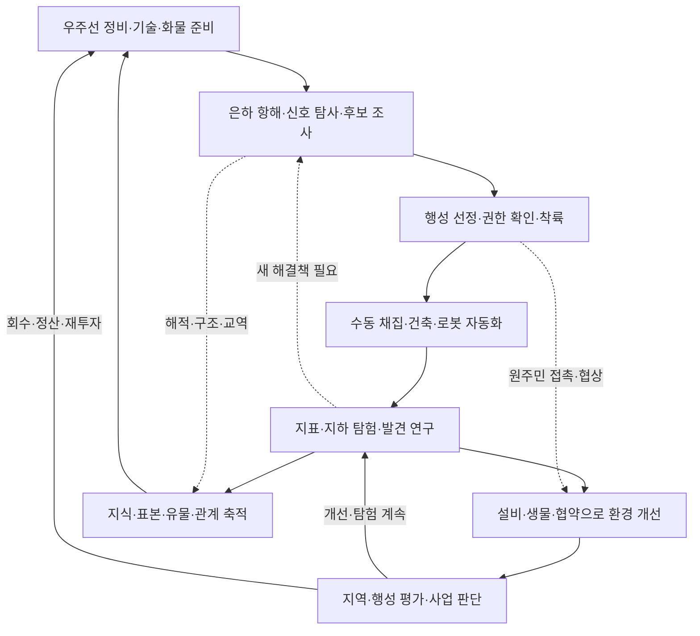

# 게임 비전과 핵심 루프

2026-09-09 탐험 변경: 기존 거주 마을은 제거하고 고지능체는 후속 고도화로 분리한다. 높은 티어일수록 새 발견의 수와 종류가 늘어나는 [탐험 확장 기획](20-exploration-discovery-expansion.md)을 추가했다. 아래 문명 만남·협약은 장기 목표로 남으며 이번 발견 확장의 필수 단계가 아니다. 마을 제외와 T1/T2 발견물의 구현 범위는 [제작 기록](../production/97-exploration-discoveries-t2.md), 새 추적·재해·교전은 [사건형 탐험 기획](21-exploration-incidents.md)을 따른다.

2026-09-09 스토리 구상: [Lotus 스토리·개척 지원 초안](19-lotus-story-and-support.md)에 직원 출발·독립 기회·지구 인명 구출의 사용자 원안과 연결 제안을 정리했다. 아래 독립 사업가 출발·최종 엔딩 미정의 후속 검토안이며, 고용 성장·독립·엔딩은 아직 구현·세부 규칙 확정이 아니다. 후속 승인된 출항 물자·공용 소형선·Lotus 보급은 [실제 구현](../production/91-lotus-start-and-airdrop.md)에 연결했다.

2026-09-06 탐험 확장과 단일 은하·티어·시드·호스트 협동 요청을 반영한 **목표 설계**다. 현재 1.2의 행성 구매·지구 원격 조종·유한 작업 구역은 [구현 현황](../planning/03-implementation-status.md)에 남긴다. 원안과 변경의 관계는 [결정 기록](../planning/02-decisions-and-risks.md)을 따른다.

새 세계의 지구 출발·항성계/공전·가스 행성은 [은하 생성](11-galaxy-tiers-and-seeds.md), 별도 대기실에서 호스트가 시작하는 흐름은 [협동 시작](12-host-coop-and-crew.md)을 따른다.

## 확정 요구사항

- 호스트가 세계·세션을 만들고 **호스트 포함 최대 6명**이 각자의 기본 캐릭터·소유 장비를 유지해 합류한다. 같은 우주선에 타고 함께 항해·탐험한다. [협동 규칙](12-host-coop-and-crew.md).
- 중심 장르는 파밍·건축·자동화·테라포밍이다. 직접 모은 자원이 AI 로봇과 설비가 되고 행성의 변화를 만든다.
- 발전한 인류가 AI 로봇으로 외계 환경을 개척하는 미래다. 플레이어는 지구에서 사업을 시작한 청년 사업가이며 초기 자본·장비가 부족하다.
- **행성을 구매하는 대신 우주선을 타고 탐험하면서 테라포밍하기 좋은 행성을 자유롭게 선정한다.** 기존의 지구에만 머무는 역할 전제는 바뀐다.
- 기본 활동 범위는 **하나의 은하**이며 새 시드는 **50만 개의 논리 행성**을 사용한다. 기존 저장과 항성계 간격의 소관은 [은하 생성](11-galaxy-tiers-and-seeds.md)을 따른다. 우주선·천체는 3D 공간에서 렌더링하고 실제 항해를 표현한다. 행성은 티어와 시드로 생성하고, 우측 또는 은하 중심 방향으로 갈수록 높은 티어가 나타나는 진행 구조를 둔다.
- 생명체는 준비된 종·형태·행동 사례를 기준으로 렌더링하는 방향을 따른다. 사례 목록·변형 범위는 설계 제안으로 둔다.
- 탑승 우주선도 뽑기·개발·업그레이드로 성장하며, 항해 중 우주해적과 여러 사건을 만날 수 있다.
- 실제 우주 데이터를 활용해 천체를 만들고, 광활한 행성의 지표와 지하를 자유롭게 탐험한다.
- 탐험의 다양한 발견을 스캔·연구하고 테라포밍 기술에 활용한다. 고유 생물의 출현, 표본 운송과 적합한 환경에서의 이식도 가능하게 한다.
- 유적·신기한 구조물·아름다운 자연 경관도 연구와 환경 개선의 원천이다.
- 여러 발전 단계의 외계문명을 발견하고 파괴·협상·거래 등 다양한 행동을 선택한다.
- 기술·로봇 제작과 확률적 등급·특성, 좋은 로봇의 회수·계승, 테라포밍 평가·판매·수익 재투자는 유지한다. 새 사업의 권한과 정산 형태는 후속 설계로 구체화한다.

## 플레이어에게 주는 경험 — 설계 제안

“내 손으로 캔 광석이 로봇이 되고, 내가 발견한 생물과 원리가 다음 행성을 바꾸는 기술이 된다.”

| 재미의 축 | 플레이 경험 | 확인할 신호 |
| --- | --- | --- |
| 목적지 선택 | 내 배·기술로 해결할 만한 행성 조사 | 같은 티어에서도 다른 후보를 고른다 |
| 직접 개척 | 지표·지하 채집, 길과 기지 만들기 | 현장 지형을 읽고 행동한다 |
| 자동화 성장 | 첫 로봇 관찰, 생산·물류 병목 해결 | 탐험에 쓸 시간이 늘어난다 |
| 발견과 연구 | 단서·실험·표본·생물 모방 | 발견의 쓰임을 다음 목적지와 연결한다 |
| 환경 변화 | 물·기후·생태·풍경의 단계적 변화 | 같은 장소를 다시 찾아가고 싶어진다 |
| 사업과 관계 | 개발 범위·협약·매각 시점 판단 | 최고 인간 거주 등급 외의 목표도 고른다 |
| 수집과 애착 | 우주선·로봇·생물 계통·도감 | 한정된 화물에 무엇을 남길지 고민한다 |

전투·외교는 이 루프를 넓힌다. 생존 소모품 관리나 반복 교전이 생산·탐험을 압도하지 않게 한다.

## 한 원정과 사업의 흐름 — 설계 제안

한 행성 개발 도중 다른 곳에서 물자·표본·기술을 찾아 돌아올 수 있다. 출발과 매각은 같은 행동이 아니다. 방문하지 않은 행성의 시뮬레이션 범위는 [월드 설계](../technical/03-universe-data-and-world-streaming.md)를 따른다. 티어 진행과 자유 탐사의 관계는 [은하·시드 설계](11-galaxy-tiers-and-seeds.md)가 기준이다.

협동에서는 한 세계·한 사업·한 주력 우주선을 공유한다. 지표·지하에서 분업하고 탑승·준비를 확인해 함께 이동한다. 개인 자산과 세계 자산, 호스트가 종료했을 때의 재개는 [호스트 협동](12-host-coop-and-crew.md)을 따른다.

## 지속 세계와 영구 성장 — 설계 제안

- **행성에 남는 것:** 지형 변화·자원 잔량·시설·환경·현지 개체군·발견·문명·협약 이력.
- **사업가에게 남는 것:** 현금·기술·연구 원리·도감·관계·우주선 개체와 개조·회수 로봇·실제로 반출한 화물.
- **다음 원정의 변화:** 같은 로봇이 수동 노동을 줄이고, 새 연구가 다른 환경 문제를 풀며, 배의 역할이 탐험 경로를 바꾼다.
- **사업 종료:** 매각·복원 계약 완료 등을 제안한다. 방문·채굴·건축 권한은 정산 종류에 따라 달라진다. [경제·계승](05-economy-and-progression.md).
- **실패의 의미:** 손상·실험 실패·협상 결렬은 복구할 일과 배울 정보를 만든다. 필수 희귀 추첨 실패나 연료 고갈로 영구 진행 불능이 되지 않게 한다.

## 현실성과 분위기 — 설계 제안

천체는 관측값·추정·게임 생성층을 구분한다. 에너지와 물질의 출처, 생물의 서식 조건, 변화에 걸리는 시간, 문명의 환경 이해관계가 결과를 설명해야 한다. 도약 기술·외계 생명·가속된 생태 시간·은하의 티어 배치는 게임 설정이다.

기업 장비 카탈로그와 개성 있는 로봇, 낯선 우주와 아름답게 바뀌는 행성을 고품질 3D 카툰으로 표현한다. 발견을 모두 파괴·반출하지 않아도 연구·사업의 성과가 남도록 한다. 원주민과의 선택에는 실제 개발 결과와 장기 관계를 부여한다.

## 아직 정하지 않은 것

우주선·지표의 조작 주체와 최종 시점, 직접 비행 범위, 실제 구형 월드·전면 굴착 여부, 축척·플레이 시간·최소 사양, 전투·문명 묘사 수위, 영구 손실·최종 엔딩은 [결정 대기](../planning/02-decisions-and-risks.md)에 둔다. 단일 은하·티어별 시드 행성·자유 탐사·지하 탐험·호스트 포함 최대 6인 협동·개인 장비 유지·공동 승선 자체는 미정이 아니다. 단계별 범위는 [고도화 계획](../planning/06-exploration-expansion-roadmap.md)을 따른다.
