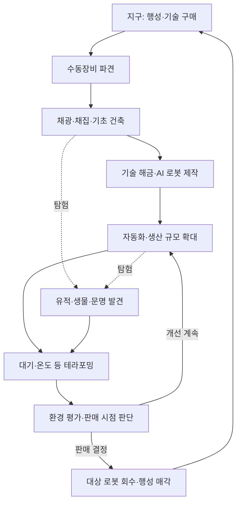

# 게임 비전과 핵심 루프

## 확정 요구사항

- 장르는 파밍과 건축이다. 채광·채집으로 시작해 AI 로봇 자동화와 행성 테라포밍으로 확장한다.
- 발전한 인류는 AI 로봇을 외계 행성에 보내 사람이 살 수 있는 환경을 만드는 기술을 확보했다.
- 플레이어는 지구에 있는 청년 사업가다. 직접 외계 행성에 가는 것이 아니라 수동장비를 원격 조종한다.
- 초기 자본과 장비가 부족하므로 작고 척박한 위성급 행성부터 사업을 시작한다.
- 기술 구매, 자원 수집, 로봇 제작, 테라포밍, 행성 판매를 반복하며 더 큰 사업으로 성장한다.
- 로봇은 확률적으로 등급이 나뉘고 특성이 무작위로 붙는다. 잘 만들어진 로봇은 회수 기술로 다음 행성에 가져갈 수 있다.
- 탐험 중 유적·미생물·동물·문명을 발견한다. 발견과 선택은 사업 성과에도 영향을 준다.

## 플레이어에게 주는 경험 — 설계 제안

“내 손으로 캔 광석이 로봇이 되고, 그 로봇들이 황무지를 사람이 살 만한 행성으로 바꾼다.”

| 재미의 축 | 플레이 경험 | 확인할 신호 |
| --- | --- | --- |
| 직접 개척 | 광맥 발견, 채광, 첫 시설 배치 | 시작 직후 스스로 할 일을 이해한다 |
| 자동화 성장 | 첫 로봇의 채광·운반을 관찰하고 병목 해결 | 로봇 도입 전후 작업 부담이 줄어든다 |
| 환경 변화 | 먼지, 대기색, 물, 식생이 바뀜 | 수치 창을 열지 않아도 변화가 보인다 |
| 사업 판단 | 기술·시설 투자와 판매 시점 선택 | 최고 등급만을 무조건 기다리지 않는다 |
| 수집과 애착 | 특성 있는 로봇·생물·유물 확보 | 다음 행성에 데려갈 대상을 고민한다 |

전투와 발견 이벤트는 이 루프를 확장한다. 첫 버전의 중심은 생산과 테라포밍의 완결성이다.

## 한 회차의 흐름

| 단계 | 주요 행동 | 결과 |
| --- | --- | --- |
| 사업 준비 | 자본 안에서 행성·기술·운송 계획 선택 | 이번 회차의 조건과 목표 설정 |
| 착륙·개척 | 수동장비로 주변 탐색, 자원 확보, 기지 배치 | 첫 제작·전력·보관 기반 확보 |
| 첫 자동화 | 채광 로봇 제작, 작업 대상 지정 | 반복 노동 일부 해방 |
| 산업 확장 | 생산·전력·운반 병목 해결 | 테라포밍 설비를 유지할 생산력 확보 |
| 환경 조성 | 대기·온도·물·생태를 조정 | 환경 적합도와 예상 판매가 상승 |
| 정산 | 평가 확인, 회수 대상 지정, 행성 판매 | 현금과 영구 성장 자산 확보 |
| 재투자 | 다음 기술·행성·수송 능력 구매 | 더 편한 시작 또는 더 어려운 조건에 도전 |

수동 채집·건축·탐험은 자동화 이후에도 가능하다. 단계는 기능 해금과 이해를 위한 흐름이며, 모든 행동을 순서대로 강제하는 선형 미션은 아니다.

## 한 회차와 영구 성장 — 설계 제안

- **행성에 남는 것:** 지형, 자원 잔량, 건물, 환경 상태, 로컬 발견·선택 이력, 회수하지 않은 로봇.
- **사업가에게 남는 것:** 현금, 구매 기술, 우주선 등급, 도감·발견 기록, 회수한 로봇, 별도로 반출한 물품.
- **성장의 대가:** 좋은 장비를 얻어도 다음 행성의 환경·물류·수송 한도에 따라 구성이 달라진다.
- **회차 종료:** 정상 매각을 기본으로 한다. 매각 불가 상태와 사업 중단의 복구 규칙은 [경제 문서](05-economy-and-progression.md)에 둔다.

## 분위기 — 설계 제안

기업 장비 카탈로그, 소형 로봇의 움직임, 황량한 외계 풍경과 환경 복원의 대비를 살린다. 기업별 개성과 가벼운 풍자는 가능하지만 테라포밍 성과는 플레이어가 자랑하고 싶을 만큼 아름답게 표현한다.

문명과의 선택은 밝은 개척 분위기와 긴장 관계가 있으므로 전체 출시 범위에서 별도로 다룬다. 대상 연령·묘사 수위는 [결정 대기 항목](../planning/02-decisions-and-risks.md)의 미정 사항이다.

## 아직 정하지 않은 것

시점, 정확한 조작 방식, 실제 구형 행성 여부, 복셀 지형 채굴, 플랫폼·최소 사양, 한 행성의 목표 플레이 시간, 멀티플레이, 최종 엔딩. 첫 회차의 임시 범위는 [MVP 문서](../planning/01-mvp-and-roadmap.md)에서 제안한다.
