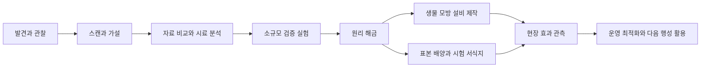

# 발견·연구·생태 이식

2026-09-12 보행 전반 개선 승인·구현: 지상 동물은 실제 이동 거리·몸집·다리 길이에 맞춰 걸으며 체형별 지지 순서, 발 접지, 회전·정지 전환을 사용한다. 일반 개체와 생물 사건·새끼·거대 개체의 표시를 같은 구동기에 연결한다. 현재 지상 5,130종의 적용, Blender 관절 수정 40종, 기존 저장 호환과 대표 검수/단일 관절의 한계는 [142 제작 기록](../production/142-ground-locomotion.md)에 둔다. 원산지·출현·성향을 바꾸거나 비행/수중 동작까지 새로 제작한 것은 아니다.

2026-09-12 사용자 승인에 따라 선공하는 종을 포함한 일반 토착 지상 동물의 실제 교전을 연결한다. 원산 행성·서식 조건·이식 경계를 유지하며 공격 성향·동작·무력화의 소관은 [전투 설계](27-ground-and-flight-combat.md), 첫 범위와 확인은 [137 제작 기록](../production/137-native-wildlife-combat.md)을 따른다.

2026-09-11 승인 구현: 지상 표본의 종별 기능을 실물 표본·기초 환경 분석·실험용 광물로 연구한다. 분석한 표본을 다른 행성의 지원 구획에 이식하면 그 구획 안의 대응 설비 처리 속도를 보조한다. 현재 여섯 기능은 수질 처리·온도 조절·생태 배양에 연결하며 가장 강한 한 종만 적용한다. 기존 환경별 공학 연구의 증거와 +20% 개조는 유지한다. 수치·실제 확인·공중/수중 경계는 [순차 구현 기록](../production/128-performance-and-content-commits.md#o07--종별-기능-분석과-현장-복원)을 따른다.

2026-09-11 승인 구현: 현재 원정의 활성 지상 동물은 안전한 짧은 경로에서 배회·섭식·휴식하며 근처 승무원에게 회피/경계 반응을 보인다. 실제 충돌·호스트 스캔/공격/채집과 무력화 위치 저장을 연결한다. 기존 종의 원산지·등장 확률·휴면/이식 경계를 유지한다. [구체 범위·수치 소관·실제 확인](../production/128-performance-and-content-commits.md#o06--일반-지상-동물의-행동).

2026-09-10 최신 확정: 기본종을 총 8,000종으로 확장하고 **각 종의 자연 원산지는 한 행성으로 제한**한다. 같은 항성계도 예외가 아니다. 기존 저장·플레이어가 옮긴 외래종은 구분한다. 생물은 기존 행성 유형의 온도·압력·기질·서식 층에 맞춰 제작하고, **생물체 유형별 전용 리깅과 동작 검수**를 필수로 한다. 카탈로그·모델 구현과 실제 플레이 확인 범위는 [8,000종 작업 기록](../production/124-biota-8000-work.md)을 따른다. 아래의 이전 수량·항성계 단위 중복 제안에 이 확정이 우선한다.

## 2026-09-10 — 항성계 고유 생태 방향 검토, 미구현

사용자는 같은 항성계 안의 행성끼리는 같은 종이 있어도 되지만, 다른 항성계에 완전히 같은 종이 자연 분포하는 것은 원하지 않는다고 설명했다. 중심으로 향하는 주 탐험 방향에 생물권을 집중하고 반대편은 대부분 무생물로 두는 방안과, 전체 기본종을 2,000~3,000개로 늘리는 방안의 비교를 요청했다. **현재 코드는 아래의 1,000개 카탈로그·행성별 독립 선택이며 항성계 간 중복을 아직 막지 않는다.** 이번 검토로 은하 분포나 기본종 수를 변경하지 않았다.

구현 제안은 다음과 같다. 구체적인 생명권 항성계 수·범위·종 수는 아직 확정하지 않았다.

- 새 은하 생성 규칙에서 기본종별 자연 기원 항성계를 하나씩 고정한다. 같은 항성계의 행성들은 환경에 맞는 종을 공유할 수 있으며, 다른 항성계에서는 같은 기본종을 자연 선택하지 않는다. 이름·종 ID·색·크기만 바꾸어 중복 금지를 충족했다고 세지 않는다.
- 플레이어가 표본을 운송·이식한 외래종은 기존 출처·반입 이력을 유지한다. 자연 분포의 고유성을 이식 기능 금지로 확대하지 않는다.
- 고정된 화면 좌우 대신 **태양계에서 중심으로 향하는 방향과 그 주변 분기 항로**를 기준으로 생명권 후보 성역을 정한다. 현재 태양계의 은하 방위도 시드에서 결정되므로 화면 왼쪽이 항상 중심 방향이라는 전제를 코드에 넣지 않는다. 반대 방향은 무생물 비중을 높이되 자원·지형·유적·산업 후보는 유지한다.
- 생명권 항성계 수와 종별 배정량을 함께 제한한다. 3,000종에서 항성계당 평균 10개의 독점종을 쓴다는 단순 예시는 300개 항성계를 지원한다. 실제로는 환경군별 종 수·서식 적합성·티어별 다양성까지 맞아야 한다. 은하의 한쪽 절반만 비운다고 전체 중복 문제가 해결되지는 않는다.
- 기원과 종 배정을 방문 순서와 독립적으로 시드·생성 버전에 고정한다. 먼저 간 사람이 종을 소진해 다른 항성계가 뒤늦게 무생물로 바뀌지 않게 한다. 기존 은하의 소급 변경은 별도 범위다.

**추천 순서:** 항성계 독점 배정과 주 탐험 방향의 생명권 분포를 먼저 정하고, 전체 2,000종으로 확장한 뒤 필요한 환경군·구조·행동의 차이를 보강하며 3,000종으로 늘린다. 아래의 현행 티어별 확률을 새 은하 전체에 그대로 보장할 수는 없다. 생명권 성역을 선택할 확률과 그 안에서 행성이 생물을 가질 조건부 비율을 분리해 다시 설계해야 한다.

2026-09-10 로컬 파일 합산: 현재 1,000종의 near/far GLB 2,000개는 649.75MiB다. 최근 추가 400종의 평균 파일 크기를 이후 제작에도 적용하면 전체 2,000종은 약 1.14GiB, 3,000종은 약 1.65GiB로 추산된다. 이는 압축 전 GLB 파일만의 추정으로 Blender 원본·검수 이미지·도감·카탈로그·Godot 변환 자산·최종 배포 압축·실행 메모리는 포함하지 않는다. 향후 형태/텍스처/애니메이션 복잡도가 같다는 보장도 없다. 용량만으로 확장 여부를 정하지 않고 실제 실루엣·동작·서식 조건의 구분과 현장 밀도를 함께 검수한다.

## 2026-09-10 — 식물·미생물 100종 추가, 기본형 1,000개

사용자 확정: 특이한 식물·미생물을 합쳐 100종 추가하고 전체 기본형을 1,000개로 맞춘다. 제작 배분은 식물 60개·미생물 군락 40개다. **현재 합계는 동물 700 + 식물 185 + 미생물 115 = 1,000개**이며, 색·크기 외형 프로필 20,000개는 별도로 센다.

뒤틀린 고리 잎·현수 씨앗주머니·열린 격자 꽃·접힌 부채 잎·겹친 씨방과, 흡관 모자이크·기포 뗏막·다공성 탑·편조 생물막 등 20구조군을 각 5개 기본 모델로 제작했다. 미생물은 육안으로 보이는 군락·생물막으로 표현한다. [100종 구조 목록](25-xenoflora-catalogue.md), [제작·실제 확인](../production/123-xenoflora-100.md).

새 은하에 `flora_catalog_hash`를 고정하고 100종을 자연 선택 풀에 포함한다. 앞선 600개/900개 카탈로그로 만든 기존 은하의 계통 선택·배치를 보존한다. 이번 추가는 아래 기원 가중치와 동물 계통 수를 바꾸지 않는다. 식물·미생물은 지표·동굴 환경마다 각각 1계통이며 `ecology_expansion.json`의 `non_animal_lineages_per_layer`로 관리한다.

### 티어별 등장 확률을 읽는 기준

아래는 **새 가상 착륙 행성에서 자연 표시 후보가 되는 기원의 가중치**다. 테라포밍·반입 이식 전, 종별 기후와 실제 지형·거리·표시 상한을 판정하기 전의 값이다. 실제 착륙·탐험에서 목격할 확률을 측정한 표가 아니다. 태양계 기준 천체와 기존 저장은 해당 저장의 종전 규칙을 따른다.

| 티어 | 동물 — 정착 기원 | 식물 — 휴면 포함 | 미생물 — 휴면 포함 | 무생물 기원 |
| --- | ---: | ---: | ---: | ---: |
| T1 | 25% | 40% | 40% | 60% |
| T2 | 40% | 55% | 55% | 45% |
| T3 | 55% | 70% | 70% | 30% |
| T4 | 70% | 82% | 82% | 18% |
| T5 | 85% | 92% | 92% | 8% |

한 행성의 기원을 함께 사용하므로 세 범주를 독립 추첨하는 확률이 아니며 가로로 더하지 않는다. 동물은 휴면 상태에서 자연 성체를 숨긴다. 식물·미생물은 휴면체도 표시하므로 `정착 + 휴면` 기원을 합친다. **활동 가능한 정착 기원만 세면 세 범주 모두 동물 열과 같다.** 정착 기원에서도 기후가 맞지 않으면 휴면이 되며, 모든 모델은 접지·거리·표시 상한을 통과해야 보인다. 휴면 기원의 활동 전환은 적합한 복원 시험 구획과 기존 천이 시간을 따른다.

종 수를 늘리는 것은 선택 가능한 외형을 늘리는 일이다. 생물권이 있는 행성 비율은 아래 기원 가중치로 별도 결정한다. 높은 티어에서도 무생물 기원은 남고, 무생물 행성에 자연 생물이 저절로 생기지 않는다.

한 행성 안의 배치 비중도 구분한다. 현재 지표에서 세 범주의 계통 풀이 모두 있으면 셀 후보의 동물:식물:미생물 비중은 `동물 계통 수:1:1`이다. T1은 60:20:20%, T2는 약 71.4:14.3:14.3%다. 고티어는 동물 계통 수만 증가하므로 식물·미생물의 상대 후보 비중은 감소한다. 이는 시야에 실제 남는 개체의 비율이 아니다. T1~T5 지표·동굴 계통 수와 조건부 후보 비중은 [코드에서 산출한 기록](../production/media/xenoflora/probabilities.json)에 둔다.

## 2026-09-10 — 동물 300종 추가·티어별 생물권

사용자 확정: 예상 밖의 다양한 신체 구조를 가진 **동물 기본종 300종을 추가**한다. 생명체가 없는 행성도 존재하며, 생물권 비율은 T1에서 낮고 높은 티어로 갈수록 증가한다. 색·크기 변이를 기본 종 수에 중복 계산하지 않는다.

30개 신체 구조군에 각각 10개 기본형을 제작했다. 기존 동물 400종과 합쳐 동물 700종이며, 이 첫 확장 당시 미생물·식물까지 포함한 기본형은 900개였다. 각 새 기본형의 20개 외형 프로필은 별도 6,000개 변이다. [300종 구조 목록](24-xenofauna-catalogue.md), Blender/게임 연결과 실제 확인은 [제작 기록](../production/122-xenofauna-300.md)에 둔다.

새 은하의 생태 규칙은 `data/ecology_expansion.json`에서 읽고 생성 당시 manifest에 고정한다. 아래 수치는 구현에 사용한 **초기 밸런스**이며 사용자 확정 수치나 관측된 실제 발견률이 아니다.

| 티어 | 무생물 기원 | 휴면 기원 | 정착 기원 | 지표/동굴 동물 계통 상한 |
| --- | ---: | ---: | ---: | ---: |
| T1 | 60% | 15% | 25% | 3 / 2 |
| T2 | 45% | 15% | 40% | 5 / 3 |
| T3 | 30% | 15% | 55% | 7 / 4 |
| T4 | 18% | 12% | 70% | 9 / 5 |
| T5 | 8% | 7% | 85% | 11 / 6 |

기원 추첨 이후에도 종별 온도·압력·수분·지표/지하 조건과 실제 지형 지지가 필요하다. 따라서 정착 기원 비율을 ‘착륙하면 동물을 볼 확률’로 해석하지 않는다. 무생물 기원에는 자연 계통을 만들지 않으며, 환경 복원만으로 동물을 무에서 생성하지 않는다. 반입 이식은 기존 규칙을 따른다.

신규 종은 현무암·건조·한랭·동굴·온대·결정·열수 환경에 나뉜다. 한 행성은 지질에 맞는 환경군에서 서로 다른 신체 구조군을 우선 선택한다. 신규 일반종은 지상·동굴의 수동적 생물이며, 공중/수중 이동이나 새 포식 AI를 포함하지 않는다. 기존 역할 조건에 맞으면 현지 생물 사건의 후보로도 사용하며, 공격이 없는 신규 종을 둥지 수호자의 공격 개체로 쓰지 않는다.

기존 은하는 기존 기원 추첨·계통 선택·배치를 유지한다. 과거 생성형 행성의 bar 압력을 kPa 서식 조건과 비교하던 오류는 기후 판정 경계에서 고친다. 저장된 프로필과 계통을 다시 추첨하지 않는다. 새 종의 자연 분포·티어 가중치는 새 은하에 적용하며, 기존 은하의 분포를 소급 변경하지 않는다.

2026-09-09 후속: 실제 현지 서식종에 역할·크기·색 변이를 입힌 생물 사건을 T3까지 연결한다. 거대 이동 개체는 기본 개체의 세 축 모두 4배다. 종 관측과 특이 개체 사건 기록, 출현 조건·보상은 [사건형 탐험 소관 규칙](21-exploration-incidents.md#현지-서식종의-사건-개체--2026-09-09-승인구현)을 따른다.

## 2026-09-09 — T3 이상 설계도와 연구의 관계

T3 이상 건물·설비의 설계도는 탐험에서 얻거나 우주정거장에서 구매한다. 사용권·중복·연구 과정과의 관계는 [경제·기술](05-economy-and-progression.md#2026-09-09--t3-이상-설계도-해금우주정거장-구매)을 따른다. 아래 연구 단계가 구매한 같은 설계의 필수 재해금으로 중복되지 않도록 후속 구현한다. 이번 현장 개발은 T1/T2까지이며 T3 판매는 아직 구현하지 않는다.

2026-09-09: [티어별 발견 확장 기획](20-exploration-discovery-expansion.md)에 자연·생태·지하·무인 유산 등 50개 후보와 원리·실물·재방문 연결을 정리했다. 기존 거주 마을은 제거하고 고지능체는 후속 고도화로 분리한다. 아래 문명 지식·현지 협약 사례는 미래 설계이며 현재 발견 연구의 필수 조건이 아니다. 후보의 효과·연구 연결은 구현 전 제안이다.

2026-09-09 사용자 변경: **표본 실물은 일반 아이템창으로 통합한다.** 수납·이동의 소관은 [아이템·장비](13-inventory-and-equipment.md)다. 별도 격리 화물칸·표본 전용 4개 제한을 현재 원정에서 없애고, 이식할 실물은 실행자의 배낭에서 한 개 소비한다. 관측 지식과 채집·이식 이력은 공동 연구 기록에 보존한다.

2026-09-09 UX03: J는 발견/공동 연구 열람이며 기존 생태 실행과 공동 설비 개조는 실제 표본 연구대에서 수행한다. 단계·비용은 유지하고 호스트가 장치 접근을 검사한다. [실제 적용과 한계](../production/73-growth-refit-and-market.md).

2026-09-08 UX02: J 발견 도감은 소지품과 별개로 전체 관측 지식을 보존하고 이름·종류·발견 행성으로 탐색한다. 생물 선택 후 현재 분석/서식지/이식 단계와 행동을 표시한다. 실제 작업 장소와 호스트 소비 규칙은 유지한다. [구현 및 검증 경계](../production/72-discovery-factory-and-navigation.md).

2026-09-08 A05: 첫 심부 정밀 채집 연구의 발견·표본 기여·분석 상태를 세계에 공유 저장한다. 실제 스캔/수동 채광에서 증거를 얻고 각 참여자가 배낭 보석을 기여한다. 기존 생태 연구는 유지하며 표본 분석 화면·시제품·현장 시험은 A06/A07에서 연결한다. [현재 규칙과 확인 범위](../production/66-shared-expedition-research.md).

2026-09-06 확장 설계. **우주·행성 탐험에서 얻은 다양한 요소의 테라포밍 활용, 행성 고유 생물의 출현, 스캔·연구·표본 운송·환경을 맞춘 이식, 유적·구조물·아름다운 자연의 기술적 활용**은 확정 요구사항이다. 아래 생물·연구 단계·수치는 설계 제안이며 가상 콘텐츠다.

## 모든 발견에 쓰임을 주는 원칙

모든 발견 **범주**에 적어도 하나의 연구·환경·사업 연결을 설계한다. 개별 물건이 아무 기술에나 들어가는 만능 재료가 된다는 뜻은 아니다. 기술적 연관은 관찰 가능한 원리로 설명하고, 희귀 발견은 기본 설비를 대체·보완하는 새로운 방법을 연다.

| 발견 원천 | 가져올 수 있는 것 | 테라포밍으로 이어지는 방식 |
| --- | --- | --- |
| 광물·운석·혜성 | 시료·원소·동결 물질 | 촉매·흡착제·공급 물질 |
| 미생물·동물·식생 | 스캔·대사 기록·살아 있는 표본 | 배양·정착, 효소·재료 연구, 생물 모방 장치 |
| 유적·이상 구조물 | 구조 측정·회로·작동 로그·부품 | 에너지·수로·기후 제어 원리의 재현 |
| 자연 경관 | 표면 구조·광학·바람·수문·공생 관측 | 집수·열 관리·서식지 설계, 보존형 사업 |
| 문명·문화 | 환경 지식·설계도·관리 관행 | 공동 연구·현지 환경 목표·운영 방법 |
| 우주 현상 | 방사선·입자·궤도 변화의 관측 | 차폐·센서·궤도 설비 운용 |

스캔 데이터는 지식이고 표본은 실물이다. 사진만으로 생물을 배양하거나, 표본 하나를 모든 행성에 동시에 놓지 않는다. 아름다운 장소는 대량 채취 없이 **어떻게 작동하는지 관찰하는 것**만으로도 기술을 열 수 있다.

## 연구 과정

| 단계 | 플레이어의 판단 | 비용·결과 |
| --- | --- | --- |
| 관찰·스캔 | 무엇이 달라 보이는지 찾고 관측 위치 선택 | 도감에 외형·환경·추정 기능 기록 |
| 가설 | 가열·흡착·반사 등 가능한 역할 비교 | 실험에 필요한 증거·재료·장치 공개 |
| 분석 | 반복 관찰, 시료, 유사 자료 중 경로 선택 | 연구실 시간·전력; 확인된 특성 공개 |
| 검증 | 온도·기질·압력 등을 바꾼 대조 실험 | 효과 범위·소모·부작용·불확실성 확인 |
| 원리 해금 | 생물 활용 또는 공학적 재현 선택 | 영구 지식; 설비·배양 생산은 별도 비용 |
| 현장 시험 | 작은 격리 구역에 설치·이식 | 지역 효과·생존·주변 반응 확인 |
| 확장·개량 | 효과를 확인하고 운영 범위 확대 | 효율·안정성 개선, 파생 설계도 |

반복 실험은 연구원이 자동 수행하고 플레이어는 조건과 가설을 선택한다. 무작위 성공 버튼을 수십 번 누르는 구조를 피한다. 실패는 투입 한도 내 시료·시간 손실과 새로운 원인 정보로 끝나며, 다음에 바꿔야 할 조건을 알려 준다. 같은 실험·같은 결과를 저장 재개로 재추첨하지 않는다.

### 기술망과 대체 경로

기술은 `기초 이론/구매 기술 + 발견 원리 + 검증 기록 + 제작 재료`의 조합으로 정의한다. 예를 들어 집수 기술은 응결 잎, 동굴 결로 구조, 문명 설계도 중 하나로 특화할 수 있다. 모두 같은 보너스를 주지 않고 습도·전력·수질에 대한 강점을 달리한다.

표준 대기·열·물·기초 생태 기술은 상점과 확정 연구로 확보한다. 희귀종을 놓치거나 반출을 거부당해도 기본 테라포밍은 가능해야 한다. 중복 발견은 분포 지도·적응 범위·재현성 자료로 쓰되 진척 상한과 다른 조건의 증거 요구를 둔다. 같은 바위를 반복 스캔해 영구 연구 점수를 무한 생성하지 않는다.

## 고유 생물이 자연스럽게 나타나는 과정

환경을 바꾸자 생물이 나타나는 경험은 다음 출처로 설명한다.

| 출처 | 출현 조건 | 시간과 기록 |
| --- | --- | --- |
| 휴면 미생물·포자·알 | 숨겨진 원래 서식지의 온도·물·기질이 회복 | 행성 생성 때 생물권 잠재력을 정하고 휴면→활동 이력 저장 |
| 지하·수중 피난처의 생물 | 통로·먹이·적합한 지표 환경이 생김 | 이동 경로와 기존 개체군 연결 |
| 기존 생태의 천이 | 생산자·분해자·서식처가 먼저 안정 | 단계별 정착과 경쟁, 후속 생물 활동 |
| 반입한 생물 | 배양·운송·시험 이식 완료 | 외래종 표시, 출발지·계통·도입자 기록 |
| 장기간의 적응·종 분화 | 충분한 세대·환경 차이·격리 | 후속 장기 콘텐츠; 짧은 회차의 기본 출현과 구분 |

생명이 없는 행성에서 물을 뿌린 직후 복잡한 동물이 무에서 생기는 규칙은 기본으로 쓰지 않는다. 출처가 아직 밝혀지지 않았으면 ‘기원 미확인’으로 남긴다. 행성의 기원·휴면층은 생성 시 고정하고 문명은 생태 점수가 올랐다는 이유로 즉석 생성하지 않는다. 실제 천체를 바탕으로 만든 생물도 게임 속 가상 생명이다.

생물의 외형·행동·효과는 검수한 사례를 사용한다. 시드는 환경에 맞는 사례·위치·허용된 변형을 선택하며 몸체를 즉석 생성하지 않는다. 후속 종 분화도 새로운 사례 또는 검수한 계통 범위로 표현한다. [사례 선택 기준](11-galaxy-tiers-and-seeds.md).

## 고온 바위형 생물 사례

사용자 예시의 핵심인 **발견한 생물을 연구해 다른 행성의 열 문제에 활용**하는 경험을 아래처럼 구체화한다. 높은 체온은 관측 결과이며, 주변을 데우는지 식히는지와 같은 말은 아니다. 사용자 예시에 함께 등장한 저온 행성 활용과 냉각 활용을 각각 가능한 연구 갈래로 둔다.

가상종 `lithotherm`은 광물성 외피와 고온의 내부를 가진다. 첫 스캔은 표면 온도·주변 기질만 알려 준다. 열원 차단·먹이 교체·방열량 비교로 에너지가 어디서 오는지 확인한다.

| 검증된 원리의 후보 | 저온 지역 활용 | 냉각 활용과 한계 |
| --- | --- | --- |
| 광물 산화로 열을 내는 대사 | 먹이·산화제를 공급해 온실·해빙 거점 가열 | 자체는 열원이므로 냉각 생물로 쓰지 않음 |
| 열을 저장·옮기는 외피 구조 | 주간 열 저장→야간 방출, 열 교환 소재 | 외부 방열계에 열을 전달할 때 국소 냉각 가능; 포화되면 중단 |
| 생물 모방 열 이동 장치 | 재생 가능한 열원과 연결해 서식지 가열 | 전력과 방열 장소 필요; 더운 쪽에 이동 열+사용 에너지가 방출 |

한 개체가 위 원리를 모두 가진다고 확정하지 않는다. 실험 결과로 선택한 원리만 적용한다. 살아 있는 생물 이식 경로와 외피만 모방한 공학 장치 경로를 모두 제공하면 생물 운송을 좋아하는 플레이와 산업 설계를 좋아하는 플레이가 나뉜다.

냉각 설비가 같은 행성의 다른 구역에 열을 버리는 것만으로 행성 전체가 냉각되지는 않는다. 행성 규모의 냉각은 반사율·대기 조성·우주로의 방열 등 외부 에너지 수지의 변화와 연결한다. 입출력 에너지 균형이라는 현실 원칙을 참고하되 위 생물과 장치는 가상 설계다. [NASA 복사 에너지 수지](https://science.nasa.gov/ems/13_radiationbudget/).

### 실제 플레이 예시

1. 화산 동굴에서 열화상과 발자국으로 바위형 생물을 발견한다.
2. 스캔·먹이 분석으로 광물 산화 발열을 확인하고 원리 연구를 해금한다.
3. 살아 있는 표본도 일반 배낭과 우주선 창고로 운송한다. 생물별 온도·기질·기체 유지 조건은 후속 제안이며, 별도 격리 생물실 확보를 현재 채집의 선행 조건으로 두지 않는다.
4. 얼음 행성의 전체 지표는 생존 범위 밖이므로 작은 가열·차폐 구획을 먼저 만든다.
5. 시험 이식 후 먹이 소비·열 출력·수질 변화를 확인한다. 생물의 열로 주변 얼음을 녹이고, 공생 미생물·집수 설비로 물을 활용한다.
6. 환경이 바뀌어 개체군이 줄면 다른 종·설비로 역할을 교대한다. 후속 냉각 사업에는 별도 검증한 열 교환 원리를 이용한다.

## 표본·화물·이식

| 대상 | 운송 조건 | 유지되는 정보·손실 |
| --- | --- | --- |
| 관측 데이터 | 저장 장치, 통신·분석 | 실물 생물과 별개; 확정 도감은 보존 |
| 비활성 시료 | 질량·부피, 물질별 용기 | 분석 가능한 잔량·오염·채취 위치 |
| 휴면 배양체 | 저온 또는 종별 휴면 조건 | 생존율·복원 조건·배양 계통 |
| 살아 있는 개체 | 온도·압력·기체·먹이·공간·격리 | 건강·스트레스·생식 가능 여부·유전 계통 |
| 유물 | 크기·질량·차폐·고정 장치 | 원본 ID·연구 단계·반출 권리 |

아래 생명 유지 규칙은 미구현 후속 제안이다. 2026-09-09 확정한 통합 아이템창을 별도 보관 화면으로 분리하는 요구가 아니다. 후속에서는 질량·부피 외에 생명 유지 전력·열 처리 등의 조건을 검토한다. 출발 전에 항해 기간 동안 유지 가능한지 확인한다. 전력 부족은 우선순위 조정·휴면 전환·귀항으로 대응하고, 혼자 하는 게임의 일시정지·종료 시간 때문에 표본이 조용히 죽지 않게 한다. 협동 세계가 계속 열려 있으면 개인 메뉴·이탈과 무관하게 생물실은 진행하며, 경고·유지 작업을 남은 승무원에게 전달한다. 팀 전체 정지·호스트 종료는 [협동 시간 규칙](12-host-coop-and-crew.md)을 따른다. 표본이 죽더라도 남은 조직 분석과 이미 확인한 지식은 별도 보존한다.

이식은 `목적지 조사 → 환경 적합성 → 반입 권한 → 격리 배양 → 작은 시험 구획 → 관찰 → 확산 승인`으로 진행한다. 표본 1개가 번식 가능한 집단인지도 확인한다. 무성 배양·유성 번식·공생 의존성을 종별로 두고, 필요한 번식군·기질은 추가 확보한다.

이식 버튼에는 살 수 있는지와 원하는 효과를 낼 수 있는지를 따로 표시한다. 생존은 가능하지만 기질이 없어 열·산소를 생산하지 못하는 경우가 있다. 부적합하면 무엇을 바꿔야 하는지, 이미 있는 어떤 종이 영향을 받는지 설명한다.

## 생태계가 만드는 운영 퍼즐

각 종은 생존·번식 환경 범위, 입력 물질·에너지원, 산출물·폐열, 서식처, 경쟁·공생·포식 관계, 개체군 한도·지연 반응을 가진다. 개체군은 게임용 집계값으로 먼저 계산하고 화면의 모든 개체를 전 행성에서 물리 시뮬레이션하지 않는다.

- 산소 생성 생물도 물·기질·빛 등 설정된 입력이 필요하다. 산소가 많아지면 다른 종·화재 위험·목표 대기와 충돌할 수 있다.
- 독성에 강한 선구종은 개척 초기에 유용하지만 정화 후 쇠퇴할 수 있다. 자연스러운 역할 교대가 다음 연구를 만든다.
- 원주민이 의존하는 낮은 산소 환경을 인간 기준으로 바꾸면 협약·생존 문제가 생긴다. 테라포밍 목표는 [환경 모델](04-terraforming-and-sales.md)과 [문명 합의](10-alien-civilizations-and-diplomacy.md)를 함께 따른다.
- 외래종 과증식은 출현 전 징후·확산 예측을 보여 주고, 구획 격리·먹이 조절·회수로 제어한다. 회수에는 비용이 들며 생태 변화 전체를 버튼 하나로 원상복구하지 않는다.
- 가역적인 소규모 실험으로 배우고 확장하게 한다. 예상 밖 결과는 후속 연구·새 조합의 단서가 된다.

## 추가 콘텐츠 예시

| 가상 발견 | 가능한 연구 | 교환 조건·부작용 |
| --- | --- | --- |
| 은빛 결정 군락 | 햇빛 반사 표면·국소 냉각 | 반사광 방향, 태양광 발전·식생 빛 감소 |
| 안개를 모으는 잎 | 저전력 응결 집수 | 충분한 습도 필요, 건조 행성의 물 무한 생성 불가 |
| 탄산염 껍질 생물 | 탄소 고정·건축 재료 | 광물 기질 소비, 수질·산도 변화 |
| 황산 적응 미생물 | 초기 대기·토양 처리 | 반응 기질·부산물, 정화 후 개체군 교대 |
| 유적의 바람 회랑 | 수동 환기·열 분산 건축 | 지형·주풍향 의존, 원형 보존과 분석 선택 |
| 문명의 계절 정원 | 수문·종 교대 운영법 | 협약·지식 사용 범위·수익 공유 |

연구 화면의 마지막 질문은 ‘무엇을 얻었나’에 더해 **어느 행성의 어떤 문제를 해결할 수 있나**다. 발견 도감에서 후보 행성과 실험·선적 계획으로 바로 이어진다.

## 단독 탐험에 연결한 현재 실행 범위

[행성 생태 통합 기록](../production/11-seeded-ecology-integration.md)에 환경 적합성·시드 계통·스캔·소형 분석·고유 표본 이동·국소 복원/천이·생물량·저장 검증을 분리한다. 이 실행 단계를 본 문서 전체 연구망·격리 생명 유지·열역학·먹이망 구현 완료로 확대하지 않는다.

## 공동 원정의 현장 공학 연결

[생물 관측과 현장 공학](../production/14-biological-field-engineering.md)에서 환경 기초 분석 이후의 유료 시제품·가동 시설 시험·설비별 개조를 구현한다. 세 가상 과제는 생태 배양·열 조절·수자원 처리에 연결하며 원산지와 검증 단계를 보존한다. 발견 범주 전체와 실제 생리/열역학/먹이망은 여전히 후속 작업이다.

## 2026-09-06 — 공통 스캔과 살아 있는 정착물 확정

사용자는 궁금한 대상을 폭넓게 조사하는 방향과 광물 스캔을 승인했다. 생물은 연구·실제 성능뿐 아니라 테라포밍한 세계에서 살아가는 정원/서식지의 장식·배치 대상으로 활용한다. 지식·실물 표본·배양 개체·정착 개체를 구분한다. 상세 설계 제안, 이번 구현과 후속 범위는 [공통 조사와 살아 있는 정착물](../production/25-universal-survey-and-living-settlement.md)을 따른다.

## 2026-09-07 연구 화면 분리

사용자 확정: 개발권 연구/등록은 초기 채광의 선행 조건에서 제거한다. J 독립 연구 화면에서 기술 설계도와 생태 조사·분석을 관리한다. 기술 카드는 해금 결과 모델·선행 연구·비용·보유 상태를 보여주며 실제 구매와 분석은 착륙선 연구실 범위에서 실행한다. 제작소 시제품과 현장 시설 시험·개조는 설비 상호작용을 유지한다. [구현과 검증](../production/40-smoke-and-research.md).

### 2026-09-11 조류형 비행 생물 확정

날아다니는 새 같은 생명체를 8,000종 확장에 포함한다. 가스행성의 부유형과 지상 행성의 날개 비행형을 구분한다. 날개·조향 꼬리·착지용 발과 전용 리깅을 갖추고 해당 행성의 대기 압력·온도·기질을 적용한다. 종마다 자연 원산지는 한 행성이며 기존 독점 배정 규칙을 유지한다. 제작 수량·초기 비행 수치·실제 확인은 [작업 기록](../production/124-biota-8000-work.md)을 따른다.

### 2026-09-11 유사 체형의 중간 개체 교체

종수를 더 늘리기보다 유사 묶음의 중간 개체를 식별 가능한 다른 신체 구조로 교체한다. 큰 체형과 기관의 기능적 연결을 먼저 구분하고 색·크기 변이는 별도로 유지한다. 실제 교체 범위·28체형·전용 관절과 상태는 [제작 기록](../production/129-biota-midpoint-silhouettes.md)을 따른다. 행성 독점 원산지와 환경 적합성 규칙은 변하지 않는다.
