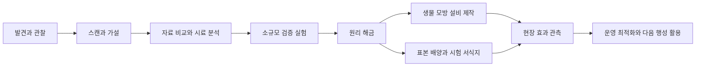

# 발견·연구·생태 이식

2026-09-06 확장 설계. **우주·행성 탐험에서 얻은 다양한 요소의 테라포밍 활용, 행성 고유 생물의 출현, 스캔·연구·표본 운송·환경을 맞춘 이식, 유적·구조물·아름다운 자연의 기술적 활용**은 확정 요구사항이다. 아래 생물·연구 단계·수치는 설계 제안이며 가상 콘텐츠다.

## 모든 발견에 쓰임을 주는 원칙

모든 발견 **범주**에 적어도 하나의 연구·환경·사업 연결을 설계한다. 개별 물건이 아무 기술에나 들어가는 만능 재료가 된다는 뜻은 아니다. 기술적 연관은 관찰 가능한 원리로 설명하고, 희귀 발견은 기본 설비를 대체·보완하는 새로운 방법을 연다.

| 발견 원천 | 가져올 수 있는 것 | 테라포밍으로 이어지는 방식 |
| --- | --- | --- |
| 광물·운석·혜성 | 시료·원소·동결 물질 | 촉매·흡착제·공급 물질 |
| 미생물·동물·식생 | 스캔·대사 기록·살아 있는 표본 | 배양·정착, 효소·재료 연구, 생물 모방 장치 |
| 유적·이상 구조물 | 구조 측정·회로·작동 로그·부품 | 에너지·수로·기후 제어 원리의 재현 |
| 자연 경관 | 표면 구조·광학·바람·수문·공생 관측 | 집수·열 관리·서식지 설계, 보존형 사업 |
| 문명·문화 | 환경 지식·설계도·관리 관행 | 공동 연구·현지 환경 목표·운영 방법 |
| 우주 현상 | 방사선·입자·궤도 변화의 관측 | 차폐·센서·궤도 설비 운용 |

스캔 데이터는 지식이고 표본은 실물이다. 사진만으로 생물을 배양하거나, 표본 하나를 모든 행성에 동시에 놓지 않는다. 아름다운 장소는 대량 채취 없이 **어떻게 작동하는지 관찰하는 것**만으로도 기술을 열 수 있다.

## 연구 과정

| 단계 | 플레이어의 판단 | 비용·결과 |
| --- | --- | --- |
| 관찰·스캔 | 무엇이 달라 보이는지 찾고 관측 위치 선택 | 도감에 외형·환경·추정 기능 기록 |
| 가설 | 가열·흡착·반사 등 가능한 역할 비교 | 실험에 필요한 증거·재료·장치 공개 |
| 분석 | 반복 관찰, 시료, 유사 자료 중 경로 선택 | 연구실 시간·전력; 확인된 특성 공개 |
| 검증 | 온도·기질·압력 등을 바꾼 대조 실험 | 효과 범위·소모·부작용·불확실성 확인 |
| 원리 해금 | 생물 활용 또는 공학적 재현 선택 | 영구 지식; 설비·배양 생산은 별도 비용 |
| 현장 시험 | 작은 격리 구역에 설치·이식 | 지역 효과·생존·주변 반응 확인 |
| 확장·개량 | 효과를 확인하고 운영 범위 확대 | 효율·안정성 개선, 파생 설계도 |

반복 실험은 연구원이 자동 수행하고 플레이어는 조건과 가설을 선택한다. 무작위 성공 버튼을 수십 번 누르는 구조를 피한다. 실패는 투입 한도 내 시료·시간 손실과 새로운 원인 정보로 끝나며, 다음에 바꿔야 할 조건을 알려 준다. 같은 실험·같은 결과를 저장 재개로 재추첨하지 않는다.

### 기술망과 대체 경로

기술은 `기초 이론/구매 기술 + 발견 원리 + 검증 기록 + 제작 재료`의 조합으로 정의한다. 예를 들어 집수 기술은 응결 잎, 동굴 결로 구조, 문명 설계도 중 하나로 특화할 수 있다. 모두 같은 보너스를 주지 않고 습도·전력·수질에 대한 강점을 달리한다.

표준 대기·열·물·기초 생태 기술은 상점과 확정 연구로 확보한다. 희귀종을 놓치거나 반출을 거부당해도 기본 테라포밍은 가능해야 한다. 중복 발견은 분포 지도·적응 범위·재현성 자료로 쓰되 진척 상한과 다른 조건의 증거 요구를 둔다. 같은 바위를 반복 스캔해 영구 연구 점수를 무한 생성하지 않는다.

## 고유 생물이 자연스럽게 나타나는 과정

환경을 바꾸자 생물이 나타나는 경험은 다음 출처로 설명한다.

| 출처 | 출현 조건 | 시간과 기록 |
| --- | --- | --- |
| 휴면 미생물·포자·알 | 숨겨진 원래 서식지의 온도·물·기질이 회복 | 행성 생성 때 생물권 잠재력을 정하고 휴면→활동 이력 저장 |
| 지하·수중 피난처의 생물 | 통로·먹이·적합한 지표 환경이 생김 | 이동 경로와 기존 개체군 연결 |
| 기존 생태의 천이 | 생산자·분해자·서식처가 먼저 안정 | 단계별 정착과 경쟁, 후속 생물 활동 |
| 반입한 생물 | 배양·운송·시험 이식 완료 | 외래종 표시, 출발지·계통·도입자 기록 |
| 장기간의 적응·종 분화 | 충분한 세대·환경 차이·격리 | 후속 장기 콘텐츠; 짧은 회차의 기본 출현과 구분 |

생명이 없는 행성에서 물을 뿌린 직후 복잡한 동물이 무에서 생기는 규칙은 기본으로 쓰지 않는다. 출처가 아직 밝혀지지 않았으면 ‘기원 미확인’으로 남긴다. 행성의 기원·휴면층은 생성 시 고정하고 문명은 생태 점수가 올랐다는 이유로 즉석 생성하지 않는다. 실제 천체를 바탕으로 만든 생물도 게임 속 가상 생명이다.

생물의 외형·행동·효과는 검수한 사례를 사용한다. 시드는 환경에 맞는 사례·위치·허용된 변형을 선택하며 몸체를 즉석 생성하지 않는다. 후속 종 분화도 새로운 사례 또는 검수한 계통 범위로 표현한다. [사례 선택 기준](11-galaxy-tiers-and-seeds.md).

## 고온 바위형 생물 사례

사용자 예시의 핵심인 **발견한 생물을 연구해 다른 행성의 열 문제에 활용**하는 경험을 아래처럼 구체화한다. 높은 체온은 관측 결과이며, 주변을 데우는지 식히는지와 같은 말은 아니다. 사용자 예시에 함께 등장한 저온 행성 활용과 냉각 활용을 각각 가능한 연구 갈래로 둔다.

가상종 `lithotherm`은 광물성 외피와 고온의 내부를 가진다. 첫 스캔은 표면 온도·주변 기질만 알려 준다. 열원 차단·먹이 교체·방열량 비교로 에너지가 어디서 오는지 확인한다.

| 검증된 원리의 후보 | 저온 지역 활용 | 냉각 활용과 한계 |
| --- | --- | --- |
| 광물 산화로 열을 내는 대사 | 먹이·산화제를 공급해 온실·해빙 거점 가열 | 자체는 열원이므로 냉각 생물로 쓰지 않음 |
| 열을 저장·옮기는 외피 구조 | 주간 열 저장→야간 방출, 열 교환 소재 | 외부 방열계에 열을 전달할 때 국소 냉각 가능; 포화되면 중단 |
| 생물 모방 열 이동 장치 | 재생 가능한 열원과 연결해 서식지 가열 | 전력과 방열 장소 필요; 더운 쪽에 이동 열+사용 에너지가 방출 |

한 개체가 위 원리를 모두 가진다고 확정하지 않는다. 실험 결과로 선택한 원리만 적용한다. 살아 있는 생물 이식 경로와 외피만 모방한 공학 장치 경로를 모두 제공하면 생물 운송을 좋아하는 플레이와 산업 설계를 좋아하는 플레이가 나뉜다.

냉각 설비가 같은 행성의 다른 구역에 열을 버리는 것만으로 행성 전체가 냉각되지는 않는다. 행성 규모의 냉각은 반사율·대기 조성·우주로의 방열 등 외부 에너지 수지의 변화와 연결한다. 입출력 에너지 균형이라는 현실 원칙을 참고하되 위 생물과 장치는 가상 설계다. [NASA 복사 에너지 수지](https://science.nasa.gov/ems/13_radiationbudget/).

### 실제 플레이 예시

1. 화산 동굴에서 열화상과 발자국으로 바위형 생물을 발견한다.
2. 스캔·먹이 분석으로 광물 산화 발열을 확인하고 원리 연구를 해금한다.
3. 살아 있는 표본을 가져가려면 적합한 온도·기질·기체 조건의 격리 생물실을 준비한다. 준비가 없으면 자료만 확보하고 돌아온다.
4. 얼음 행성의 전체 지표는 생존 범위 밖이므로 작은 가열·차폐 구획을 먼저 만든다.
5. 시험 이식 후 먹이 소비·열 출력·수질 변화를 확인한다. 생물의 열로 주변 얼음을 녹이고, 공생 미생물·집수 설비로 물을 활용한다.
6. 환경이 바뀌어 개체군이 줄면 다른 종·설비로 역할을 교대한다. 후속 냉각 사업에는 별도 검증한 열 교환 원리를 이용한다.

## 표본·화물·이식

| 대상 | 운송 조건 | 유지되는 정보·손실 |
| --- | --- | --- |
| 관측 데이터 | 저장 장치, 통신·분석 | 실물 생물과 별개; 확정 도감은 보존 |
| 비활성 시료 | 질량·부피, 물질별 용기 | 분석 가능한 잔량·오염·채취 위치 |
| 휴면 배양체 | 저온 또는 종별 휴면 조건 | 생존율·복원 조건·배양 계통 |
| 살아 있는 개체 | 온도·압력·기체·먹이·공간·격리 | 건강·스트레스·생식 가능 여부·유전 계통 |
| 유물 | 크기·질량·차폐·고정 장치 | 원본 ID·연구 단계·반출 권리 |

질량·부피뿐 아니라 **생명 유지 전력·열 처리·서로 다른 생물실**이 적재를 제한한다. 출발 전에 항해 기간 동안 유지 가능한지 확인한다. 전력 부족은 우선순위 조정·휴면 전환·귀항으로 대응하고, 혼자 하는 게임의 일시정지·종료 시간 때문에 표본이 조용히 죽지 않게 한다. 협동 세계가 계속 열려 있으면 개인 메뉴·이탈과 무관하게 생물실은 진행하며, 경고·유지 작업을 남은 승무원에게 전달한다. 팀 전체 정지·호스트 종료는 [협동 시간 규칙](12-host-coop-and-crew.md)을 따른다. 표본이 죽더라도 남은 조직 분석과 이미 확인한 지식은 별도 보존한다.

이식은 `목적지 조사 → 환경 적합성 → 반입 권한 → 격리 배양 → 작은 시험 구획 → 관찰 → 확산 승인`으로 진행한다. 표본 1개가 번식 가능한 집단인지도 확인한다. 무성 배양·유성 번식·공생 의존성을 종별로 두고, 필요한 번식군·기질은 추가 확보한다.

이식 버튼에는 살 수 있는지와 원하는 효과를 낼 수 있는지를 따로 표시한다. 생존은 가능하지만 기질이 없어 열·산소를 생산하지 못하는 경우가 있다. 부적합하면 무엇을 바꿔야 하는지, 이미 있는 어떤 종이 영향을 받는지 설명한다.

## 생태계가 만드는 운영 퍼즐

각 종은 생존·번식 환경 범위, 입력 물질·에너지원, 산출물·폐열, 서식처, 경쟁·공생·포식 관계, 개체군 한도·지연 반응을 가진다. 개체군은 게임용 집계값으로 먼저 계산하고 화면의 모든 개체를 전 행성에서 물리 시뮬레이션하지 않는다.

- 산소 생성 생물도 물·기질·빛 등 설정된 입력이 필요하다. 산소가 많아지면 다른 종·화재 위험·목표 대기와 충돌할 수 있다.
- 독성에 강한 선구종은 개척 초기에 유용하지만 정화 후 쇠퇴할 수 있다. 자연스러운 역할 교대가 다음 연구를 만든다.
- 원주민이 의존하는 낮은 산소 환경을 인간 기준으로 바꾸면 협약·생존 문제가 생긴다. 테라포밍 목표는 [환경 모델](04-terraforming-and-sales.md)과 [문명 합의](10-alien-civilizations-and-diplomacy.md)를 함께 따른다.
- 외래종 과증식은 출현 전 징후·확산 예측을 보여 주고, 구획 격리·먹이 조절·회수로 제어한다. 회수에는 비용이 들며 생태 변화 전체를 버튼 하나로 원상복구하지 않는다.
- 가역적인 소규모 실험으로 배우고 확장하게 한다. 예상 밖 결과는 후속 연구·새 조합의 단서가 된다.

## 추가 콘텐츠 예시

| 가상 발견 | 가능한 연구 | 교환 조건·부작용 |
| --- | --- | --- |
| 은빛 결정 군락 | 햇빛 반사 표면·국소 냉각 | 반사광 방향, 태양광 발전·식생 빛 감소 |
| 안개를 모으는 잎 | 저전력 응결 집수 | 충분한 습도 필요, 건조 행성의 물 무한 생성 불가 |
| 탄산염 껍질 생물 | 탄소 고정·건축 재료 | 광물 기질 소비, 수질·산도 변화 |
| 황산 적응 미생물 | 초기 대기·토양 처리 | 반응 기질·부산물, 정화 후 개체군 교대 |
| 유적의 바람 회랑 | 수동 환기·열 분산 건축 | 지형·주풍향 의존, 원형 보존과 분석 선택 |
| 문명의 계절 정원 | 수문·종 교대 운영법 | 협약·지식 사용 범위·수익 공유 |

연구 화면의 마지막 질문은 ‘무엇을 얻었나’에 더해 **어느 행성의 어떤 문제를 해결할 수 있나**다. 발견 도감에서 후보 행성과 실험·선적 계획으로 바로 이어진다.

## 단독 탐험에 연결한 현재 실행 범위

[행성 생태 통합 기록](../production/11-seeded-ecology-integration.md)에 환경 적합성·시드 계통·스캔·소형 분석·고유 표본 이동·국소 복원/천이·생물량·저장 검증을 분리한다. 이 실행 단계를 본 문서 전체 연구망·격리 생명 유지·열역학·먹이망 구현 완료로 확대하지 않는다.
