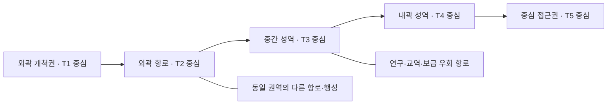

# 단일 은하·행성 티어·시드 생성

2026-09-09 확정 방향: **고티어일수록 탐험 발견의 수와 종류를 늘린다.** 단순 자원량·체력 배율과 구분하며, [발견 확장 소관](20-exploration-discovery-expansion.md)에 누적 후보·지역별 다양성·티어별 새 행동의 제안을 둔다. 기존 거주 마을은 제거하고 고지능체는 후속 고도화로 분리하므로 아래 문명 단계·시드 설계는 미래 확장을 위한 이력이다. 생성 코드는 이번 기획에서 변경하지 않았다.

2026-09-09 지역 고도화: [지역 테라포밍·지표 수급](20-regional-terraforming-and-surface-supply.md)에 T1 소규모 사업과 T2~T5의 점진적 지역/조건 확장, 지표 군집 전용 생성 버전·지하 시드 보존을 정리했다. 행성 티어·생산 단계·평가 등급의 구분은 유지한다. 기존 세계를 재생성하거나 새로운 분포를 구현한 기록이 아니다.

2026-09-06 추가 요청의 소관 문서다. **하나의 은하를 기본 활동 범위로 사용하고, 행성을 티어·시드별로 생성하며, 우측 또는 은하 중심으로 갈수록 높은 티어가 나오는 구조**는 확정 요구사항이다. 생명체는 **준비된 사례별 모델·행동을 렌더링**하는 사용자 방향을 따른다. 아래 5티어·분포·생물 사례는 구체화를 위한 설계안이다. 100만 주소·티어 분포·3D 항해의 부분 구현은 개발 기록에서 구분한다.

## 은하 규모와 항해 — 확정 요구사항

사용자의 후속 수정으로 은하당 행성 목표는 **100만 개**다. 앞선 1억 개 요청을 대체한다. 시드와 고정 주소로 전체 후보에 접근하고 필요한 천체만 생성·렌더링하며 변경분만 저장한다. 주 경험은 **3D 우주선 이동과 천체 탐험**이며 성도·목록은 보조 도구다. 목적지 선택만으로 항해를 모두 대신하지 않는다. [현재 실증](../planning/07-expansion-development-log.md).

## 세계 생성과 항성계 — 2026-09-06 확정 방향

- 새 게임은 무작위 은하 시드 하나를 만들고 같은 세계를 저장·재개한다. 모든 새 세계의 출발지는 **태양계 지구**다.
- 100만 행성은 사용자가 제시한 1000억 대비 1/100000의 **개수 축소 기준**이다. 실제 은하 개수의 관측 확정값이나 거리·반지름의 일괄 축척을 뜻하지 않는다.
- 행성은 항성에 소속되어 궤도를 돈다. 착륙 가능한 암석형과 착륙 불가능한 가스/얼음 거대행성을 포함한다. 유형·착륙 가능 여부는 티어·테라포밍 성과·그래픽 품질과 구분해 표시한다.
- 게임 시작 준비는 [별도 대기실](12-host-coop-and-crew.md)에서 처리한다. 선내는 게임 시작 후 탐험 공간이다.

### 구현 구조 선택

새 생성기 `galaxy-v3`는 125,000 항성계 × 8행성 = 1,000,000 주소를 지연 생성한다. 태양계 8행성의 이름·유형·순서와 지구 시작을 고정하고, 나머지 항성계는 독립 시드로 유형·궤도 위상을 정한다. 항성계당 가변 행성 수는 후속 확장이다. 지구 출발 위치는 지구 궤도의 우주선이며 지구 도시·우주항 지표는 별도 제작 범위다.

궤도는 게임 거리·시간으로 축약한 원궤도이며 실제 천체력·N체 중력 시뮬레이션이 아니다. 호스트의 경과 시간에서 위치를 계산하고 같은 시간을 저장·전달한다. 현재 항성계만 렌더링하고 백만 행성의 Node나 궤도 배열을 만들지 않는다. 가스형에는 띠 구름·더 큰 반지름과 ‘착륙 불가’ 표시를 사용한다. 표면 제작은 기존 지형을 재사용하며 지구의 실제 대륙·도시 재현을 주장하지 않는다.

기존 `galaxy-v2` 저장은 생성 설정·주소·지형을 유지하고 새 세계와 구분한다. 새 세계에는 별도 저장 파일을 사용해 기존 진행을 덮어쓰지 않는다.

## 은하 지도와 진행 방향 — 설계 제안

**외곽에서 중심부 방향으로 진출하는 단일 은하**를 기본안으로 삼는다. 성도는 방사형 은하 지도, 원정 계획은 같은 항로를 왼쪽→오른쪽으로 펼친 진행 지도로 제공한다. 두 화면은 같은 장소·탐사·티어 데이터를 읽으며 별개의 세계가 아니다.



표의 화살표는 권장 성장 방향이다. 같은 권역에 분기·우회·귀환·미탐사 후보가 있고 다음 행성을 순서대로 강제 배정하지 않는다. 고티어의 위험은 장비·보급·환경 지식·관계로 극복하며 단순 레벨 잠금만 쓰지 않는다. 조기 진출은 가능하되 부족한 항속·차폐·착륙 능력과 귀환 방법을 미리 알려 준다.

‘중심 접근권’은 중앙 블랙홀 내부나 모든 천체에 착륙한다는 의미가 아니다. 은하 내 탐험 가능한 성역을 콘텐츠 규모에 맞춰 구성한다. 다른 은하 이동은 기본 범위에 포함하지 않는다.

## 티어와 등급을 구분한다

| 구분 | 의미 | 바뀌는 시점 |
| --- | --- | --- |
| 행성 티어 `planet_tier` | 초기 개발 규모·문제의 복합성·자원/연구 기회의 범주 | 행성 생성 시 고정 |
| 테라포밍 등급 `terraform_grade` | 선택한 목표·범위의 현재 개선 성과 | 실제 환경·안정성 변화로 갱신 |
| 항로 위험 `route_risk` | 해적·항성 활동·보급 거리 등 여행 조건 | 사건·정세·정보 갱신 |
| 생물·발견 희귀도 | 해당 사례를 찾기 어려운 정도 | 콘텐츠 정의·분포 기준 |
| 문명 단계 | 산업·통신·우주 활동 범위 | 문명 정의·후속 사건 |
| 선체/로봇 품질 | 제작·획득 개체의 성능·특성 | 획득·개발 결과 |

**T1 행성을 S등급으로 복원할 수 있고, T5 행성도 F등급일 수 있다.** 테라포밍해서 좋아졌다고 기존 행성의 티어를 올리거나 다른 시드로 바꾸지 않는다. 높은 티어는 모든 광물이 더 많고 모든 생물이 더 강하다는 뜻도 아니다. 저티어의 특화 생물·물질·안전한 생산 거점은 후반에도 쓸 수 있다.

## 5티어 콘텐츠 초안

| 티어 | 대표 개발 문제 | 새로 필요해지는 판단 | 보상의 방향 |
| --- | --- | --- | --- |
| T1 개척 | 제한된 구역의 물·전력·기초 대기 | 수동 채집→첫 자동화, 작은 서식지 | 기초 재료·입문 원리·확정 수익 |
| T2 확장 | 여러 지형·얕은 지하·기후 편차 | 수송·전문 모듈·단순 생물 이식 | 특화 자원·생물 사례·선체 개량 |
| T3 복합 | 유역·깊은 지하·서로 다른 환경 목표 | 지역 설비·공생·문명 협약의 조합 | 복합 원리·희귀 부품·계약 선택 |
| T4 고위험 | 높은 물류 비용·강한 환경 제약·경쟁 | 물자 수입·궤도 설비·다중 거점 연계 | 고급 재료·유적 연쇄·특화 개발 |
| T5 장기 사업 | 큰 규모·상충하는 목표·장기 안정성 | 축적한 기술·생물·관계·물류의 통합 | 대표 행성 프로젝트·최종 선체 계열·명성 |

고티어의 자원량·수익은 투자·운영·운송 비용과 함께 증가한다. 난도는 단순 체력·채집 시간 배율이 아니라 해결할 조건의 종류로 만든다. 크기가 작아도 어려운 행성이 있고 큰 저난도 개발 구역도 가능하다. 고티어 진출이 고품질 그래픽 해금 조건은 아니며 모든 권역의 아트 품질은 같은 기준을 따른다.

## 방향성 있는 분포

중심에 가까워지는 진행도 `p`를 0~1로 정규화한다. 초기 방사형 지도에서는 시작권 반경을 `r_start`, 중심 접근권 경계를 `r_inner`, 현재 성역 반경을 `r`로 두고 다음 개념식을 사용한다.

```text
p = clamp((r_start - r) / (r_start - r_inner), 0, 1)
성역 티어 분포 = tier_distribution[p가 속한 권역]
행성 티어 = 독립된 티어 난수 스트림으로 분포에서 선택
```

`r_start > r_inner`를 검증하고 반경은 게임 지도 단위로 관리한다. 오른쪽 진행 지도는 같은 `p`를 가로축으로 표시하며, 화면 회전이나 카메라 방향에 따라 티어가 바뀌지 않는다.

| 권역 | T1 | T2 | T3 | T4 | T5 | 기대 티어 |
| --- | --- | --- | --- | --- | --- | --- |
| 외곽 개척권 | 85% | 15% | 0% | 0% | 0% | 1.15 |
| 외곽 항로 | 15% | 70% | 15% | 0% | 0% | 2.00 |
| 중간 성역 | 0% | 15% | 70% | 15% | 0% | 3.00 |
| 내곽 성역 | 0% | 0% | 15% | 70% | 15% | 4.00 |
| 중심 접근권 | 0% | 0% | 0% | 15% | 85% | 4.85 |

수치는 **분포 예시**이며 확률표는 데이터로 관리한다. 이웃 권역의 티어를 일부 겹쳐 다음 난도를 미리 발견하고 경계의 급격한 변화를 줄인다. 분포의 기대 티어는 중심 방향으로 증가하지만 특정 두 행성이 반드시 엄격한 순서를 이루지는 않는다. 시작권에는 선택 가능한 T1 후보와 보급·복구 경로를 별도로 보장하고, 제한된 후보 수에서 고티어가 하나도 안 나오는 성역은 정해진 보정 규칙으로 해결한다.

단일 난수를 계속 다시 뽑아 우연히 조건을 맞추는 대신, 유효 후보 목록·시도 한도·결정적 대체 템플릿을 둔다. 보정 사유·선택 결과를 생성 기록에 남긴다. 플레이어 성장에 맞춰 기존 행성 티어를 뒤에서 올리는 자동 스케일링은 사용하지 않는다.

## 실제 천체 데이터와 티어 배치

실제 자료의 반지름·질량·궤도·관측 좌표와 게임의 난도·항로를 별도 계층으로 둔다. ‘중앙일수록 행성이 고등급’은 게임의 진행 규칙이며 실제 천문학의 일반 법칙으로 주장하지 않는다.

- 은하수에서 영감을 받은 단일 은하를 제안하고, 실재 천체의 원천명·실제 좌표는 참조층에 보존한다.
- 실제 위치·관측 조건에 맞는 천체는 그 상태로 사용한다. 티어에 맞추려고 알려진 물리량이나 실제 좌표를 덮어쓰지 않는다.
- 은하 전체의 비어 있는 콘텐츠는 실제 관측에서 얻은 유형·분포를 참고한 **가상 천체**로 채운다. 실제 천체를 원형으로 삼아 다른 위치·환경을 부여했다면 별도의 가상 이름·ID로 표시한다.
- 은하 지도의 도약 항로·게임 진행 반경은 축약된 가상 표현이다. 관측 지도 보기와 혼동하지 않도록 상세 정보에서 구분한다.
- 티어를 먼저 선택한 가상 천체는 해당 범주의 유효 물리·환경 템플릿 안에서 생성한다. 실재 천체는 관측값을 먼저 고정한 후 적합한 개발 범주를 평가한다.

자료의 범위·검증·배포는 [실제 천체 데이터](../technical/03-universe-data-and-world-streaming.md)가 기준이다. 초기 콘텐츠 수는 은하의 실제 별 개수와 무관하며 필요한 성역·청크만 생성한다.

## 시드 계층과 고정되는 세계

```text
galaxy_seed + generation_version + catalog_version
  └─ sector_id → 성역 배치·항로·티어 분포
      └─ system_id → 항성계 구성
          └─ planet_id → planet_seed + planet_tier
              ├─ terrain_seed → 지표·지하·수계
              ├─ resource_seed → 광맥·물질 분포
              ├─ discovery_seed → 유적·경관·단서 사례
              ├─ ecology_seed → 허용된 생물 사례·서식지 선택
              └─ civilization_seed → 문명 사례·거주 흔적
```

파생 시드는 안정된 해시·명시된 알고리즘으로 만들고 엔진의 임시 객체 ID·순회 순서·프레임 시간에 의존하지 않는다. 제작 추첨·항해 사건·상점 갱신은 월드 생성과 별개의 난수 스트림이다. 생물 한 종을 추가했다고 같은 시드의 산·광맥이 바뀌지 않게 생성 버전과 후보 풀을 고정한다.

같은 은하/행성 시드와 버전·콘텐츠 카탈로그면 같은 결과를 만든다. 지형만 같은 것을 동일 시드 재현이라고 부르지 않고 자원·단서·사례 선택까지 확인한다. 발견 후 이름 변경·스캔·재방문·테라포밍·재시작으로 티어와 잠재 생물권을 재추첨하지 않는다. 공유 시드에는 필요한 버전 정보를 함께 표시한다.

시드만으로 플레이 진행을 저장하지 않는다. 굴착·고갈·생물군·시설·계약·소유 위치·추첨 결과는 실제 변경분으로 보존한다. 확정된 생물 사례 ID·변형·서식지를 생성 매니페스트에 남기고 다음 카탈로그 갱신 때 바꾸지 않는다.

## 생명체는 사례를 제작하고 환경에 배치한다

사용자 방향에 따라 몸체·관절·애니메이션·효과를 무제한 시드 조합으로 만들지 않는다. **종 사례의 모델·재질·행동·서식 조건·연구 효과를 먼저 제작·검수**한다. 시드는 준비된 사례 중 무엇이 어느 군락에 있는지 선택할 수 있으나 새로운 몸체나 생물학적 능력을 즉석 생성하지 않는다.

| 가상 사례 ID | 표현·행동 | 환경과 연구 방향 |
| --- | --- | --- |
| `microbe_acid_mat` | 지면 군락·막·기포, 밀도 단계 | 산성 환경의 기질 처리 |
| `lithotherm_grazer` | 고온 광물 외피·느린 보행·섭식 | 열 대사 연구, 기질을 소비하는 국소 가열 |
| `crystal_reflector` | 고정 군락·반사면·성장 단계 | 빛 반사·열 관리 원리 |
| `mist_collector` | 잎/주름의 응결·물방울 | 습도 조건의 집수 |
| `cave_mycelium` | 벽면 균사·발광 맥동·확산 | 지하 기질·공생·오염 감지 |
| `icewater_filter` | 유영·여과·휴면 단계 | 저온 수역의 물질 순환 |

사례 목록은 제작 후보이며 실제 생명 발견 자료가 아니다. 같은 기본 사례의 색·크기·표면 무늬·군집 밀도는 검수한 범위 안에서 변형한다. 골격·능력·서식 조건이 달라지는 경우는 별도 사례 또는 검증된 계통으로 정의한다. 현재 1.2 생물 모델이 이 사례 라이브러리를 완성했다는 뜻은 아니다.

배치 후보는 기질·온도·압력·물·에너지원·공생 조건과 사례의 출현 범위를 함께 검사한다. 맞는 사례가 없으면 생명 없음/잠재력 미확인으로 두며 무작위 생물을 억지 배치하지 않는다. 고유성은 행성의 조합·서식 환경·계통 이력·일부 특별 사례로 만들고, 모든 시드에 완전히 새로운 종이 있다고 약속하지 않는다.

생물의 출현·연구·이식 규칙은 [생태 설계](09-discovery-research-and-ecology.md), 모델·상태·거리별 표현의 제작은 [Blender 아트](../production/01-art-and-blender.md), 생성과 플레이 변경의 저장은 [데이터·세이브](../technical/02-data-and-save.md)가 담당한다.

## 검증할 항목

- 단일 은하의 모든 목적지가 연결된 데이터에 있고 성도·가로 진행 지도에서 같은 ID·티어를 가리킨다.
- 각 분포의 합계는 100%, 기대 티어는 진행 방향으로 비감소하며 시작 후보·보급·우회 경로가 보장된다.
- 고정된 여러 시드에서 동일 결과를 재현하고, 생성 순서·재접속·렌더링 LOD를 바꿔도 결과가 같다.
- 테라포밍 전후 티어는 고정되고 평가 등급만 실제 성과에 따라 바뀐다.
- 생물 사례의 유효 에셋·행동·환경·연구 정의가 모두 있으며 미완성 사례는 생성 후보에서 빠진다.
- 다양한 시드가 같은 배치만 반복하지 않는지, 저티어 재방문의 쓰임이 남는지, 고티어가 단순 채집 시간 증가로 끝나지 않는지 실제 플레이로 확인한다.

## 현재 생명체 선정 연결

생물 제작 완료 후 `body.streams.ecology`를 사용하는 별도 `ecology-v1` 기록을 연결했다. 방문 시 최대 8개 고유 계통의 형태/외형 ID를 고정하고 도감·규칙 해시를 저장한다. 현재 실제 지표/동굴의 209개 적합 풀과 비동기 LOD·고정 개체 주소·채집 이력·미지원 매질은 [실행 기록](../production/11-seeded-ecology-integration.md)을 따른다. 생물량 변화가 은하 주소·지형 원형·행성 티어를 다시 생성하지 않는다.

## 자원·보석 생성 확장

행성의 자원군·광체·보석 품질을 시드와 생성 버전으로 고정하고 변경분을 보존하는 후속안은 [광물·보석·강화](14-minerals-gems-and-enhancement.md)를 따른다. 행성 티어·보석 품질·장비 제작 등급·강화 단계는 서로 다른 값이다. 새 목록을 기존 은하에 무조건 재배치하는 규칙은 확정하지 않았다.

## 자원 세계·중앙 이정표 적용

새 세계의 지질·광맥 생성과 외곽/중심 티어 분포 확인, 중앙 블랙홀 관측 렌더는 [최신 적용 기록](../production/25-galactic-core-and-resource-world.md)을 따른다. 기존 저장과 새 자원 생성기의 범위를 구분한다.

## 2026-09-07 외형·복합 환경 확장

같은 타입의 Blender 외형·색상 변형, 복합 지질, 초기 물·대기 상태와 불타는 행성의 지역 냉각을 연결한다. 규칙·저장 호환 범위는 [행성 다양성](../production/31-planet-diversity.md)을 따른다.

## 2026-09-07 항성계 전체 다양성

새 은하는 4~12개 행성의 가변 항성계와 소행성대·위성·고리·진입 구도를 사용한다. 총 100만 행성과 태양계 8개를 유지한다. [구성·주소·기존 저장 호환](../production/32-system-diversity.md).
