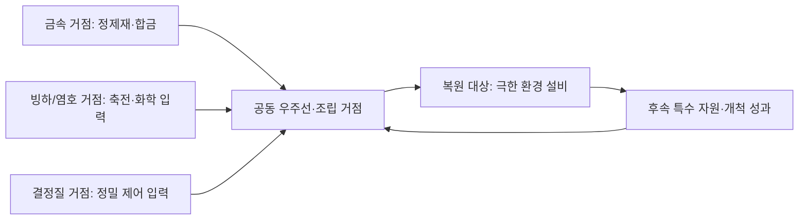

# 행성 특화·후반 공급망과 재방문

2026-09-08 후속 확정: 부재중 생산과 플레이어의 **항성계 내부 소형선 독립 운송**을 개발한다. [소관 규칙](../game/18-local-shuttles-and-distributed-industry.md)에 이번 공동 승선 예외·직접 운송·저장 경계를 둔다. 기존 단일 위치/자동 물류 제안과 충돌하면 이 후속 요구를 우선한다.

2026-09-08 후속 범위는 **텍스처·추가 계열만**으로 한정했다. 우선 후보 퇴적 분지·결정질 고원·알칼리 광화대 3종을 구현했다. 아래 후보 전체와 추가 공급망 경제를 완료한 뜻은 아니다. [제작/확인](../production/56-planet-surface-materials.md).

2026-09-08 사용자가 이 방향을 승인하고 개발을 요청했다. **복수 생산 거점·직접 운송·첫 P3 소비처를 구현**했으며 실제 규칙과 확인 범위는 [제작 기록](../production/55-planet-supply-and-tier3.md)을 따른다. 아래 신규 계열 후보·P4/P5·원격 생산·대체 공급 보장까지 모두 구현한 것은 아니다. 예시 수치는 최종 밸런스 확정값과 구분한다.

기존 자원 ID·분포의 소관은 [광물·보석](14-minerals-gems-and-enhancement.md), 제품은 [생산 단계](15-terraforming-production-progression.md), 계약·재화는 [경제](05-economy-and-progression.md), 렌더는 [복합 표면 구조](../technical/09-planet-surface-materials-and-biomes.md)다. 이 문서는 **행성별 생산 역할과 그 사이의 조달 관계**를 연결한다. [현재 렌더 적용 감사](../production/53-planet-coverage-audit.md)의 모든 모델 연결 확인을 후반 경제의 완성으로 해석하지 않는다.

## 1. 판단: 15계열은 출발점이며 최종 상한이 아니다

최초 검토 당시 15개 중 6개는 착륙 불가 거대행성이고 지상 탐험 계열은 9개였다. 후속 텍스처/외형 구현으로 현재 신규 은하는 18계열 중 12계열에 착륙할 수 있다. 외형 수만 늘려서는 서로 다른 곳을 방문할 이유가 생기지 않는다. 반대로 같은 암석형 두 행성이라도 경제적으로 채굴 가능한 광체·수율·처리 환경·입지·계약이 다르면 다른 공급 역할을 가질 수 있다.

따라서 15개를 먼저 30개로 늘리는 목표보다 **현재 자원의 특화 공급처 → 제품 수요 → 운송/거점 → 이를 알아볼 수 있는 외형** 순서로 확장한다. 현재 원소·보석·판타지 소재로 만들 수 있는 역할은 기존 계열과 지질을 먼저 활용하고, 기존 지형·채취 방식으로 담기 어려운 역할에 새 계열을 추가한다.

새 시각 계열의 채택 기준은 다음 중 하나 이상이다.

- 기존과 다른 중요한 공급·가공 역할이 있고 소비 제품이 정해져 있다.
- 현재 지형/환경으로 표현하기 어려운 채취·이동·개척 방식을 제공한다.
- 재료는 같아도 품위·접근 비용·생산 조건·물류 입지 때문에 유효한 대안이 된다.

색만 다르고 얻는 것·하는 일·환경 변화가 같으면 별도 계열보다 시드 변형으로 다룬다. 새 재화를 추가할 때는 공급지·가공·소비·재고·운송·표현·막힘 방지까지 함께 정의한다.

## 2. 현실에서 가져올 원리

**원소가 존재하는 것과 채산성 있는 광상을 얻는 것은 다르다.** USGS는 희토류 자체가 극도로 드문 것은 아니지만 경제성 있는 광상은 흔하지 않으며, 탄산암·알칼리 관입체와 풍화 산물이 중요한 공급 지질이라고 설명한다. 이는 지구 광상 자료이며 특정 외계행성의 채굴 가능 매장량 관측은 아니다. [USGS 광상 모델](https://www.usgs.gov/publications/carbonatite-and-alkaline-intrusion-related-rare-earth-element-deposits-a-deposit-model).

게임에서는 ‘다른 행성에는 그 원소가 우주적으로 0’이라고 설명하기보다 **탐사 가능한 깊이에서의 매장량·품위·가공 난도·추출 가능성**을 다르게 한다. 미량 존재는 채집 가능한 재고가 아니며, 행성 스캔의 ‘공급 불가’는 현행 기술로 유효 공급원을 찾지 못했다는 의미로 쓴다. 판타지 소재 2종은 별도의 가상 생성 규칙을 사용한다.

현실적인 다양성도 암석 색으로 다 담을 수 없다. 타이탄에는 메탄·에탄 액체 호수/바다와 두꺼운 대기가 있으며, 낮은 온도에서는 물 얼음이 암석 같은 역할을 한다. 타이탄은 위성이고 이 게임의 새 탄화수소 세계에 대한 **유사 환경 참고**일 뿐, 실제 타이탄 채굴권이나 경제성을 뜻하지 않는다. [NASA 타이탄](https://science.nasa.gov/saturn/moons/titan/facts/).

슈퍼지구는 질량/크기와 관련된 분류로 암석·가스 등의 구성이 다양할 수 있다. ‘슈퍼지구 전용 광물’처럼 자원을 하나로 묶지 않는다. 크기·중력·대기·조성·일사·지역 지질을 독립 축으로 유지한다. [NASA 슈퍼지구](https://science.nasa.gov/exoplanets/super-earth/).

## 3. 구현 전 조사에서 확인한 경제 경계

| 현재 경로 | 확인한 상태 | 후반 공급망에 주는 의미 |
| --- | --- | --- |
| `mineral_world.json` + `mineral_world.gd` | 10종 지질, 같은 기본 종류의 보조 지질 주력 광물을 합침 | 지질 역할은 있지만 혼합에 따라 자원 종류가 넓어짐 |
| 현행 주/보조 조합 30개 정적 대조 | `cratered + metallic`은 일반 산업 자원 10종 중 8종을 후보로 가짐 | 많은 종류의 보유만으로 특화를 평가하면 한 곳의 범용성이 높을 수 있음 |
| T4 이상 `profile.exotic` | 행성마다 성핵광·암흑광 중 한 종류를 선택 | 두 소재 동시 수요를 넣으면 자연 채굴 공급처가 분리됨. 현재는 티어/시드 중심이며 특수 지질 조건은 약함 |
| `production_tier2.json` | 공통 제품/후속 입력 제품 9종, 직접 원료는 철·구리·암석·얼음·규소·인산염 중심 | 초반 지역 생산 중심. 후반 일반 금속·희토류·특이 소재 전체 수요망은 미완성 |
| `ground_progression.gd` | 새 T1/T2의 유한 시작 자원과 외곽 탐험 보완 | 초기 진행 보장은 유지해야 하며 후반 특화 제한을 소급 적용하지 않음 |
| `space_stations.json` | 정거장 기본 거래 품목은 철·구리·암석·얼음·희귀 결정 | 현재 교역이 모든 후반 조달 실패의 대안이라고 주장할 수 없음 |
| `expedition_business.gd` | 다른 행성에 활성 계약이 있으면 신규 현장 건설/등록을 제한 | 현재 그대로는 여러 행성에 동시 생산 거점을 만드는 흐름이 막힘 |
| 같은 코드의 정산 | 상태를 `settled`로 바꾸고 시설·창고를 인계 | 정산 후 기존 공장을 계속 자기 공급처로 쓰는 권한은 없음 |
| `crew_authority.gd.step_surface` + 산업 `tick` | 착륙 중 현재 행성의 활성 사업만 갱신 | 다른 행성·항해 중 생산 누적과 상시 자동 운송은 미구현 |

위 ‘8종’은 원광 후보 집합의 정적 비교다. 실제 지역의 광맥 출현·매장량·품위·처리량을 보장하지 않으며 보석·시작 보급·교역까지 합친 인벤토리 수량도 아니다. 후반 수요를 설계하기 전 현재 모든 자원이 효율적으로 자급 가능한지 단정하지 않는다.

## 4. 공급 특화와 부족분의 설계

각 행성의 경제 프로필은 주력 공급, 보조 공급, 미량/비채산성, 현지 조달 불가, 수입 수요를 구분한다. 기존 ‘주력 2~3종·보조 2~3종’은 출발 가이드이며 행성 전체의 원소 수를 제한하는 물리 법칙이 아니다.

- **기초 생존·첫 자동화:** 입문 지역의 철·구리·암석·얼음과 진행 보장량을 유지한다. 첫 로봇을 만들기 위해 행성 몇 곳을 먼저 순회하지 않게 한다.
- **중간 산업:** 같은 재료가 여러 행성에 나오더라도 주력 공급처의 유효 매장량·수율·공정 여건이 더 좋게 한다. 한 번의 소량 제작은 현지 조달, 큰 생산은 공급망이 유리할 수 있다.
- **후반 핵심 조합:** 일부 핵심 입력은 한 행성의 경제적 채굴 풀에 함께 배정하지 않는다. 성핵광/암흑광 같은 명시적 분리와 일반 재료의 비용 특화를 함께 사용한다.
- **고티어:** 모든 원료를 더 많이 주는 상위호환으로 만들지 않는다. 특수 공급과 극한 조건을 추가하고, 낮은 티어의 편한 대량 공급처도 후반 가치가 남게 한다.
- **혼합 지질:** 보조 지질을 추가했다고 광물 목록이 무제한 누적되는 방식을 피한다. 매장량/품위/접근 가능 예산을 함께 배정하고, 주요 수입 필요성이 없어지는 조합은 생성 규칙에서 검토한다.

고품위는 먼저 추출량·처리 비용 차이로 표현하여 광물별 재고 등급을 무작정 늘리지 않는 안을 추천한다. 동일 아이템에 품질을 추가한다면 기존 광맥 `quality`, 보석 품질, 정제품 순도를 혼동하지 않고 버전/스택 정책을 별도로 정한다.

경제적 비교는 같은 단위의 생산 묶음에 대해 `설비 투자 배분 + 채굴/정제 운영 + 운송 + 관리 시간`을 함께 본다. 현재 무료 성간 이동에 갑자기 연료비를 추가하지 않는다. 초기에 운송 비용은 실제 플레이 시간·화물 용량·적재 작업으로 평가하고, 후속 운송 서비스 가격은 별도 설계한다.

## 5. 추가·강화할 행성 역할 후보

아래 원료/산출물은 게임 제안이다. 지구 광상의 원리를 차용하더라도 특정 종류 행성에 해당 자원이 풍부하다고 과학적으로 보장하지 않는다. 기존 원소는 유지하고 새 기체·유기물 재료는 소비처와 함께 도입 여부를 결정한다.

| 역할 후보 | 공급과 소비처 제안 | 환경·시각·플레이 차이 | 판단 |
| --- | --- | --- | --- |
| 금속질 건조 세계 | 철·니켈·티타늄 → 구조·내환경 합금 | 어두운 노두·산화면·지하 금속 광화대 | 기존 `oxidized/metallic` 강화 우선 |
| 퇴적·인산염 세계 | 인산염·알루미늄 → 토양·정착 제품 | 층리·분지·퇴적 절벽 | `sedimentary`를 주 역할로 승격할 프리셋 후보 |
| 결정질·알칼리 광화 세계 | 희토류·규소·선별 광물 → 정밀 제어·고급 구동 | 결정질 노두·밝은 암맥·특화 정제 | `pegmatite/alkaline`의 주 역할과 외형 강화 |
| 염호·증발 분지 | 리튬 등 추출 가능 염수 성분 → 축전/화학 제품 | 염수·소금 지각·퇴적 경계·추출 공정 | 기존 `salt` 확장 또는 별도 프리셋. 현행 염원에 리튬이 있다는 뜻은 아님 |
| 탄화수소·유기물 세계 | 탄소계 원료 → 수지·막·복합재 후보 | 어두운 모래·연무·저온 액체·밀폐 처리 | 기존 15계열에 부족한 신규 후보. 새 자원/제작/액체 표현 필요 |
| 해양·군도 세계 | 물·염수 성분, 생태가 있을 때만 배양 원천 | 적은 육지·연안/해저 접근·부유 설비 | 새 접근/건축 기능 비용이 커 후순위. 기존 습윤 대륙과 구분 |
| 빙하·빙저 지열 세계 | 물 얼음·지질별 리튬/니켈, 저장·냉각 조건 | 얼음 껍질·균열·지열 경계 | 기존 빙하 3계열 강화. 현지 저온 가공은 후속 능력 |
| 고온·용융 지각 세계 | 내열 원료·국소 에너지, 조건부 성핵광 | 냉각 전선·용암 지각·접근 설비 | 기존 `volcanic` 강화. 성핵광은 가상 분포 |
| 심부 특이 구조 세계 | 조건부 암흑광 → 안정화 코어 | 깊은 구조층·균열·별도 탐사 신호 | 가상 심부 프로필, 기존 지질 위 특수층으로 우선 구성 |
| 거대행성 대기 채취 | 공정용 기체 후보 → 후속 화학/에너지 | 궤도 수집·저장·처리 | 착륙 유지 금지. 신규 궤도 산업이 있을 때 확장 |

추천 우선순위는 기존 금속·빙하·화산의 역할 명확화 → 퇴적/결정질·알칼리 프리셋 → 염호 추출과 탄소계 공정 → 해양/거대행성 산업이다. 탄소계 공정을 도입할 때도 입문 레시피를 소급 교체하지 않는다. 신규 외형 수는 이 역할과 제작 범위를 확정한 뒤 정하며 15개를 상한으로 고정하지 않는다.

## 6. 후반 조달 흐름 예시

**한 행성을 끝내고 버리는 진행에서, 복원 대상과 공급 거점을 구분하는 진행으로 확장한다.** 예를 들어 극한 행성의 P4 설비 한 묶음을 만들 때 다음 연결을 사용할 수 있다.

화살표는 목표 생산망이며 현행 완성된 레시피/자동 운송이 아니다. 최초 극한 설비는 앞 단계의 재료로 제작해 접근한다. 목적지에서만 얻는 특수 재료를 그 목적지에 처음 접근하는 장비의 유일한 선행 재료로 요구하지 않는다. T4 원광의 기존 등급 3 최초 채집 경로도 보존한다.

출발 가이드로 P1은 한 지역, P2는 외곽/지하와 선택적 다른 공급처, P3는 두 공급 역할의 조합, P4/P5는 3~4개 주요 공급 역할을 제안한다. 이는 필수 방문 행성 수나 동시 기지 수 확정이 아니다. 공급 역할이 한 행성에 일부 겹치거나 교역으로 대체될 수 있다. 개별 나사 하나가 아니라 생산 배치·설비 세트·큰 복원 단계별로 조달한다.

첫 공급지 발견과 설치는 탐험의 가치다. 이후 재방문은 쌓인 물량 회수·증설·새 광체 개발·연구·계약 갱신 같은 결정을 제공해야 한다. 단지 재료 2개가 부족해 같은 길을 반복 왕복하는 것을 후반 콘텐츠로 삼지 않는다.

## 7. 공급망이 성립하려면 필요한 거점·물류

### 복원 계약과 생산 권한 분리

최초 제안은 활성 복원 계약 하나를 유지하면서 별도 허가를 가진 공급 거점의 설치·보관·운영을 허용하는 것이었다. 이번 구현은 위 제작 기록을 따른다. `restoration_contract`와 `production_lease`를 분리하고 행성/구역별 기간·범위·인계 자산을 기록한다. 이하 기간·범위의 상세 구분은 후속 설계다.

정산 선택은 복원 성과의 지급과 생산 시설의 보유/인계 여부를 분리해 보여 준다. 시설을 넘겨 잔존가치를 받고 같은 시설을 다시 자기 공장으로 쓰지 않는다. 공급 거점을 유지하면 인계 대금에서 해당 자산을 제외하거나 별도 권한 비용을 반영한다. 원주민/타 세력의 개발 권리는 기존 협약 규칙을 따른다. 이미 정산된 기존 저장에 권리를 소급 복구하지 않는다.

### 생산과 운송을 별도로 성장

1. **저장·재방문:** 여러 현장 재고/광맥/설비를 보존하고, 방문 중 생산한 실제 화물을 공동 선박으로 운반한다. 떠난 현장이 멈춘다면 상태를 명시한다.
2. **세션 중 비활성 현장 생산:** 검증된 광맥·시설·전력·운반 연결만 집계 계산한다. 입력·매장량·창고 여유가 소진되면 멈춘다. 여러 행성의 3D 장면을 모두 실행하지 않는다.
3. **대량 직접 운송:** 화물 증설·현지 정제·묶음 적재로 왕복당 작업량을 줄인다. 생산 배치에 맞게 현재 슬롯/스택 한도를 조정한다.
4. **반복 항로 위탁:** 한 번 개척한 경로를 운송 계약·별도 물류선으로 운영하는 후속 선택. 실제 출고 재고·이동 화물·도착 재고를 한 원장으로 관리한다. 플레이어가 각각 별도 함선을 타는 협동 다중 함대로 자동 확대하지 않는다.

비활성 생산은 호스트 세션의 게임 시간으로 시작하는 안이다. 현실 시계 기반 오프라인 생산을 함께 승인하지 않는다. 호스트가 결과·마지막 계산 시각·재고·광맥 고갈을 저장하고 재접속/재방문으로 이중 지급하지 않는다. 손상/붕괴 등 미구현 위험을 보이지 않는 곳에서 임의 발생시키지 않는다.

출항 전에 부족 제품·대체 공급처·보유/예약 재고·예상 적재량을 같은 조달 계획으로 묶는다. 화면은 이후 FIELD v1의 지도·아이콘·제품 카드로 만들며 이번에는 UI를 구현하지 않는다.

## 8. 은하 생성과 막힘 방지

시드에 자원이 존재하는 것만으로 진행 가능성을 보장하지 않는다. **현재 항속·장비·허가·조달 예산으로 도달하는 공급처**가 필요하다. 주력 항로마다 필요한 다음 단계의 공급 후보와 적어도 하나의 대체 경로를 확보하는 생성/계약 규칙을 제안한다. 대체 경로는 다른 광체·행성·제한된 교역·조사 계약일 수 있으며 모든 재료를 모든 정거장에서 무제한 판매하지 않는다.

- 지질·환경적으로 가능한 후보 안에서 역할을 배정한다. 플레이어가 부족해졌다고 기존 시드 광맥을 재추첨하지 않는다.
- 지역 한 곳의 고갈·매각·접근 실패가 전체 은하의 필수 제작을 영구 차단하지 않게 한다.
- 필수 공급처와 대체 경로는 크기·항속·기술·기후 접근 요구까지 함께 확인한다. 최초 제작에 자기 산출물을 요구하는 순환 잠금을 금지한다.
- 성핵광과 암흑광은 다른 공급처를 확보할 명확한 후반 목표로 활용하되 모든 기초 소모품에 강제하지 않는다.
- 다른 호스트 세계에서 재화를 가져와야 하는 진행을 전제로 하지 않는다. 같은 은하·호스트 소유 경계 안에서 해결 가능해야 한다.

## 9. 제안 데이터와 개발 순서

예정 `planet_economy_profiles`는 지질별 채산성·주/보조 공급·수입 수요·현지 공정 조건·능력 태그를 가진다. 기존 자원 지질을 중복 정의하지 않고 ID로 참조한다. `supply_regions`는 발견된 후보·항로·접근 조건을, `production_leases`는 세계 소유 거점·권한·정산 관계를, `logistics_orders`는 예약/출고/운송/도착의 물량을 담당한다. 파일명과 구조는 구현 때 정한다.

순서는 다음을 추천한다.

1. 기존 재화의 후반 소비처와 주력/보조/수입 표를 정한다. 새 원료는 기존 것으로 해결되지 않는 역할만 추가한다.
2. P3 대표 제품 하나의 두 공급 역할을 만들고 유효 광맥·접근 경로·공급권 보존·직접 운송을 연결한다.
3. 비활성 생산과 적재 편의를 연결한 뒤 공급 역할을 확대한다. 공급망이 멈추는 상태에서 다행성 상시 생산을 전제로 밸런스를 정하지 않는다.
4. 부족한 역할에 신규 행성 외형·표면·채취 방식을 제작한다. Blender·INK 실제 렌더·ElevenLabs 및 기본 플레이 품질 기준을 따른다.
5. P4/P5와 반복 항로 위탁을 별도 단계로 확장한다. 15계열 렌더 존재 수를 경제 완료 지표로 쓰지 않는다.

구현 전 검토는 제한된 제작 의존 그래프와 도달 가능한 공급 후보로 한다. 한 행성 자급 우회, 첫 장비 순환 잠금, 매각 후 공급 상실, 동일 화물 이중 계산을 확인 대상으로 둔다. 실제 최소 실행은 한 대표 두 행성 조달→제작→저장/재방문 흐름이며, 이번 문서 작업에서는 게임 테스트·렌더·새 자산 제작을 하지 않았다. 코드/데이터 정적 확인과 현실 근거 조사만 수행했다.
