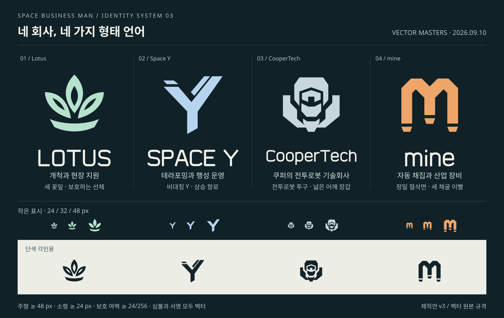

# 기업과 살아 있는 우주 공간

2026-09-10 후속 요청: 심볼의 품질을 높이고 [커밋별 작업 계획 SP00~SP11](../planning/16-space-corporations-commits.md)으로 나누어 진행한다. 아래 S01~S05는 기능 묶음이며 실제 작업/완료 상태는 커밋 계획에서 관리한다.

2026-09-10 **설계 초안**. 기업의 심볼·역할, Space Y 관리 화성, 시드별 거점·항로·선박·사건을 함께 설계한다. 사용자 확정 방향과 아래 연결 제안을 구분한다. 최초 초안은 문서와 2D 시안이었다. 현재 S01의 기존 실물 표식·조사·기업 기록은 [SP02 구현](../production/108-corporate-presence-sp02.md)에 연결했으며 SP03 복원 화성과 SP04 궤도 교역도 아래 구현 기록에 연결했다. 나머지 우주 활동은 설계 단계다.

## 1. 사용자 확정 방향

- Lotus, Space Y, CooperTech를 플레이하면서 자연스럽게 이해할 수 있게 한다. 각 회사에 식별 가능한 심볼을 둔다.
- Space Y는 SpaceX를 모티브로 한 테라포밍 선발 기업이다. 이미 테라포밍에 성공해 관리하는 행성을 두며, **태양계 화성은 테라포밍된 상태로 등장**한다.
- 회사가 관리하는 공간에는 전투기·무역선 등 활동 주체가 필요하다. 행성 사이를 이동하며 거래한다는 느낌을 만든다.
- **쿠퍼테크(CooperTech)**는 **쿠퍼가 설립하고 사장으로 이끄는 전투로봇 기술회사**다. 종전 회사와 신봉/종교 설정을 대체하며 장갑·기계 구조를 중심으로 디자인한다.
- Lotus는 순수 창작 기업이다. 자동 채집기계·로봇 회사는 소문자 **mine**이다.
- 모든 요소를 항상 우주 화면에 띄울 필요는 없다. 시드마다 실제로 존재하는 활동과 흔적을 인지할 수 있어야 한다.

쿠퍼테크의 전투로봇 제조와 설립자/사장은 확정 설정이다. 회사의 대외 관계는 미정이며, 일상적인 산업 활동과 폐기/고장 로봇의 위험을 함께 제안한다. 화성은 앞선 추천안인 우주 경관과 궤도 교역을 첫 개발 기본선으로 둔다. Space Y의 악역 설정·기업 간 전쟁·Lotus의 숨은 목적은 이 요구에 포함되지 않는다.

## 2. 공간을 구성하는 기본 원리 — 제안

**기업이 운영하는 장소가 있고, 그 장소 때문에 배가 오가며, 작업과 사고가 흔적을 남긴다.** 이 인과관계를 행성·항만·선체·화물에 같은 심볼로 반복해서 보여 준다.

| 층 | 실제 존재하는 것 | 플레이어가 인지하는 방법 |
| --- | --- | --- |
| 거점 | 관리 행성, 궤도 항만, 채굴 작업장, 제한 연구 시설 | 행성 환경·야간 불빛·설비 실루엣·항만 표식 |
| 일상 활동 | 화물 운송, 접안 대기, 정비, 경비 순찰 | 출발/목적지가 있는 이동·적재 상태·편대 행동 |
| 사건 | 고장, 유실 화물, 구조 요청, 제한구역 경고 | 실제 선박/물건·신호·접근에 따른 상태 변화 |
| 흔적 | 빈 접안구, 오래된 비콘, 폐기 로봇, 배송 라벨 | 선박이 없을 때도 남는 모델·표식·짧은 기록 |

기업 활동의 밀도와 행성 티어는 별개다. 안전한 저티어 교역 중심도 있고, 고티어 무인 탐사권도 있다. **활동이 없는 공간도 의도된 지역 성격**으로 남긴다. 모든 행성·항성계에 네 회사를 균등 배치하지 않는다.

## 3. 네 회사의 역할과 시각 언어 — 제안

그림은 쿠퍼테크의 전투로봇 투구·어깨 장갑으로 교체한 **벡터 제작안 v3**다. 현재 원본·출력·변경 범위는 [전투로봇 심볼 제작 기록](../production/107-coopertech-sentinel-symbol.md)을 따른다. v0/v1/v2는 이전 회사·이전 문양의 과거 비교 자료이며 현재 제작 기준이 아니다. 최종 로고 승인·Blender 제작·게임 적용·INK 렌더 검수를 뜻하지 않는다. 색상은 제조사 식별 제안이며 게임의 선택·적대 상태 색상을 대체하지 않는다.

| 회사 | 플레이어가 기억할 한 문장 | 심볼과 도장 방향 | 장비의 형태·움직임 |
| --- | --- | --- | --- |
| **Lotus** | 나의 개척 현장을 지원하는 후발 회사 | 기존 HERON/보급 상자의 **세 꽃잎**을 정돈. 청록·크림 외장에 주황 심볼 | 둥근 보호 케이스, 접근하기 쉬운 정비부, 노출 화물 잠금장치. 접근→안전 대기→투하→이탈이 읽히는 지원선 |
| **Space Y** | 이미 행성을 바꾸고 일상을 운영하는 선발 회사 | **갈라지는 상승 궤적과 Y**. 백색·흑연색 외장에 푸른 식별부 | 긴 동체, 반복되는 표준 화물 모듈, 정리된 접안 장치. 무역선은 규칙적으로 출입하고 경비기는 짧고 정확하게 방향을 바꿈 |
| **쿠퍼테크(CooperTech)** | 쿠퍼가 이끄는 강력한 전투로봇 기술회사 | **전투로봇 투구와 넓은 어깨 장갑**. 흑연 외장·강철 표식·산화 적색 식별판 | 경사 장갑, 보호된 광학부, 견고한 동력부와 무장 고정부. 포탑/센서의 준비→조준→사격→냉각을 기계 동작으로 표현 |
| **mine** | 어디에서 일하든 보이는 자동 채집기계 제조사 | **두 채굴 이빨/갱도 아치가 만드는 m**. 산업 주황·짙은 프레임·크림 서비스부 | 노출 유압축, 교체식 집게·드릴, 넓은 하중 프레임. 채집·적재·정비 동작과 작업등으로 역할을 전달 |

Space Y는 재사용 우주 운송·표준화·대규모 산업이라는 모티브를 우리 형태로 옮긴다. SpaceX의 로고 글꼴·X 궤적·기체를 그대로 가져오지 않는다. 쿠퍼테크의 설립자 쿠퍼는 게임의 창작 인물이다. 심볼은 기계적 강도·정밀 기술을 표현하며, 기존 전투로봇의 위협적인 실루엣과 작은 붉은 기능 센서를 유지한다.

### 제조사와 운영사를 분리한다

mine이 만든 기계를 Space Y가 사용하거나 Lotus가 배송할 수 있다. 큰 선체/컨테이너 표식은 **운영사**, 작은 정비 명판은 **제조사**, 교역 화물 표시는 **상품/목적지**를 뜻한다. mine 로봇이 Space Y 항만에서 일한다고 mine 소유 행성으로 표시하지 않는다.

네 회사를 동일한 군사 세력으로 만들 필요는 없다. Space Y의 경비와 무역, Lotus의 보급, CooperTech의 전투로봇/보안 제품, mine의 산업 장비가 우선이다. mine 전투기나 네 회사 전용 수도를 기본 요구로 추가하지 않는다. 회사 간 납품 관계는 가능성을 여는 제안이며 인수·계열사·전쟁 관계는 미정이다.

### 심볼의 반복 사용

- 원거리: 고유 선체 실루엣·큰 도장 면·편대 형상으로 구분한다. 작은 로고를 억지로 확대하지 않는다.
- 근거리: 선체 옆면·상부, 화물 상자, 항만 진입 표지에 같은 심볼을 반복한다.
- 조사: 운영사 심볼 → 선박/시설명 → 지금 하는 작업과 목적지 순서로 표시한다.
- 기록: 첫 실물 발견 후 J의 기업 기록에 대표 모델과 짧은 소개를 남기는 안이다. 회사 소개 강의나 필수 팝업 네 개로 시작하지 않는다.
- 정식 제작 시 단색 양각/음각과 작은 HUD용 단순형을 함께 만든다. 심볼 실루엣은 단색에서도 구별되어야 한다.

## 4. 화성 — 모든 시드에서 만나는 Space Y의 실적

### 확정 설정과 제안 풍경

화성은 **Space Y가 테라포밍을 성공시키고 관리 중인 행성**이다. 모든 새 시드에서 이 정체성을 유지한다. 환경 개선 정도·해안선·거주 시설의 구체적인 형태는 제작 제안이다.

붉은 고지대와 큰 협곡의 인상을 남기고, 푸른 수역·녹색 저지대·흰 구름·푸른 대기 가장자리를 함께 보여 준다. 지구 모델을 녹색으로 복제하기보다 화성이 바뀌었다는 인상을 만든다. 야간에는 소수의 거주/산업 구역과 연결 불빛, 궤도에서는 환경 유지 설비·물류 항만이 보인다. 행성 전체에 건물을 균일하게 뿌리지 않는다.

이 환경은 **게임 세계의 미래 테라포밍 결과**다. 실제 천체 참조 정보와 분리된 게임 환경/운영 층으로 기록하고 스캔에서 `Space Y 관리 · 테라포밍 완료`로 설명한다. 원본 천체 자료의 출처를 허구의 해양·생태 데이터로 덮어쓰지 않는다. 행성 주소·궤도 정체성·티어도 환경 외형 변경 때문에 재추첨하지 않는다.

### 먼저 보여 줄 장면 — 제안

1. 지구 출항 시 Lotus의 선박/화물 심볼을 접한다.
2. 화성에 접근하면 복원된 경관과 Space Y 항만, 출입하는 무역선, 경비 순찰이 함께 보인다.
3. 화물을 실은 출항선과 빈 포드를 단 귀항선이 다른 작업 상태를 보여 준다. 같은 시각 화성 쪽으로 접근하는 선박도 둔다.
4. 항만 가까이에서 한 번의 짧은 교신으로 운영사를 알린다. 예시: “Space Y 화성 관제. 화물선 접근 중, 우현 통로를 유지하십시오.”
5. 스캔으로 복원 완료·운영사·방문 가능 범위를 확인한 뒤 자유롭게 출항한다. 화성 방문·교역을 첫 개척의 의무 코스로 만들지 않는다.

지구–화성 왕복은 행성 사이 무역을 처음 이해하는 항로다. 지구 쪽 목적지도 실제 주소/궤도 물류 지점으로 존재해야 한다. 지표 우주항 제작 전에는 관측 가능한 궤도 접안 구역으로 표현하며, 목적지 없는 장식 비행을 지구 무역이라고 기록하지 않는다.

### 접근 범위와 기존 규칙의 조정점

| 항목 | 현재 코드/규칙 | 추천하는 첫 범위 |
| --- | --- | --- |
| 화성 외형 | 기존 `mars.glb`·태양계 공통 경로 | 미래 복원 외형·Space Y 운영 정보 추가 |
| 지표 착륙·채굴·건설 | 태양계 전체 금지 | 지표 방문은 답변에 따라 결정. 우선 궤도 경관/교역부터 제안 |
| 화성 스캔·안내 | “태양계 · 테라포밍 불가 행성” | 복원 완료와 운영권 때문에 자유 개척 대상이 아님을 설명 |
| 정거장 | 태양계·입문 추천 목적지·실제 첫 성간 목적지 제외 | 화성 전용 고정 항만만 명시적 예외로 제안. 첫 성간 목적지의 정거장 제외는 유지 |
| 화성 성과 보상 | 플레이어의 복원 성과 없음 | 회사의 선행 성과를 플레이어 복원율·정산 보상으로 지급하지 않음 |

화성 교역을 채택하면 시작점에 물자 판매처가 생기므로 무료 출항 물자/Lotus 지원·재판매 수익과 함께 초반 공급을 확인한다. 현재 정거장 재고를 그대로 복사한 무제한 지원처로 만들지 않는다. 초반 무료 항해·자유 목적지 선정은 유지한다.

## 5. 시드별 기업 진출과 항로 — 제안

태양계의 지구 시작·복원 화성은 **공통 기준점**이고, 그 밖의 지역은 시드가 기업 진출·활동 상태를 결정한다. 같은 시드의 같은 주소에는 다시 방문해도 같은 거점과 연결이 있으며, 시간·사건 때문에 달라진 상태는 저장한다.

| 항성계 성격 | 거점/항로 구성 | 보이는 활동 | 배가 없을 때 남는 증거 |
| --- | --- | --- | --- |
| 운영 중심 | Space Y 관리 행성 + 항만 + 인접 물류 연결 | 대형 무역선·경비 편대·접안 대기 | 항만 설비·유지 위성·거주 불빛 |
| 개척 전선 | Lotus 지원 지점 + 개발 후보 + 물자 반입 | 보급선·탐사선·작은 화물선 | 보급 상자·현장 비콘·회사 표지 |
| 산업 공급권 | 광물 공급지 + mine 작업/정비 시설 + 반출 항로 | 광석 운반선·정비선·자동 채집기계 | 집하 포드·작업등·장비 명판 |
| 제한 연구권 | 쿠퍼테크 시험/보안 거점 + 제한된 물류 연결 | 봉인 수송선·감시 드론 | 경계 비콘·전투로봇 표식·폐기 로봇 |
| 쇠퇴 항로 | 폐쇄 접안 시설 + 끊긴 옛 항로 | 드문 회수선·구조 신호 | 파손 비콘·빈 거치대·표식이 남은 잔해 |
| 미진출 탐사권 | 기업 거점 없음 | 드물게 통과하는 탐사선 또는 선박 없음 | 자연 천체·미확인 신호. 기업 흔적을 억지로 보장하지 않음 |

복수 회사가 같은 항성계에 있을 수 있다. 하나의 주된 역할과 보조 활동을 먼저 고르고 지질·생산지·관리 행성·기존 정거장과 맞는 위치를 찾는다. 적합한 운영 행성이 없으면 궤도 중계 지점으로 연결하거나 그 조합을 제외한다. 가스/얼음 거대행성을 착륙 가능한 관리 행성으로 바꾸지 않는다.

### 생성 순서

1. 기존 천체·티어·지질·정거장 주소와 시작 제약을 먼저 읽는다.
2. 넓은 권역별 기업 진출 정도·물류 중심 후보를 독립 시드로 만든다. 모든 항성계에 같은 출현 확률을 적용하지 않는다.
3. 적합한 행성의 `미진출 / 개척 중 / 운영 중 / 철수`와 운영사를 정한다. 플레이어에게 자유 개발 후보를 충분히 남긴다.
4. 유효한 출발지·목적지 사이에 화물 항로를 만들고 소유 거점 경비 순환로를 별도로 둔다.
5. 그 항로를 사용하는 선박의 운영사·기종·화물 분류·운항 위상과 시설 흔적을 정한다.
6. 실제 활동에 맞는 고장·유실·경고 등 사건 후보를 붙인다. 발견하기 전부터 보상 사건을 매 프레임 추첨하지 않는다.

별도 난수 이름공간 예시는 `corporations-v1`, `sites-v1`, `routes-v1`, `traffic-v1`, `incidents-v1`이다. 새 로고나 선종을 추가해도 기존 지형·광맥·동굴·행성 티어의 난수 순서를 바꾸지 않는다. 인접 항성계를 어느 순서로 열어도 항로 양 끝이 일치하도록 연결 ID는 정렬한 주소 쌍에서 만든다.

최소 발견 보장은 **시작 플레이 구간의 읽기 쉬운 접점**에 적용한다. 태양계에서 Lotus와 Space Y를 보고, mine은 제조 명판/기존 로봇으로, CooperTech는 후속 탐험의 비콘·제품·폐기 로봇으로 알 수 있다. 모든 첫 행성에 네 기업의 우주선을 소환하거나 정거장이 없어야 하는 첫 성간 목적지에 거래 시설을 넣는 보정은 하지 않는다.

## 6. 선박이 정말 일하는 것처럼 보이는 조건

### 역할별 제작 우선순위 — 제안

| 대상 | 멀리서 읽힐 구조 | 필요한 행동 | 첫 범위 |
| --- | --- | --- | --- |
| Space Y 무역선 | 길쭉한 중앙 동체 + 교체식 대형 화물 포드 | 접안 해제·가속·순항·제동·대기·접안, 적재/빈 포드 구별 | 가장 먼저 신규 제작 |
| Space Y 경비 전투기 | 작은 동체 + 구별되는 날개/추진 배열 | 둘 이상 간격 유지, 항만 순찰, 접근선 확인·복귀 | 선체·순찰부터. 실제 우주 교전은 별도 단계 |
| Lotus 우주 수송선 | 보호 외장 + 외부 화물 잠금부 | 개척지 방향 운송, 보급 인계 | 기존 지상 HERON과 역할을 구분해 후속 제작 |
| mine 산업 운반/정비선 | 노출 프레임 + 기계/광석 포드 + 정비 암 | 작업장 접근·포드 인계·정비 | 기존 로봇/화물 표식 접점을 먼저 적용 |
| CooperTech 봉인 수송선·감시기 | 장갑 프레임 실루엣 + 보호 센서·봉인 격실 | 제한 시설 출입·정렬 정지·센서 추적 | 표식·비콘·지상 로봇 연결 후 확장 |

현재 HERON은 덕트 팬과 현장 투하 구조를 가진다. 이를 진공 우주에서 팬만 돌리며 순항시키지 않는다. 지상 배송 모델을 재사용하려면 우주 추진/분리 모선 구조와 역할을 먼저 설계한다. 첫 제작의 범위를 줄이려면 Lotus는 기존 지상 보급선·상자만으로도 존재를 전달할 수 있다.

### 운항 상태

`적재/접안 → 출발 허가 → 가속 → 순항 → 감속 → 접근 대기 → 접안/하역`을 공통 상태로 둔다. 선박마다 속도·회전·화물 상태가 역할에 맞아야 한다. 행성 공전 위치를 따라 목적지 항만과 접근 경로도 움직이고 항성·천체·플레이어의 안전 공간을 관통하지 않는다.

- 같은 배는 같은 ID·운영사·항로·화물 임무를 유지한다. 카메라를 돌리거나 성간 왕복할 때 새 선박/보상으로 바뀌지 않는다.
- 현재 화면 안에서 출현/소멸하지 않도록 항만 가림·충분한 거리·화면 밖에서 표현 단계를 전환한다. 관찰 중인 선박은 더 높은 우선순위로 유지한다.
- 항로는 직선 대각선 선 하나로 우주 화면 전체를 덮지 않는다. 선택한 배나 지도에서 목적지·이동 방향을 확인한다.
- 무역선 적재 상태와 접안 행동을 함께 바꾼다. 화물선 수가 적더라도 목적 있는 왕복이 반복되면 공간이 운영된다는 인상을 준다.
- 첫 항해를 순찰 검문·충돌·강제 교전으로 막지 않는다. 첫 경비 구현은 이동·감시까지이며, 공격을 표시하면서 실제 판정이 없는 교전으로 꾸미지 않는다.

NPC 무역은 회사/항만 사이의 세계 활동이다. **플레이어 거점 간 운송을 자동 대행하는 기능은 추가하지 않는다.** 첫 표현 단계에서는 NPC 화물 운항과 기존 상점의 유한 재고를 분리한다. 물류 도착에 따른 재입고·가격 변동을 넣는 단계에서는 실제 배송 원장·수량·중복 방지를 연결해야 하며, 단순 배경 비행이 경제 시뮬레이션 완성을 의미하지 않는다.

## 7. 일상에서 이어지는 사건 — 후보

큰 사건 사이에는 조용한 정상 운항을 둔다. 접근할 수 있는 대상·행동·준비/성공/실패가 마련된 사건부터 넣는다. 아래 행동을 새로 구현하기 전까지 F 버튼 한 번으로 완료하는 대체품을 사건 완성으로 기록하지 않는다.

| 사건 후보 | 사전 단서 | 플레이어의 행동 | 지속되는 결과 | 필요한 선행 기능 |
| --- | --- | --- | --- | --- |
| Space Y 항만 출입 대기 | 점멸 유도등·먼저 진입하는 화물선 | 대기 구역 유지 또는 다른 곳으로 비행 | 앞선 배가 접안하고 통로가 열림. 일상 장면으로 보상 없음 | 항만 대기열·접근 경로 |
| 운송 중 유실된 포드 | 불균형 화물선·같은 운영사 라벨 | 실제 포드에 접근해 회수하고 항만 인계 | 해당 포드 제거·한 번의 인계 기록·작은 운송 대금 후보 | 우주 화물 회수·적재·거래 원장 |
| Lotus 지원선 지연 | 정지한 지원선·짧은 정비 요청 | 요청 물자를 싣고 직접 전달하거나 지나감 | 해당 지원선의 작업 재개. 기존 필수 보급을 인질로 삼지 않음 | 선박 간 인계·유한 계약 |
| mine 작업장 고장 | 멈춘 채굴 암·견인 대기 포드 | 예비 부품 운반·외부 정비 장치 조작 | 기계 재가동·정비 기록/부품 대가 | 작업장 실물·정비 상호작용 |
| CooperTech 감시 경계 | 전투로봇 문양의 경계 비콘·센서 추적·접근 경고 | 관측·우회·제한선 안쪽 조사 선택 | 조사 정보 또는 사건 상태 변화 | 감시 범위·경고 전조. 적대 대응은 회사 관계 결정 후 |
| 폐기 로봇 화물의 흔적 | 봉인 수송 컨테이너·훼손된 CooperTech 명판 | 좌표를 따라 지상 잔해 조사 | 기존 폐기 전투로봇 사건과 기업 정체 연결 | 우주 단서와 지상 사건 ID 연결 |
| Space Y 경비의 상선 구조 | 정상 항로에서 벗어난 선박·경비 집결 | 안전거리 관찰·보조 수송 또는 이탈 | 구조 성공/실패 상태·잔해/항로 정보 | 선박 손상·구조. 실제 전투는 후속 |

고티어에서는 지상·우주·다른 행성의 단서 연결을 늘릴 수 있다. 기존 [사건형 탐험](21-exploration-incidents.md)의 T4/T5 장기 원정 후보와 연결하되, 회사 로고 추가만으로 그 콘텐츠가 구현되었다고 기록하지 않는다. 해적은 별도 활동권을 가지며 CooperTech 심볼을 모든 해적선의 기본 표식으로 쓰지 않는다.

## 8. 표시·소리·성능·협동의 경계

### 보여 주는 우선순위

1. 가까운 행성·항만·선박의 실제 모델과 모션.
2. 선택/조준한 대상의 심볼·현재 활동·목적지.
3. 발견한 항로와 운영 거점의 지도 정보.
4. 항만 교신·작업 흔적·J 기록으로 보완.

처음부터 미탐사 쿠퍼테크 제한 시험 시설을 지도에 확정 공개하지 않는다. 센서로 존재만 파악하면 미확인 신호로, 조사하면 실제 식별 정보로 바뀐다. 기업색과 위험색은 분리하고 경고에는 형태·범위·짧은 이유를 함께 표시한다. 창이 열린 동안 개인 조종·발사 입력과 불필요한 교신 반복을 막고, 다른 승무원의 세계 진행은 유지한다.

진공의 외부 선박 소리는 관제 무전·기체 내부 진동·탐지기의 합성 피드백으로 구분한다. Lotus는 친근한 지원 어조, Space Y는 간결한 운항 관제, CooperTech는 건조하고 정돈된 안내, mine은 작업 확인음을 제안한다. 실제 인물·기업 음성을 흉내내지 않으며 필요한 새 효과음·음성은 ElevenLabs로 제작하고 출처/프롬프트와 게임 재생을 기록한다. 첫 만남 교신은 상태가 바뀔 때만 짧게 재생한다.

### 시뮬레이션은 관심 지역에만

| 범위 | 유지하는 것 | 계산 방식 제안 |
| --- | --- | --- |
| 먼 항성계 | 거점·항로 정의, 운항 시간표, 변경 기록 | 시드로 지연 생성. 선박마다 Node/물리/매 프레임 갱신 없음 |
| 같은 항성계의 먼 항로 | 현재 운항 위상·간단 위치·가시 신호 | 호스트 게임 시간에서 위치 계산, 가벼운 저빈도 갱신 |
| 승무원 주변/관찰 대상 | 선박 모델·회피·접안·센서·사건 | 필요한 대상만 실제 동작·네트워크 관심 집합에 포함 |

초기 화면 예산 예시는 **가까운 선박 6척, 먼 실루엣 12척, 큰 상호작용 사건 1개**다. 확정 성능 수치가 아닌 제작 시작 상한이며 네 회사 수를 채우는 목표가 아니다. 화면 품질/LOD는 개인 설정을 따르되 이미 선택한 물체·호스트 판정·사건의 존재를 변경하지 않는다.

FINCH로 다른 행성에 간 승무원을 포함해 모든 활성 플레이어의 관심 영역을 합쳐 호스트가 처리한다. 호스트 카메라에 안 보인다고 게스트 앞의 배/사건을 없애지 않는다. 각 클라이언트는 자기 화면의 렌더만 줄인다. 같은 회사 화물이나 사건 보상은 6명이 각각 중복 수령하지 않는다.

시드는 배치·초기 상태를 결정하고, 호스트 세션 게임 시간은 운항 위상을 결정한다. 거래/회수/파괴/완료는 호스트 변경 원장에 기록한다. 저장·재접속에서 시간과 ID·미수령 화물을 복구하고 재추첨/재지급하지 않는다. 게임 종료 후 현실 시간 배송은 별도 승인 없이 추가하지 않는다.

## 9. 데이터·코드 연결점 — 구현 전 제안

| 제안 데이터 | 책임 |
| --- | --- |
| `corporations` | `lotus`, `space_y`, `coopertech`, `mine`의 표시명·심볼·도장·역할·통신 음색 |
| `corporate_sites` | 고정 화성 예외, 시드 시설 유형·운영사·환경 운영 상태·접근 정책 |
| `shipping_routes` | 출발/도착 주소, 운영사, 화물 분류, 시간표, 운항/중단 상태 |
| `traffic_vessels` | 제조사·운영사·선체·항로 ID·운항 위상·표현 단계 |
| `space_incidents` | 실제 선박/시설 참조, 발견·진행·종결·보상 처리 |
| 저장 확장 | `corporate_rules_version`, `traffic_epoch`, 거점/선박/사건 변경분과 영수증 |

이름은 설계용 제안이며 해당 파일/필드가 구현돼 있다고 가정하지 않는다. 새 회사 ID는 `coopertech`, 표기는 **쿠퍼테크(CooperTech)**다. 기존 `illuti_dormant_combat_robot` 사건 ID·이미지 경로는 저장/시드 재현용 호환 식별자로만 유지한다. 새 회사/콘텐츠 ID에 과거 접두사를 쓰지 않는다. `Spcae Y`는 **Space Y**로 통일한다.

현재 확인한 연결점은 `scripts/domain/universe.gd`의 태양계 참조·착륙 제한, `scripts/world/solar_planet.gd`의 화성 모델, `scripts/domain/space_station.gd`의 출현/교역, `scripts/ui/first_departure.gd`와 `stellar_transit_overlay.gd`의 안내/스캔이다. Lotus 모델의 세 꽃잎은 `tools/build_lotus_support.py`의 `stamp`, mine 명칭은 `data/catalog.json`, 쿠퍼테크의 기존 전투로봇 형태는 `tools/coopertech_robot.py`에 있다.

화성 새 외형은 천체 기준 자료와 분리한 게임 층으로 추가한다. 새 세계부터 기업 배치 버전을 기록하는 것을 기본안으로 하며 기존 저장의 관리권·행성 환경·정거장·시설/광맥을 소급 재추첨하지 않는다. 기존 세계에 심볼만 적용하는 호환 변경과 화성 환경/항만을 추가하는 이행은 구분한다. 새 화성 이행 여부는 실제 구현 전에 별도 항목으로 기록한다.

## 10. 개발 묶음과 이번 작업의 상태

| 순서 | 결과물 | 완료를 판단할 최소 경험 |
| --- | --- | --- |
| S01 기업 식별 | 확정 심볼, 기업 표시 데이터, 기존 Lotus/mine/CooperTech 실물에 일관된 표식 | 보급 상자·작업로봇·폐기 전투로봇의 운영/제조사를 구별 |
| S02 화성과 정상 운항 | 복원 화성·항만, Space Y 무역선·경비기, 지구–화성 물류 상태 | 실제 우주 창에서 화성 경관과 출발→접근→접안을 관찰 |
| S03 시드 기업 활동 | 권역별 거점·운영 행성·화물 항로·흔적 생성 | 운영권/개척권/미진출권의 차이, 같은 장소 재방문의 연속성 |
| S04 작은 상호작용 사건 | 유실 포드·정비·CooperTech 단서부터 필요한 행동과 보상 | 실제 회수/운반/조사→상태 변화→한 번의 정산 |
| S05 후속 확장 | 회사별 추가 선종·방문 구역·우주 구조/교전·경제 연결 | 해당 기능별 플레이 범위를 별도 설계/확인 |

새 3D 자산은 [공통 Blender 제작](../production/49-common-blender-art.md)과 [INK v1](../production/06-rendering-quality-standard.md), 화면은 [FIELD v1](../production/22-uiux-guide.md), 음원은 [ElevenLabs 제작](../production/02-audio-and-elevenlabs.md)을 따른다. 실제 모델·가동 부품·효과·소리와 최소 게임 확인이 필요하다. 로고 시안이나 선박 숫자만으로 우주 품질 완료를 선언하지 않는다.

**최초 초안에서 한 일:** 기존 설정/코드 읽기, 소관 설계와 결정 기록 정리, 네 심볼의 2D 비교 초안. **최초 초안에서 하지 않은 일:** 게임 구현, 심볼 최종 확정, Blender/Godot 렌더·게임 실행·음원 제작/재생·네트워크 검증. 문서 작업이므로 게임 테스트는 실행하지 않는다. 이후 테스트도 저장소의 초기 개발 최소 확인 규칙을 따른다.

2026-09-10 **S01 / SP02 구현:** 기존 Lotus 선체·상자와 mine/CooperTech 로봇의 실물 표식, E 식별, J 기업 기록, 기존 저장의 선택적 식별 기록을 연결했다. [아트·현재 플레이·미확인 범위](../production/108-corporate-presence-sp02.md). 복원 화성은 아래 SP03에 연결했고 항만·무역선·시드 기업 활동과 우주 사건은 후속이다.

2026-09-10 **SP03 구현:** 모든 새 manifest에서 화성은 Space Y 복원 완료 관리 행성이다. 기존 저장은 소급 변경하지 않는다. [모델·스캔·출항 안내·확인 범위](../production/110-restored-mars-sp03.md).

2026-09-10 **SP04 구현:** 새 manifest에 화성 항만과 지구 물류항을 고정 예외로 연결했다. 기존 은하·첫 성간 목적지 제외는 유지하며 두 항만에서 유한 기초 물자를 독립 거래한다. [궤도 대기·모델·장부·검수와 경계](../production/111-orbital-ports-sp04.md). 앞선 표의 현행 비교는 초안 작성 당시 기록이다.
