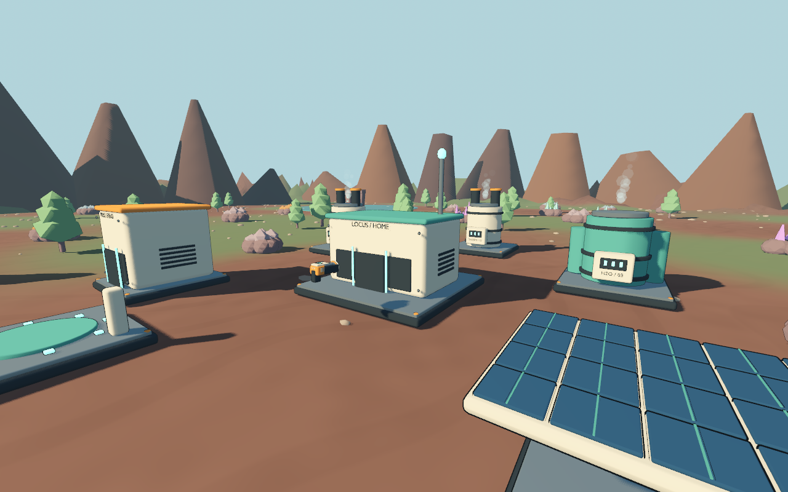
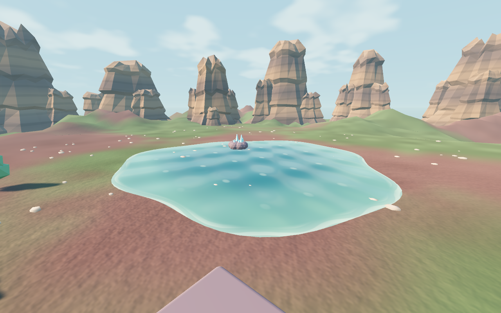

# 1.2 렌더링 품질과 성능

2026-09-09 현재 원정: 렌더가 꺼진 우주 뷰는 시각 계산도 멈추고 최신 스냅샷만 보관한다. 화면 복귀 및 착륙/이륙 준비 때 다시 반영한다. 지상 지도 인덱스 준비와 닫힌 메뉴 갱신을 줄인 실제 범위는 [백그라운드 최적화](83-background-update-and-save.md)를 따른다.

현재 시작·원정에서 사용하는 개인 그래픽 옵션과 시야거리는 [설정·원경 구현 기록](18-client-settings-and-view-distance.md)을 따른다. 아래의 기존 캠페인 설정은 과거 구현 이력이다.

현재 공식 표현은 [INK v1 고정 품질 기준](06-rendering-quality-standard.md)을 따른다. 아래 혼합 재질·조명과 수치는 INK 적용 전 1.2의 구현·측정 이력이다.

## 진단과 적용 방향

사용자 피드백: 모델링과 게임은 마음에 들지만 광원·그림자·그래픽 효과가 부족하다. 기존 모델을 살려 Godot 안에서 화질을 높이고, 필요한 모델만 보강한다.

1.1에도 방향광, 그림자, 툰 셰이딩과 약한 발광은 있었다. 다만 모든 재질의 거칠기를 최소 0.72로 올리고 발광을 45%로 줄여 금속·도장·상태등이 비슷하게 보였다. 환경광은 면 방향과 관계없이 같은 색이었다. 지면에는 색 무늬만 있었고 물에는 움직이는 색 띠만 있었다. 배경 산은 반복되는 원뿔 34개였다. 따라서 장비 전체의 폴리곤 수를 늘리는 것보다 조명·재질·표면 표현을 먼저 바꾸었다.

| 영역 | 1.2 실제 적용 | 비용을 제한한 방법 |
| --- | --- | --- |
| 조명 | 따뜻한 태양, 하늘에서 오는 환경광과 반사, ACES 톤매핑 | 태양 1개 유지, 하늘 갱신은 환경값 1단위 변화 시만 수행 |
| 그림자 | 가까운 곳에 해상도를 배분하는 4분할 그림자, 경계 혼합·바이어스 조정. 근접 화면에서 확인된 표면 얼룩은 바이어스 0.1·법선 바이어스 1.7로 수정 | 2K/4K 프리셋, 80~115m 범위 |
| 접지 음영 | SSAO로 기초판·부품 틈·지면 접촉부 강조 | 균형은 절반 해상도, 성능 우선은 끔 |
| 재질 | 금속 0.27, 에나멜 0.34, 차체 0.52 등 거칠기 분리, 물리 기반 하이라이트와 약한 가장자리 반사 | 같은 원본의 재질 인스턴스를 재사용. 자연물·발광면의 불필요한 외곽선 패스 제거 |
| 발광·실광원 | 상태등 HDR 발광, 절제된 글로우, 전력이 공급되는 가까운 설비의 빛 번짐 | 그림자 없는 지역 광원 최대 2/4/6개, 카메라 근처 42m까지만 선택 |
| 지면 | 월드 좌표로 계산하는 미세 요철·모래결·생태 패치, 더 완만한 주변 구릉 | 근거리에서만 요철, 42m 밖에서는 세부 요철 소거. 별도 고해상도 텍스처 불필요 |
| 물 | 불규칙한 물가 메시, 정점 물결, 움직이는 수면 법선과 반짝임, 물가 거품 | 12×96 분할, 불투명 수면. 화면 반사는 높음에만 제공 |
| 하늘·원경 | 구름과 태양광을 가진 하늘, 대기 원근감, 위성 표면 무늬 | 하늘에 TIME·카메라 위치를 사용하지 않아 매 프레임 반사 큐브맵을 재생성하지 않음 |
| 필요한 모델 보강 | Blender로 암벽 3종 추가, 태양광 패널 셀 간격·어두운 받침 보강 | 원본은 각각 4개 편집 객체, 출력은 각각 1메시·1,280삼각형. 26개를 재사용 |
| 거리별 모델 | Godot가 생성한 LOD를 프리셋에 따라 선택 | 장비 원본의 팬·포탑·피스톤·바퀴는 보존 |

카툰 색상과 실루엣·외곽선은 유지하면서 표면 반사와 명암을 보강한 혼합 표현이다. 장비 24종을 고밀도 모델로 다시 제작한 것은 아니다. 새 암벽의 [원본·출력 목록](../../art/blender/landscape/manifest.json)과 [Blender 생성 도구](../../tools/build_landscape.py)를 별도로 제공한다. 태양광 패널은 원거리에서 밝은 잡무늬가 생기던 표면을 확인해 어두운 받침과 셀 두께·높이 간격을 보강했다. 효과를 끈 비교 화면에서도 남는 문제여서 해당 모델을 수정했으며, 카탈로그 이미지도 다시 렌더했다. Blender를 재실행해 원본을 저장·내보내고 다시 열어 이미지를 출력한 뒤 정상 종료했다.

## 게임에서 선택하는 화질

설정 → 그래픽 품질에서 즉시 적용한다. `설정·진행 저장`으로 보관하며, 기존 세이브에 설정값이 없으면 **균형**을 사용한다. UI 해상도와 게임 규칙은 프리셋에 따라 달라지지 않는다. 값의 기준은 [graphics.json](../../우주-비즈니스/data/graphics.json), 적용은 [graphics.gd](../../우주-비즈니스/scripts/actors/graphics.gd)다.

| 옵션 | 성능 우선 | 균형 · 기본 | 높음 |
| --- | --- | --- | --- |
| MSAA | 2× | 2× | 4× |
| 태양 그림자 | 2K / 80m | 2K / 90m | 4K / 115m |
| 그림자 필터 | PCF | PCF | PCSS, 광원 각도 0.8° |
| 접지 음영 SSAO | 끔 | 절반 해상도 | 전체 해상도 |
| 화면 간접광 SSIL | 끔 | 끔 | 켬 |
| 화면 반사 SSR | 끔 | 끔 | 켬 |
| 발광 번짐 | 끔 | 켬 | 켬 |
| 지역 광원 한도 | 2 | 4 | 6 |
| LOD 허용 오차 | 4px | 3px | 1px |

화면 반사와 간접광은 화면 밖이나 가려진 물체의 정보를 사용할 수 없으며, 시점을 돌리면 결과가 달라질 수 있다. 이 한계 때문에 기본 화질은 하늘 반사를 사용한다. [Godot 환경·후처리 문서](https://docs.godotengine.org/en/stable/tutorials/3d/environment_and_post_processing.html)

그림자의 바이어스와 최대 거리는 접지감·표면 얼룩·해상도 사이의 절충이다. 높음에서만 광원의 각도를 사용해 멀리 드리워진 그림자가 더 퍼지도록 한다. [Godot 조명·그림자 문서](https://docs.godotengine.org/en/stable/tutorials/3d/lights_and_shadows.html)

하늘 셰이더가 TIME을 참조하면 반사 큐브맵도 매 프레임 갱신될 수 있다. 이번 구름은 정적인 패턴이며 테라포밍에 따라 하늘의 색과 구름의 밝기가 바뀐다. [Godot 하늘 셰이더 문서](https://docs.godotengine.org/en/stable/tutorials/shaders/shader_reference/sky_shader.html)

## 비교와 검증

동일 시드·로봇 30대·생태 100·카메라 4개·1280×800의 고정 장면을 사용한다. 시뮬레이션과 로봇 이동은 멈추고, 각 시점에서 3초 준비 후 240프레임을 기록한다. 이전 버전과 새 프리셋의 화면·JSON은 `test-results/graphics/`에 있다. 실제 작동 중 성능은 별도의 `benchmark.gd`로 측정한다.

측정 환경은 Apple M2 / Godot 4.7.2 / Metal Forward+다. VSync 해제 요청 후에도 macOS 표시 경로에서 약 60Hz의 간격이 남으므로, 16.6ms 부근 결과를 GPU의 최대 처리 속도로 해석하지 않는다. 이 Metal 실행에서 Godot의 GPU 타이머는 0을 반환하여 **미지원/측정 불가(null)**로 기록했다. CPU 렌더 시간과 전체 프레임 시간은 별도 값이다.

| 화질 / 고정 기지 전경 | 평균 프레임 | p95 | 환산 fps | 드로콜 | 렌더 삼각형 수* |
| --- | ---: | ---: | ---: | ---: | ---: |
| 1.1 이전 | 16.43ms | 17.24ms | 60.9 | 1,052 | 1,288,352 |
| 1.2 성능 우선 | 16.42ms | 17.70ms | 60.9 | 843 | 702,222 |
| 1.2 균형 | 16.44ms | 17.57ms | 60.8 | 826 | 854,838 |
| 1.2 높음 | 25.24ms | 30.34ms | 39.6 | 844 | 1,276,058 |

*렌더 모니터가 집계한 값으로 그림자와 추가 패스가 포함된다. 고유 모델 삼각형의 합이 아니다. 균형에서 기지 전경 드로콜은 1,052→826, 렌더 삼각형은 약 129만→85만으로 줄였다.

마지막 측정에서 균형의 네 시점은 평균 16.41~16.45ms였다. 높음은 평균 19.92~25.24ms로 약 40~50fps였다. 앞선 측정에서는 균형 기지 전경 18.87ms, 높음 34.80ms도 관찰했다. 반복 측정의 변동이 커서 모델 보강만으로 그 차이가 줄었다고 해석하지 않는다. GPU 타이머 부재와 공유 실행 환경 때문에 화질 비용은 대략적인 비교로 사용한다. 프레임 안정성이 우선이면 성능 우선을 선택한다. 한 Mac에서의 짧은 장면 측정으로 다른 해상도·GPU·장시간 플레이를 보장하지 않는다.

### 실제 엔진 화면

동일한 카메라의 1.1 / 1.2 균형 비교다. 별도 이미지 보정이나 생성형 이미지로 바꾸지 않았다.

| 1.1 | 1.2 균형 |
| --- | --- |
|  |  |
|  |  |

[높음에서의 반사·음영 화면](media/1.2-high.png), [근접 장비 화면](media/1.2-first-person.png), [960px 설정 화면](media/1.2-settings.png)도 확인할 수 있다. [측정 원본 JSON](media/1.2-rendering-measurements.json)을 함께 보관한다.

```bash
./tools/godot.sh --script res://tests/capture_rendering.gd -- --label=balanced
./tools/godot.sh --script res://tests/capture_rendering.gd -- --label=high
./tools/godot.sh --script res://tests/capture_rendering.gd -- --label=performance
./tools/test_game.sh --with-ui
```

`before` 폴더는 변경 전 1.1 코드를 실행해 저장한 결과다. 현재 코드에서 `--label=before`로 실행해 이전 렌더러를 재현할 수는 없다.

검증은 총 813개 확인 항목(기존 783 + 그래픽 30)을 통과했다. 실제 채광·펄스·건설·로봇 전투와 15단계 안내의 기존 검사를 함께 수행했고 엔진 오류는 0건이었다. 별도의 실행 중 벤치마크는 균형, 로봇 30대, 생태 100에서 평균 17.10ms / p95 19.42ms였다.

최종 macOS 1.2.0 ZIP을 새 폴더에서 풀어 ad-hoc 서명·버전·화면·정상 종료를 검증했다. 엔진 오류는 0건이었다. [실행 안내](../release/01-playing-and-building.md)와 `test-results/release.json`을 참고한다.

## 추가 도구·향후 판단

이번 개선에는 추가 소프트웨어나 유료 플러그인이 필요하지 않다. 기존 Blender와 Godot로 완결된다. 새 음원을 추가하는 작업은 없어 ElevenLabs 음원을 재생성하지 않았다.

전체 동적 GI(SDFGI), 전역 볼류메트릭 안개, 전 시설의 실시간 그림자 광원, 전 모델의 고밀도 재제작은 이번 버전에 넣지 않았다. 현재의 빈번한 건설·행성 변화와 Mac의 프레임 예산을 고려하면 기본값에 한꺼번에 추가할 항목은 아니다. 이후 실내 공간이나 영화적인 장면이 필요해지면 해당 장면에서 개별 비교한다. 고해상도 근접 촬영이 목표가 될 때는 장비별 UV·베이크 AO·마모 마스크·실루엣 디테일을 따로 제작하는 것이 다음 순서다.

## 데모 이후의 새 품질 후보

사용자의 전체 모델·배경 교체 방향에 맞춘 신규 예제는 [카툰 렌더링 품질 연구](04-visual-target.md)를 따른다. 본 문서의 1.2 전후 비교와 프리셋 측정은 당시 실행판의 이력으로 유지한다.
