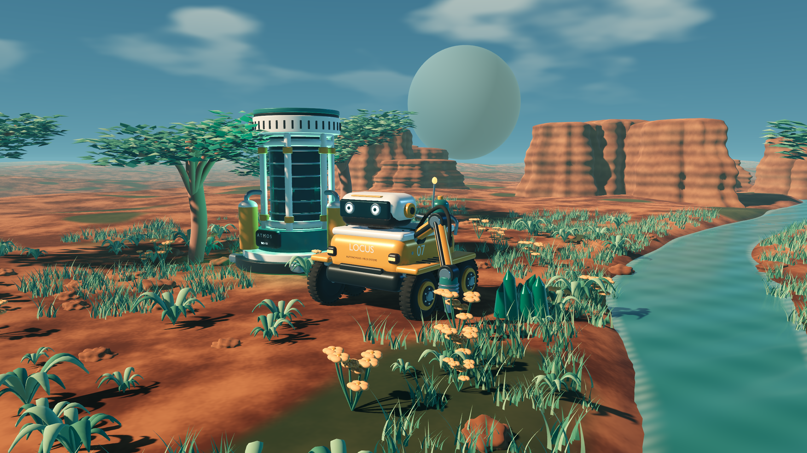
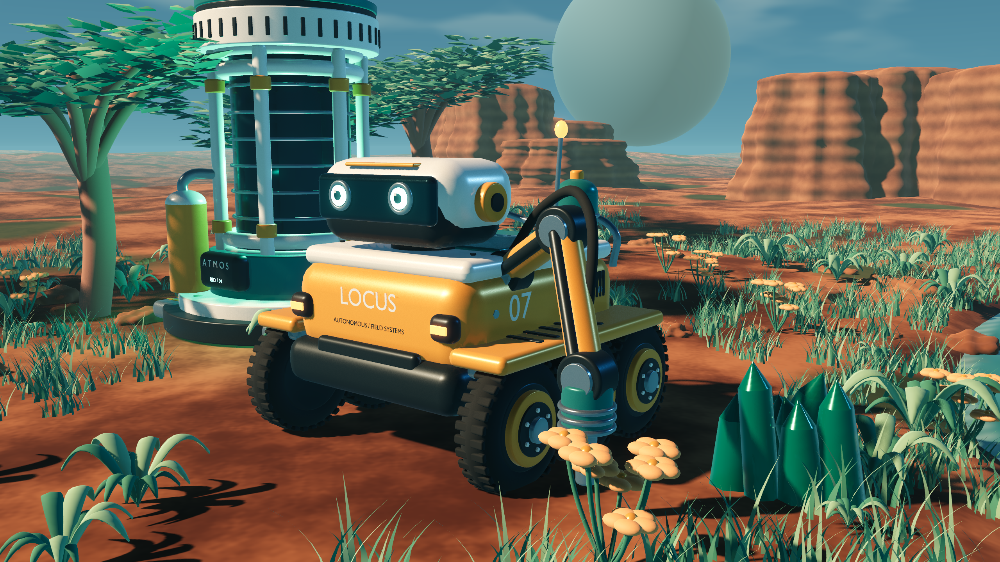

# 데모 이후 카툰 렌더링 품질 연구

## 요청과 상태

2026-09-06 사용자는 게임 고도화 전에 높은 품질의 카툰 렌더링 예제를 요청했다. 기존 3D 모델은 모두 교체할 예정이며 배경도 고도화하므로, 1.2와의 비교보다 새 장면의 전체 완성도를 검토한다.

이번 결과는 **검토용 아트 방향 후보**다. 최종 렌더링 방식·성능 예산을 승인한 것으로 기록하지 않는다. 기존 게임 전체에 이 품질을 적용한 상태도 아니다.

## 제작한 장면

`quality_showcase.tscn`은 캠페인·세이브 없이 실행되는 독립 Godot 장면이다. 신규 채광 로봇 M-07, 대기 설비 ATMOS, 사암·침식 절벽, 굽은 잎의 다육식물, 풀·꽃·수목으로 테라포밍 개척지를 구성했다. Blender 원본 12개와 게임용 GLB 12개를 [매니페스트](../../art/blender/showcase/manifest.json)에 기록했다.

- 로봇: 곡면 외장과 4분할 베벨, 6개 타이어의 트레드·허브·체결부, 서스펜션과 피스톤, 관절·유압 호스, 압력 용기, 광학 렌즈와 제조 표기.
- 재질: 도장·고무·금속·렌즈·발광을 분리한 물리 기반 반사와 정리된 카툰 형태·색 구성. 기존의 강한 단일 툰 조명보다 곡면과 반사를 읽는 혼합 표현을 검토한다. 손으로 그린 텍스처나 UV 마모 베이크를 완료한 것은 아니다.
- 환경: 연속 지표, 침식 절벽의 곡면과 지층 색, 물가의 젖은 표면·잔물결·포말, 물가와 식생 군집을 따른 풀 배치, 개별 잎으로 만든 수목, 꽃과 광물 군집.
- 조명: 따뜻한 주광·차가운 보조광, SSIL 간접광, SSAO 접촉 음영, SSR 수면 반사, 8K 방향광 그림자·PCSS, 거리 안개, ACES 톤매핑, 절제한 발광 번짐.
- 출력: 자동 촬영 2560×1440, 수동 관찰 1920×1080 내부 렌더, 4× MSAA. 창은 1600×900이며 스크린샷은 내부 렌더 해상도로 저장한다.

간접광·후처리 설정의 API 기준은 [Godot Environment 공식 문서](https://docs.godotengine.org/en/stable/classes/class_environment.html)다. 전체 화면의 세부를 판단할 수 있도록 심도 흐림은 적용하지 않았다.

## 실행과 조작

```bash
./tools/show_quality.sh
./tools/show_quality.sh -- --capture
./tools/godot.sh --headless --script res://tests/check_quality_showcase.gd
```

| 조작 | 기능 |
| --- | --- |
| 1 / 2 / 3 | 대표 전경 / 로봇 근접 / 넓은 풍경 |
| 왼쪽 버튼 드래그 | 주시점 주위 카메라 회전 |
| 마우스 휠 | 확대·축소 |
| Space | 자동 회전 켜기·끄기 |
| H | 제목·조작 안내 표시 전환 |
| F12 | 현재 화면 PNG 저장 |
| Esc | 예제 종료 |

촬영 명령은 UI를 숨긴 세 시점을 실제 엔진에서 렌더하고 PNG와 프레임 측정 JSON을 `test-results/showcase/`에 저장한 뒤 종료한다. `--quick`은 작업 중 첫 시점만 촬영하는 옵션이며 성능 측정을 대체하지 않는다. 자동 촬영과 수동 촬영은 일반 게임 저장 파일에 접근하지 않는다.

## 재제작

```bash
/Applications/Blender.app/Contents/MacOS/Blender --background --python tools/build_quality_showcase.py
./tools/godot.sh --headless --editor --import
```

원본은 `art/blender/showcase/`, 출력은 `우주-비즈니스/assets/models/showcase/`에 있다. 원본에서는 부품을 편집할 수 있고 GLB에서는 정적 재질별 메시를 합친다. 이번 장면은 형태·재질·환경을 검토하는 목적이며 로봇의 이동·채광 애니메이션과 게임 충돌·제작·AI 연결은 별도 제작 대상이다.

## 판단의 범위

이 예제는 화질을 우선한 소규모 장면이다. 대규모 건설·다수 로봇·절차적 월드에서 같은 프레임률을 보장하지 않는다. 실제 게임의 최소 사양이나 기본 화질로 확정하기 전에는 대표 플레이 부하에서 LOD·가시성·그림자 범위·간접광 비용을 검토해야 한다. 새로운 전체 자산 교체는 이 예제의 시각 방향을 검토한 다음 단계다.

SDFGI와 체적 안개의 조합은 `--experimental-gi`로 재현할 수 있다. 이 호스트에서 첫 촬영까지 2분 이상 지연되어 기본 예제에서는 끈다. 화면 출력은 확인했지만 안정적인 실시간 운용이나 별도 성능 측정이 완료된 옵션으로 취급하지 않는다.

## 실제 엔진 화면과 검증





[넓은 풍경](media/quality-study-landscape.png)도 촬영했다. 위 이미지는 Godot의 뷰포트를 그대로 PNG로 저장한 결과다.

Godot 4.7.2 / Apple M2 / Metal Forward+ / 2560×1440에서 각 시점 4초 준비 후 120프레임을 측정했다. 전경 평균 181.40ms, 근접 201.41ms, 풍경 196.07ms로 약 5.0~5.5fps였다. p95는 각각 207.52 / 231.71 / 226.45ms다. 현재 설정은 화질 연구용이며 플레이용 프레임 예산을 만족한다고 볼 수 없다. 공유 호스트의 짧은 측정이고 GPU 실행 시간과 전체 표시 간격을 분리한 결과는 아니다. [측정 원본](media/quality-study-measurements.json)을 참고한다.

최종 세 시점 캡처와 정상 종료에서 엔진 오류 0건을 확인했다. 별도 headless 검사로 장면 구성, 로봇 로딩, 세 카메라, 자동 회전과 UI 전환을 확인했다. Blender 원본 12개와 GLB의 실제 삼각형 수를 매니페스트와 대조했다. 기존 캠페인 규칙은 수정하지 않아 전체 게임 규칙 검사를 이번 예제의 검증 결과에 더하지 않는다.

## 후속 검토: 굵은 검은선 카툰

사용자 참고 화면에 맞춰 로봇·자원·풀·건물을 각각 렌더한 [굵은 검은선 스타일 연구](05-ink-style-study.md)를 추가했다. 후속 사용자 승인으로 [INK v1](06-rendering-quality-standard.md)이 공식 기준이 되었다. 이 문서의 PBR 혼합 예제는 이전 비교 이력으로 보존한다.
