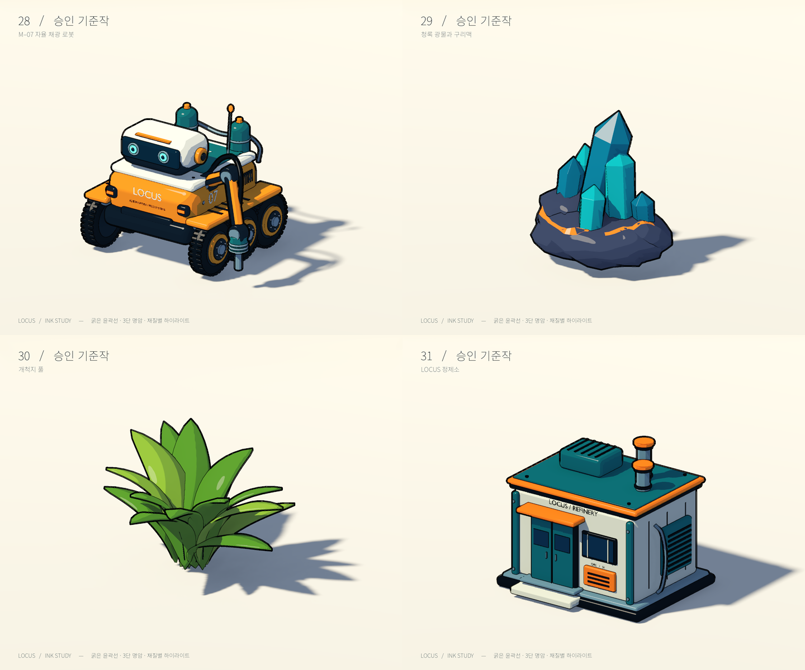

# 공식 렌더링 품질 기준 — INK v1

## 상태와 적용 대상

**2026-09-06 사용자 승인. 앞으로 개발하는 모든 시각 요소는 ‘고품질 모델 + 굵은 검은 윤곽선 + 단계형 명암’으로 제작한다.** [승인 기준작 네 종](05-ink-style-study.md)의 형태 완성도와 잉크 표현을 기준으로 삼는다. 기존의 연속적인 PBR 중심 품질 연구는 비교 이력이다. 스타일을 다시 선택하는 단계로 돌아가지 않는다.

대상은 로봇·수동 도구·자원·시설·풀·나무·지형·암벽·물·유적·생물·문명·우주선·천체·동굴·생산 및 테라포밍 효과와 게임 내 자산 미리보기다. 아직 없는 우주선·지하·새 생물도 이 기준을 따라 제작한다. 이 문서는 해당 콘텐츠의 구현 완료를 뜻하지 않는다.

사용자가 확정한 것은 시각 방향과 일관된 품질이다. 아래 수치는 이를 재현하는 **현재 구현 기준값**이며 사용자가 픽셀·셰이더 수식까지 지정했다는 뜻은 아니다. 조정할 때는 기준작과 실제 게임 화면을 함께 갱신해 품질이 유지되는지 확인한다.



## 유지해야 하는 시각 특성

| 항목 | 제작·검수 기준 |
| --- | --- |
| 외곽선 | 거의 검은 실루엣, 가려짐 경계, 더 가는 부품 경계. 외곽보다 내부 선이 강해지지 않는다. |
| 명암 | 주광의 어두운 면·중간 면·밝은 면 3단 구성. 경계에는 좁은 안티앨리어싱 전이만 둔다. 환경광·그림자 때문에 최종 화면의 색이 정확히 세 개여야 한다는 뜻은 아니다. |
| 형태 | 곡면은 매끄러운 실루엣, 필요한 모서리는 베벨과 올바른 법선. 카툰이라는 이유로 구·바퀴·잎을 불필요하게 각지게 만들지 않는다. 결정·파손 암석의 의도적인 면은 허용한다. |
| 구조 | 로봇 관절·바퀴·도구 연결, 건물의 문·창·통풍·배관처럼 용도를 설명하는 구조를 갖춘다. 단순 박스 위에 선만 추가한 모델은 새 최종 자산으로 승인하지 않는다. |
| 재질 | 크림색 도장·청록 장비·주황 포인트·짙은 프레임을 기준 팔레트로 사용한다. 자연물과 제조사별 변주는 가능하다. 금속·도장·광물은 작은 면 하이라이트로 구분한다. |
| 디테일 | 넓은 색면을 먼저 읽게 한다. 미세한 거칠기 노이즈·촘촘한 삼각형 선·읽을 수 없는 양각 글씨가 화면을 채우지 않게 한다. |
| 식생 | 두께·굽힘·겹침이 있는 잎. 잎 실루엣은 유지하고 작은 잎맥 선은 줄인다. 군집·원거리에서 검은 덩어리가 되면 LOD와 내부 선 밀도를 수정한다. |
| 배경 | 전경과 같은 명암 언어를 쓴다. 원거리 내부 선은 줄이고 대기 원근으로 거리감을 만든다. 플레이어·자원·상호작용 대상보다 과도한 대비를 주지 않는다. |
| 효과 | 채집·충전·고장·가동·생태 변화가 즉시 구분되어야 한다. 발광으로 실루엣을 지우지 않는다. 수증기·먼지·투명 배치 미리보기는 의미에 맞는 투명도를 유지한다. |
| 시간 변화 | 카메라 이동·회전, 바퀴·팬·포탑 동작, 채광·건축, 환경 변화 중에도 선이 표면에서 떨어지거나 번쩍이지 않아야 한다. |

색만으로 자원·상태·등급을 구분하지 않는다. 실루엣·아이콘·이름을 함께 사용한다. 외부 게임은 표현 참고만 허용하며 캐릭터·로고·텍스처를 복제하지 않는다.

## 단일 구현 경로

- 공통 변환: [`FrontierInkStyle`](../../우주-비즈니스/scripts/actors/ink_style.gd). GLB의 재질 이름·기본색·거칠기·금속성·발광·정점색을 공통 셰이더로 연결한다. 현재 자산은 단색 재질이다. 향후 텍스처 기반 자산은 텍스처 슬롯 지원과 실제 렌더 검사를 먼저 추가한다.
- 불투명 메시: [`ink/cel.gdshader`](../../우주-비즈니스/assets/materials/ink/cel.gdshader). 직접광 3단과 제한된 하이라이트.
- 공통 명암 수식: [`cel_light.gdshaderinc`](../../우주-비즈니스/assets/materials/ink/cel_light.gdshaderinc). 지면·암벽·물·달에도 포함하여 다른 조명 모델이 섞이지 않게 한다.
- 윤곽선: [`ink/contour.gdshader`](../../우주-비즈니스/assets/materials/ink/contour.gdshader). Forward+의 깊이·법선 버퍼에서 경계를 검출한다. 게임 월드당 화면 패스 하나를 두어 1인칭·관찰 카메라 전환에도 적용한다.
- 값의 원본: [`render_style.json`](../../우주-비즈니스/data/render_style.json). 게임 화질 프리셋과 별개로 유지한다. 성능·균형·고품질 모두 동일한 잉크 스타일이다.
- 촬영 목록: [`render_assets.json`](../../우주-비즈니스/data/render_assets.json). ID·원본·GLB·카테고리·형태 교체 상태를 기록한다. 도감도 같은 Godot 셰이더로 렌더한다.

1200px 출력 높이 기준 외곽 탐색 반경은 3px, 내부는 1.25px다. 식생 단독 촬영은 2.5px/0.85px를 사용한다. 이는 최종 선 전체 폭이 아니라 경계 검출 반경이다. 해상도·렌더 스케일에 따라 보정하므로 고해상도에서 선이 상대적으로 가늘어지지 않는다. 게임 내부 선은 카메라 깊이 35~100m에서 점차 억제한다. 외곽은 남기되 깊이 60~180m에서 대비를 40%까지 낮춘다. 연속된 지면의 원근 기울기는 깊이 불연속 검출에서 상쇄한다. 깊이 변화 0.005m 미만의 작은 양각 내부 선은 억제한다.

기준 촬영은 1440×1200, 4× MSAA, 1.5배 3D 스케일, 정사영 3/4 시점, 방향광과 절제된 환경광이다. 게임은 프리셋별 MSAA에 더해 화면 FXAA를 적용한다. 이는 검토용 촬영 설정이며 플레이 전체에 1.5배 스케일을 강제하지 않는다. 도감 PNG는 480×400, 분류판은 원본을 720×600으로 축소해 조합한다. AI 이미지나 외부 그림으로 게임 렌더 결과를 대체하지 않는다.

반투명 효과·배치 고스트는 별도 혼합 재질을 사용한다. 하늘·안개·UI는 형태·가독성을 위해 적합한 전용 셰이더를 유지한다. 이를 일반 불투명 모델의 PBR 복귀 근거로 쓰지 않는다.

## 필수 요소 재렌더 범위

| 범주 | 이번 촬영 대상 | 수 |
| --- | --- | ---: |
| 장비 | 채광·탐광·경비 로봇, 수동 흡입기 | 4 |
| 시설 | 착륙 기지, 보관함, 태양광, 충전 패드, 제작소, 대기·온도·물·생태 설비, 원자로 | 10 |
| 자원 | 철·구리·암석·얼음·결정 | 5 |
| 발견·환경 | 유적, 미생물, 동물, 문명, 나무, 배경 암벽 3종 | 8 |
| 승인 기준작 | M-07, 청록 광물, 개척지 풀, 정제소 | 4 |
| 합계 | 현재 게임 자산 27종 + 승인 기준작 4종 | **31** |

현재 게임 27종의 **렌더 경로와 도감 이미지를 전부 갱신**한다. 기존 GLB의 형태·작동 부품은 보존한다. 승인 기준작 4종은 고품질 모델 교체 시 따라야 할 기준이며 게임의 기존 ID에 무조건 덮어쓰지 않는다. 목록의 `legacy`는 재렌더 대상이면서 **형태 재제작이 남은 자산**, `approved-reference`는 승인된 형태 기준작이다. 기존 나무·생물·시설이 새 기준작 수준으로 재모델링됐다고 기록하지 않는다.

지면·물·하늘·자갈·달은 개별 GLB가 아닌 절차적 환경이므로 위 31개 수량에 넣지 않고 게임의 황무지·생태 변화 화면으로 검토한다.

[장비](media/ink-catalog/board-equipment.png) · [시설](media/ink-catalog/board-buildings.png) · [자원](media/ink-catalog/board-resources.png) · [발견·배경](media/ink-catalog/board-environment.png) · [촬영 메타데이터](media/ink-catalog/renders.json)

## 후속 자산 완료 조건

1. 소관 게임 문서에서 용도·게임 거리·상태·충돌 및 필요한 동작을 확인한다.
2. Blender 원본과 GLB를 함께 저장하고 `Anim_` 등 동작 연결점을 보존한다. 원본 생성·교체 상태와 삼각형/재질 비용을 기록한다.
3. 공통 셰이더를 적용하고 렌더 목록에 등록한다. 임의로 다른 외곽선·명암 셰이더를 복제하지 않는다.
4. 단독 3/4 촬영에서 전체 형상·접지 그림자·재질 차이를 확인한다. 바닥에 파묻히거나 프레임 밖으로 잘리지 않아야 한다.
5. 주광·그늘·역광, 보통 플레이 거리·근접·원거리, 실제 환경에 여러 개를 배치한 화면을 검사한다. 식생·바퀴·철망·문자처럼 선이 밀집하는 부분을 확대한다.
6. 움직임·작업 상태·카메라 전환·투명 효과를 확인하고 대표 혼합 장면의 성능을 측정한다. 단독 스튜디오의 프레임률을 게임 성능으로 보고하지 않는다.
7. 아래 자동 검증과 이미지 검토를 통과한 뒤 구현 현황과 형태 상태를 갱신한다. 렌더 성공은 형태 품질 승인과 별개의 조건이다.

```bash
./tools/render_ink_catalog.sh          # 전 목록 + 실제 게임 도감 PNG 갱신
./tools/show_ink_catalog.sh            # ← → 선택, 드래그 회전, 휠 확대
./tools/test_game.sh --with-ui         # 게임 회귀 + 모든 메시/카메라 렌더 검사
```

자동 검사는 게임 GLB의 목록 누락, 원본 누락, 불투명 표면의 공통 재질 누락, 환경 명암 분리, 프리셋 변경 시 스타일 소실을 잡는다. 실제 GPU 검사는 1인칭·관찰 카메라에서 윤곽을 켰을 때 화면 변화가 존재하는지 확인한다. 미적 품질·미세한 시간 깜빡임까지 자동으로 승인하지는 않는다.

이 문서와 승인 기준작이 앞으로의 고정 품질 기준이다. 성능 조정은 LOD·인스턴싱·그림자·조명 비용을 먼저 줄인다. 스타일이나 형태 완성도를 낮춰 해결하려면 기준 변경임을 명시하고 사용자 방향과 일치하는지 검토한다. 최소 사양과 대규모 확장 월드의 최종 FPS 예산은 아직 미정이다.

## 이번 적용의 검증 기록

2026-09-06 Godot 4.7.2 / Metal Forward+ / Apple M2에서 전체 게임 회귀 검사를 실행하고 최종 윤곽 수정 후 그래픽·렌더·자산 검사를 다시 통과했다. [검증 기록](media/ink-catalog/verification.json)의 총 1,194개 확인 항목은 실패 0건이며 네 기준작 스튜디오 검사도 통과했다. 31종의 최종 촬영 오류는 0건이다. 자동 결과와 별도로 분류판·도구 바닥 가림·암벽 배경 끝·1인칭·관찰·생태 변화·도감 화면을 눈으로 확인했다.

[짧은 플레이 성능 측정](media/ink-catalog/performance.json)은 균형 설정, 1280×800, 로봇 30대, 생태 100, 시뮬레이션 실행 상태에서 평균 17.56ms(약 57fps), p95 20.52ms였다. 현재 기존 형상을 사용한 한 M2의 180프레임 측정이며, 고밀도 모델로 전부 교체한 뒤의 성능이나 확장 월드의 성능을 보장하는 수치는 아니다.


## 지표 실증의 지역 광원 보정

E0-B에서 공통 명암 수식의 방향광 경계 처리는 유지하면서 점·스포트 광원에는 연속적인 거리 감쇠를 적용했다. `ATTENUATION`을 일괄 임계 처리하던 경로는 손전등이 멀리 있는 동굴 벽을 비추지 못하게 했다. `test_ink_local_light.gd`가 실제 GPU에서 가까운 면·먼 면·소등을 비교한다. 이 변경은 윤곽·각도별 3단 명암의 변경이나 최종 동굴 아트 승인을 의미하지 않는다. 지형 형태·원거리 경계·경관 배치는 [개발 기록의 미완료 항목](../planning/07-expansion-development-log.md)을 따른다.

## 기본 실행 경로의 시청각 품질

콘텐츠 확장 시 기존 장비·건설 미리보기·작업 모션/효과/음원을 현재 기본 실행 경로에서도 유지한다. [기본 플레이 품질 복구](19-play-quality-restoration.md)에 첫 커밋 비교와 현재 원정 연결·검증을 기록한다. 단독 렌더 자산이 존재하는 것만으로 플레이 품질 완료를 표시하지 않는다.

윤곽선 화면 합성은 불투명 장면 뒤, 투명 효과 앞(`render_priority=-128`)에 실행한다. 화면 텍스처에 포함되지 않는 배치 고스트·입자 위에 늦게 합성하면 실제 효과를 지운다. `test_ink_rendering.gd`에서 투명 건설 모델과 실제 풀링 이펙트 셰이더의 출력 픽셀을 검사한다.
