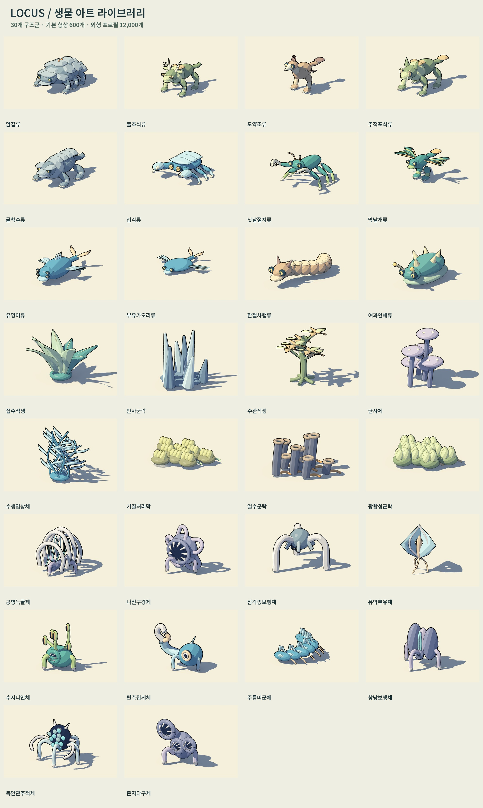

# 생물 전체 렌더링 — 기본 모델 600개

2026-09-08 최신 아트 상태: [600개 전수 검토·200개 선별 개선·400개 원본 유지](54-planets-and-life-art.md). 600개 기본형 렌더·미리보기를 새 내부/원거리 선으로 갱신했다. 아래의 최초 제작과 외형 프로필 전수 촬영 기록은 당시 결과로 보존한다.

2026-09-06 사용자는 이 서브 작업에 생물 전체 렌더링을 맡기고, 공격하는 동물의 공격 모션·효과 포함을 요청했다. 첫 제작분의 기본 모델 수는 100개 제안에서 250개를 거쳐 **500개**로 늘렸고, 후속 요청으로 이형 100개를 추가했다. 이 문서는 제작·시각 연결의 소관이며 실제 행성 생성·생존·연구·전투 규칙을 구현하는 문서가 아니다. 모든 불투명 모델은 [INK v1](06-rendering-quality-standard.md)을 따른다.

> **현재 확장:** 눈·감각기관과 해부 구조를 다양화한 [이형 생물 100개](09-aberrant-bestiary.md)를 추가해 총 600개·30개 구조군·12,000개 외형 프로필로 확장했다. 아래 500개 수량과 제작 결과는 첫 제작분의 기록이다.

## 첫 500개 제작분의 수량과 용어

- 제작 결과는 **색상만 다른 모델을 제외한 기본 형상 500개**와 모델당 20개의 외형 변형, 합계 10,000개 시각 프로필이다.
- 기본 형상은 20개 구조·행동군을 공유한다. 각 군의 환경형 5개에 해부·구조 변형 5개를 제작하여 25개 모델을 만든다. 골격을 공유한다는 이유로 서로 다른 파일을 모두 독립적인 종으로 부르지 않는다.
- 모델당 변형은 허용 환경 안의 팔레트 5개와 크기 4개다. 색상·크기 변이는 새로운 종이나 새로운 능력으로 기록하지 않는다.
- 동물 300개, 식생 125개, 미생물 군락 75개다. 공격 시연 대상 동물은 250개이며 수치는 렌더 작업 구성이다. 실제 공격성·출현 확률·개체 수는 게임 설계의 값이 아니다.
- 100만 행성은 생물 원본 모델을 100만 벌 저장하라는 의미가 아니다. 각 사례에 환경 표식을 부여하되 실제 생성기는 별도 환경·생태 검증을 통과한 사례만 채택해야 한다.
- 제작 도감의 spawn_enabled: false는 유지한다. 후속 [메인 생태 통합](11-seeded-ecology-integration.md)은 명시적인 환경/구조군 허용 규칙으로 현 지표/동굴에 적합한 209개 풀을 사용한다. 제작물 전체를 자동 출현시키지는 않는다.

## 제작 구조

[형상 목록](../../우주-비즈니스/data/bestiary/forms.json), [외형 프로필](../../우주-비즈니스/data/bestiary/appearances.json), [환경 표식](../../우주-비즈니스/data/bestiary/environments.json)을 분리한다. Blender 원본은 art/blender/bestiary/, GLB는 우주-비즈니스/assets/models/bestiary/에 둔다. 각 형상은 편집 원본·근거리/원거리 모델·해시·삼각형 수·동작 연결점을 기록한다. 팔레트 수치는 Blender의 선형 색 공간이며 Godot의 source_color 입력에 전달할 때 sRGB로 변환한다. GLB 원본과 런타임 팔레트의 밝기가 달라지지 않도록 같은 변환을 도감 촬영에도 적용한다.

| 구조군 | 표현 방향 |
| --- | --- |
| 암갑류·뿔초식류·도약조류 | 광물 외피, 보호 뿔, 도약용 다리와 깃 구조 |
| 추적포식류·굴착수류 | 낮은 추적 자세·턱, 굴착 앞다리·보호 갑주 |
| 갑각류·낫날절지류 | 집게·여러 지지 다리, 분리된 낫날 앞다리 |
| 막날개류·유영어류·부유가오리류 | 날개막·손가락 뼈, 유영 지느러미·꼬리 |
| 환절사행류·여과연체류 | 연결된 체절·감각 돌기, 연체 외피·호흡 돌기 |
| 집수식생·반사군락·수관식생 | 두께 있는 잎·결정 표면·가지와 수관 |
| 균사체·수생엽상체 | 갓·포자 구조, 유연한 수중 잎 |
| 기질처리막·열수군락·광합성군락 | 확대 표현한 막·소포·연결 필라멘트·군락 굴뚝 |

미생물은 단일 세포를 동물 크기로 돌아다니게 만든 것이 아니라 관찰용 군락 표현이다. 생존 온도·대기 조성·먹이·공생의 실제 수치는 이 렌더 작업에서 확정하지 않는다. 온대·습지·수관·해양처럼 인간 거주 환경과 연결되는 생물군도 포함한다. 무생물 행성과 서식 조건은 [생태](../game/09-discovery-research-and-ecology.md)·[은하 생성](../game/11-galaxy-tiers-and-seeds.md)의 규칙을 따른다.

## 공격 동작과 효과

[공격 시연 정의](../../우주-비즈니스/data/bestiary/attack_presentation.json)의 시간은 시각 조율용 값이다. 전조 0.55초, 공격 0.30초, 회복 0.75초를 기본으로 두고 원형별 동작을 구분한다.

| 방식 | 동작 | 효과 |
| --- | --- | --- |
| 돌진 | 머리를 낮춤·몸통 전진·복귀 | 접촉 고리·광물 파편 |
| 차기 | 다리 준비·차기·회복 | 짧은 궤적·파편 |
| 물기 | 턱 벌리기·전진·턱 닫기 | 접촉 궤적·파편 |
| 내려치기 | 몸 올리기·내려치기·회복 | 동심 고리·흙 파편 |
| 집게·베기 | 앞다리 들기·교차 공격·회복 | 교차 궤적·접촉 파편 |
| 급강하 | 날개 준비·접근·복귀 | 접근·접촉 궤적 |
| 분사 | 머리·턱 준비·분사·회복 | 이동 액적·접촉 비산 |

모션은 이름 붙인 관절/부품의 절차 애니메이션이다. 베이크된 골격 클립이나 실제 길 찾기 AI를 제공했다고 해석하지 않는다. bestiary_actor.gd는 전조·공격·회복의 **시각 이벤트**만 알리고 피해·명중·드롭·소유권을 변경하지 않는다. 효과는 재사용하는 고정 노드 풀로 표현하고 동작 종료·새 모델 선택 때 해제한다. 새 음원 제작은 이번 렌더링 범위에 포함하지 않는다.

## 실행과 재생성

    /Applications/Blender.app/Contents/MacOS/Blender --background --python tools/build_bestiary.py
    python3 tools/bestiary/audit_catalogue.py
    ./tools/godot.sh --headless --editor --import
    ./tools/render_bestiary.sh
    ./tools/show_bestiary.sh
    ./tools/show_bestiary.sh -- --attack-captures
    ./tools/godot.sh --headless --script res://tests/check_bestiary.gd
    ./tools/godot.sh --headless --script res://tests/check_bestiary_colors.gd
    python3 tools/bestiary/build_boards.py
    python3 tools/bestiary/run_review.py
    python3 tools/bestiary/build_review_boards.py

모음판 제작에는 Pillow가 필요하다. 최종 도감 등록은 이미지 검증을 통과한 뒤 tools/bestiary/register.py로 수행한다.

도감은 구조군 선택, 이전/다음 모델, 20개 외형 변형, 대기·이동·섭식·휴면·스트레스·공격 시연, 조명 전환·회전·확대를 지원한다. 모델에 공격 표현이 없으면 공격 버튼을 비활성화한다.

렌더 도구는 기본 모델의 1440×1200 렌더와 480×400 도감, 그늘·역광·원거리 검수, 240×200 외형 프로필 이미지를 저장한다. 중간 산출물과 완료 기록을 구분하고 중단 후 이어서 촬영할 수 있다. 미완료 파일을 완료로 세지 않는다.

## 검증 기록과 남은 범위

최종 수량·형상 중복 검사는 media/bestiary/geometry-audit.json, 실제 로딩·상태·공격·LOD 검사는 media/bestiary/verification.json, 이미지·목록 검사는 후속 렌더 기록을 기준으로 한다. 현재 세 검증 기록 모두 생성됐으며 형상 500개·프로필 10,000개·이미지 12,000개가 확인됐다.

완료 보고에서는 실제 생성 수량, 자동 검사, 눈으로 검토한 모음/대표 화면, 공격 시연 영상과 미연결 범위를 분리한다. 실제 지형에서의 발 접지·유영·비행 경로, 충돌·명중, 생태 적합성, 연구·운송, 6인 동기화와 게임 전체 성능은 메인 개발과의 통합 단계에서 검증한다. 사용자가 최종 형태를 승인한 것으로 자동 표기하지 않는다.

## 2026-09-06 제작 결과

- Blender 편집 원본 500개, 근거리/원거리 GLB 1,000개. 실제 월드 좌표의 메시 정점으로 색상·이름을 제외해 비교한 결과 중복 형상 0개.
- 근거리 삼각형 4,316~47,892개(평균 17,511), 원거리 1,372~15,264개(평균 5,767). 원본은 20개 구조군을 공유하므로 500개의 전혀 다른 골격이라는 뜻은 아니다.
- 기본 모델 1440×1200 렌더 500장, 그늘/역광 1,000장, 원거리 형상 500장, 외형 변형 240×200 이미지 10,000장. 별도로 480×400 도감 500장과 분류판 20장·외형 모음판 500장을 제공한다.
- [형상 검사](media/bestiary/geometry-audit.json), [동작 검사](media/bestiary/verification.json) 10,502항목, [도감 조작 검사](media/bestiary/gallery-verification.json) 13항목, [렌더 파일·픽셀 검사](media/bestiary/render-verification.json)를 통과했다. 각 모델의 20개 변형은 실제 이미지 픽셀도 서로 다르다.
- 20개 형상 분류판을 눈으로 검토했고 절지류의 발끝 연결을 수정한 뒤 다시 내보내고 촬영했다. 20개 구조군의 주광/그늘/역광/원거리 비교판 4장, 공격 가능한 10개 구조군의 전조/공격/회복을 검토했다. 이 검토는 제작 검수이며 사용자 최종 형태 승인과 구분한다.
- GLB 수입 색과 런타임 기본 팔레트를 비교하는 [색 관리 검사](media/bestiary/color-verification.json) 666항목을 통과했다.
- [전체 회귀 검사](media/bestiary/regression.json)는 공통 목록 533개를 포함해 실패 0건이다.
- 공통 렌더 목록에도 기본 모델 500개를 등록했다. 공통 분류판은 페이지당 최대 10개로 나눠 거대한 단일 이미지를 만들지 않는다. 기존 게임 자산은 보존했다.

[전체 구조군 보기](media/bestiary/overview.jpg) · [공격 비교 1](media/bestiary/attack-board-1.jpg) · [공격 비교 2](media/bestiary/attack-board-2.jpg) · [도감 조작 화면](media/bestiary/gallery-ui.png)

### 혼합 배치와 통합 제약

온대 외형 12개와 기존 암벽 3개를 검수용 바닥에 배치해 [플레이 거리](media/bestiary/field-play.png)·[근접](media/bestiary/field-near.png)·[원거리](media/bestiary/field-far.png)·[역광](media/bestiary/field-backlight.png)을 촬영했다. 실제 행성 스트리밍 장면이나 서식 시뮬레이션이 아니다. 작은 화면에서 복잡한 잎/부품의 검은 선이 밀집하므로 실제 플레이 도입 때 군집 LOD·부품 합치기와 거리별 가독성을 추가 조율해야 한다.

[성능 기록](media/bestiary/performance.json)은 Apple M2, 1280×800, 12개 생물과 암벽, 180프레임에서 평균 30.25ms·p95 33.92ms, 866 드로 호출이었다. 명시적 촬영 호출이 포함된 검수 환경이며 다른 로컬 작업과 자원을 공유했다. 출시 FPS나 500개 동시 배치를 보장하지 않는다. 실제 게임 도입 전 스키닝/인스턴싱·가시 범위와 프레임 예산 최적화가 남는다.

이번 범위의 완료는 **렌더링 라이브러리와 시연 기능 제공**이다. 행성 시드별 서식 검증·행동 AI·발 접지 IK·물/공중 이동·충돌·명중·능력치·연구/운송·멀티플레이 동기화는 메인 통합 범위다. 공격은 절차 애니메이션과 시각 효과이며 베이크된 스킨 골격 클립이나 사운드는 제공하지 않는다.

### 영상 재생성

첫 500개 제작분의 기존 공격 영상은 각 구조군의 전조·공격·회복·대기를 3초씩, 총 900프레임/30초로 촬영한다. 창 가림 때문에 엔진의 자동 녹화가 프레임을 건너뛸 수 있어 명시적 프레임 촬영을 사용한다. 원본 프레임은 기본 /tmp/bestiary-film-frames에 두며 BESTIARY_FILM_FRAMES로 바꿀 수 있다.

    ./tools/show_bestiary.sh -- --film-captures
    /Applications/Blender.app/Contents/MacOS/Blender --background --python tools/bestiary/encode_film.py -- /tmp/bestiary-film-frames docs/production/media/bestiary/bestiary-attacks.mp4

[30초 공격 시연](media/bestiary/bestiary-attacks.mp4)

기본 촬영은 현재 목록의 모든 공격 구조군을 포함한다. 추가 100개만 촬영하려면 --aberrant를 사용하며 [확장 제작 기록](09-aberrant-bestiary.md)의 21초 영상 명령을 따른다.

## 기존 생물 8개 눈 수정 — 2026-09-06

사용자가 기존 생물에서도 비슷한 눈을 일부 다르게 해 달라고 요청했다. 기존 500개 중 8개를 선정해 눈·감각기관만 수정한다. 기본 모델 수는 600개, 외형 프로필 수는 12,000개로 유지하며 추가 이형 100개는 이번 수정 대상이 아니다.

| 기존 모델 ID | 수정 내용 |
| --- | --- |
| bio_lithic_16 | 두 눈을 중앙의 마름모 단안으로 교체 |
| bio_grazer_01 | 넓고 낮은 가로 동공과 보호 눈꺼풀 |
| bio_stalker_01 | 긴 세로 동공과 곡선 눈꺼풀 |
| bio_burrower_21 | 동굴형의 눈을 없애고 진동 감각 주름으로 교체 |
| bio_carapace_01 | 두 눈을 각각 여러 렌즈 소면을 가진 복안으로 교체 |
| bio_winged_16 | 이마에 모인 작은 눈 6개 |
| bio_swimmer_01 | 위아래로 배열된 눈 4개 |
| bio_slug_21 | 얼굴의 눈을 없애고 촉수 끝의 눈 2개만 유지 |

선택은 tools/bestiary/eye_designs.py로 관리하고 기존 Blender 제작 도구에 연결한다. 눈 수정 대상 외의 원본/GLB는 재생성하지 않으며 기존 동작 연결점·몸체·서식 조건·공격 유형은 유지한다. 수정 전후 비교는 당시 기본 렌더에서 같은 머리 영역을 잘라 조합한 것이며 AI 이미지로 대체하지 않는다.

    /Applications/Blender.app/Contents/MacOS/Blender --background --python tools/build_bestiary.py
    python3 tools/bestiary/audit_catalogue.py
    ./tools/godot.sh --headless --editor --import
    ./tools/render_bestiary.sh --eye-revisions
    ./tools/show_bestiary.sh -- --eye-revisions
    ./tools/show_bestiary.sh -- --eye-revisions --attack-captures
    python3 tools/bestiary/build_eye_comparison.py

[수정된 얼굴 8개](media/bestiary/eye-revision/overview.jpg) · [수정 전후 1](media/bestiary/eye-revision/before-after-1.jpg) · [수정 전후 2](media/bestiary/eye-revision/before-after-2.jpg)

[원본 비교](media/bestiary/eye-revision/source-verification.json)에서 눈 이외의 몸체 메시·변환·동작 연결점이 일치했다. [범위 검사](media/bestiary/eye-revision/scope-verification.json)는 지정한 8개만 변경되고 나머지 592개·GLB 1,184개가 유지됐음을 확인했다. 근거리·원거리 GLB 16개, 기본/조명/원거리 이미지 32장과 외형 변형 160장을 갱신했다.

[검증 기록](media/bestiary/eye-revision/verification.json): 전체 로딩·동작 13,022항목, 색 관리 888항목, 공통 INK 자산 20,010항목에 실패가 없다. 전체 12,000개 외형 이미지 검사도 통과했다. [주광·그늘·역광·원거리·공격 비교 1](media/bestiary/eye-revision/review-1.jpg)·[비교 2](media/bestiary/eye-revision/review-2.jpg)를 눈으로 검토하고, 수정 대상 중 공격형 7개의 전조·공격·회복을 촬영했다. 게임 전체 회귀 검사를 재실행한 것은 아니다.

실제 출현·생태·전투 연결과 사용자 최종 아트 승인은 기존 통합 범위를 따른다.

## 전수 렌더의 Git 추적 정책 변경

2026-09-06 후속 사용자 요청으로 개별 `variants/`, `lighting/`, `lod/` 캡처는 Git 추적에서 제외하고 로컬 파일은 보존한다. 이 문서의 과거 제작 수량·검증 결과는 이력으로 유지한다. 기본 모델 렌더·게임용 미리보기·검토 모음판과 매니페스트는 보존하며 [에셋 버전 관리](../technical/05-asset-version-control.md)의 선택 범위 재생성 방법을 따른다.
