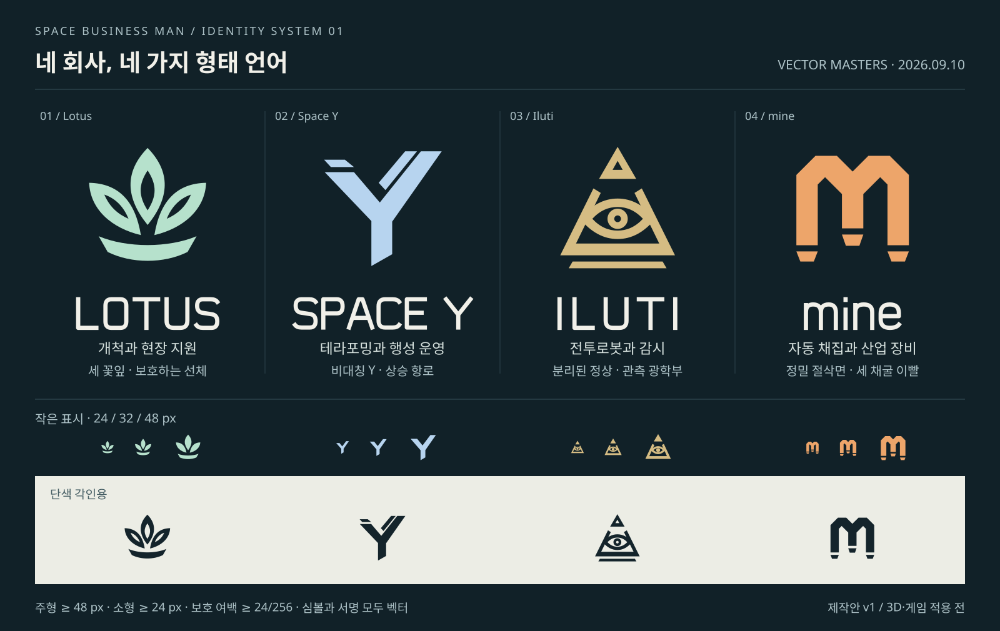

# 기업 심볼 v1 — SP01 벡터 제작

2026-09-10 명칭/설정 변경: 이 문서는 당시 제작·검수 이력이다. 현재 전투로봇 제조사는 **쿠퍼테크(CooperTech)**이며, 과거 회사명·심볼은 현재 제작 기준에서 제외한다. [현재 설정·표시·심볼과 호환 경계](106-coopertech-rebrand.md)를 우선한다.

2026-09-10 사용자 요청에 따라 기존 v0의 아이디어를 유지하면서 심볼의 형태·여백·워드마크와 용도별 출력을 다듬었다. [커밋 계획 SP01](../planning/16-space-corporations-commits.md)의 **벡터 제작** 범위다. 실물 각인·UI 연결·Blender/Godot 검수는 SP02 이후이며 최종 로고에 대한 사용자 승인을 임의로 기록하지 않는다.

## 형태 변경

| 회사 | v0에서 바뀐 점 | 소형 처리 |
| --- | --- | --- |
| Lotus | 세 꽃잎의 바깥/안쪽 곡률과 사이 공간을 맞추고, 평평한 받침을 보호 선체 같은 곡면으로 바꿨다. 비어 있는 꽃잎 중심도 실제 투명 벡터다. | 내부 음각을 없애 작은 크기에서 꽃잎이 끊기지 않게 한다. |
| Space Y | 오른쪽으로 더 높게 뻗는 Y, 평행한 상승 궤적, 비스듬히 잘린 추진부로 방향성을 준다. | 가는 보조 궤적을 제거하고 갈라진 주형/줄기 폭을 키운다. |
| Iluti | 분리된 정상부의 음각·일정한 피라미드 면·받침 단·눈꺼풀과 광학 링을 정돈한다. | 정상부 음각·받침 단·동공의 작은 구멍을 빼고 피라미드/눈의 여백을 넓힌다. |
| mine | 반복되는 절삭 각도·두 갱도 아치·깊이가 다른 세 이빨의 간격과 중심축을 정돈한다. | 세 기둥과 이빨을 넓히고 절단 간격을 키운다. |

워드마크는 기하학적인 획으로 직접 구성해 외부 글꼴 파일 없이 렌더되는 벡터로 출력한다. Lotus는 여유 있는 간격, Space Y는 긴 사명에 맞는 폭, Iluti는 넓은 자간, mine은 소문자 아치로 구별했다. 설명용 비교판의 한글에는 시스템/프로젝트 글꼴을 사용하지만, 출력된 회사 서명에는 글꼴 의존성이 없다.

## 원본과 출력

- 편집 원본: [`art/branding/corporations/`](../../art/branding/corporations/identity.json)의 `lotus.svg`, `space_y.svg`, `illuti.svg`, `mine.svg`. 각 파일의 `primary`와 `compact` 그룹을 따로 편집한다.
- 색/크기/보호 여백/표시명 원본: [`identity.json`](../../art/branding/corporations/identity.json). 색은 **sRGB 벡터 표시색 제안**이다. Blender의 선형 RGB 재질로 그대로 복사하지 않는다.
- 출력: 같은 폴더의 `exports/{company_id}/`에 `primary`, `positive`, `reverse`, `compact`, `compact-positive`, `compact-reverse`, `signature` 각 SVG. 4사 × 7종 = 28개이며 [`exports/manifest.json`](../../art/branding/corporations/exports/manifest.json)에 목록을 남긴다.
- 재생성: `python3 tools/build_corporate_identity.py`. 표준 Python 라이브러리만 사용하고 편집 원본은 덮어쓰지 않는다.
- 비교판: [`company-symbols-v1.svg`](../game/media/corporations/company-symbols-v1.svg). [v0](../game/media/corporations/company-symbols-v0.svg)는 초기 아이디어 이력으로 보존한다.

## 사용 규격

주형은 48px 이상, 소형은 24px 이상을 제작 시작 기준으로 한다. 둘은 같은 그림을 단순 축소한 파일이 아니라 내부 구멍·궤적·눈·이빨을 각각 보정한 형태다. 표시 공간이 부족하면 심볼 크기를 확보하거나 기업명을 선택 상세에 함께 표시한다. 가장 작은 UI 사용 규격은 실제 게임 렌더에서 조정한다.

심볼의 외곽에는 256단위 원본 기준 최소 24단위의 **보호 여백을 추가 확보**한다. 파일 자체의 투명 패딩이 이 외부 배치 여백을 항상 대신한다는 뜻은 아니다. 가로/세로를 따로 늘리거나, 비스듬한 면에 붙이기 전에 벡터를 찌그러뜨리지 않는다. 투명 구멍에 배경색을 박아 넣지 않는다.

색 버전은 어두운 배경의 기업 식별용, `positive`는 밝은 배경용 짙은 단색, `reverse`는 어두운 배경용 밝은 단색이다. 기존 Lotus 보급품의 주황 도장 등 실제 제조사 팔레트 이행은 SP02의 모델 적용에서 결정한다. 이번 벡터 제작이 기존 게임 재질을 바꾼 기록은 아니다.

제조사와 운영사 표식은 소관 설계를 따른다. 심볼 안에 체력·적대·교역 가능 색을 섞지 않는다. 3D에서 양각/음각·도장·스텐실로 옮길 때 두께·분리 섬·곡면 접지·가려짐은 실제 용도에 맞춰 제작한다.

## 확인한 범위

브라우저 SVG 렌더에서 네 주형·벡터 워드마크·24/32/48px 소형·밝은 바탕 단색을 확인했다. 초기 비교판 하단의 여백 설명을 파일 패딩과 혼동하지 않도록 수정했다. 출력 SVG XML/로컬 참조·폰트 비의존 출력과 같은 원본의 재생성 일관성을 확인했다.

이번에는 코드의 게임 연결·Blender 모델/GLB·실제 게임 HUD·INK 선체 렌더·음원·저장을 변경하지 않았다. 게임 테스트는 실행하지 않았으며 현재 조작이나 멀티플레이를 검증했다고 주장하지 않는다. 게임용 실제 표식과 처음 조사하는 경험은 **SP02**다.
