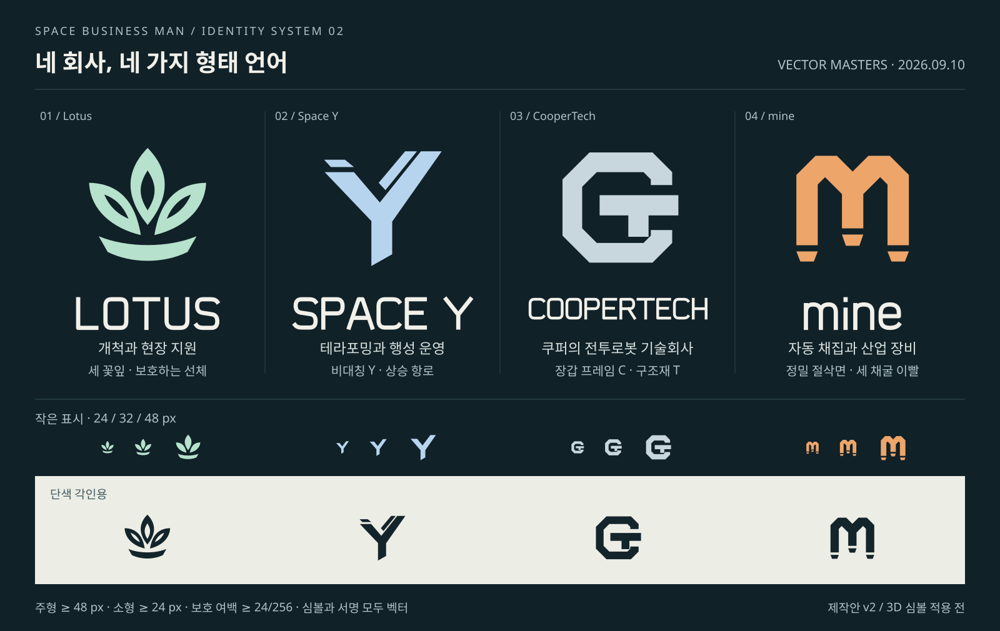

# 쿠퍼테크 — 전투로봇 제조사 전환

2026-09-10 후속: 아래 장갑 CT는 [전투로봇 심볼 v3](107-coopertech-sentinel-symbol.md)로 대체됐다. 본문은 당시 전환 기록이다.

2026-09-10 사용자 확정: 종전 일루티·일루미나티 신봉 설정을 제외하고 **쿠퍼가 설립하고 사장으로 이끄는 전투로봇 기술회사 쿠퍼테크**로 교체한다. 영문 **CooperTech**, 새 회사 ID `coopertech`, 장갑 프레임 C와 구조재 T를 결합한 심볼은 이 요구 안의 제작 선택이다.

## 현재 회사 설정과 형태

쿠퍼테크는 쿠퍼가 만든 전투로봇 기술회사다. 설립자의 추가 이력·선악·타사와의 계약/전쟁 관계는 새로 확정하지 않는다. 전투로봇의 힘·장갑·기계 구조를 중심으로 표현한다. 기존 전투로봇의 경사 장갑·비대칭 무장·작은 기능 센서와 흑연/산화 적색 배색은 이어간다.

심볼은 장갑을 두른 C 안에 두꺼운 구조재 T를 결합한다. 피라미드·눈·신봉 집단 문양을 현재 자산으로 사용하지 않는다. Lotus·Space Y·mine 원본은 변경하지 않았다.

- 원본: [`coopertech.svg`](../../art/branding/corporations/coopertech.svg)의 주형/소형 그룹.
- 설정: [`identity.json`](../../art/branding/corporations/identity.json)에 표시명·쿠퍼 설립자/사장·전투로봇 업종을 기록했다.
- 출력: `art/branding/corporations/exports/coopertech/`의 주형·단색·소형·서명 7 SVG. [전체 목록](../../art/branding/corporations/exports/manifest.json)은 네 회사 28개를 가리킨다.
- 재생성: `python3 tools/build_corporate_identity.py`. COOPERTECH 워드마크에 필요한 R/H 벡터 글자를 추가하고 현재 비교판을 v2로 전환했다.
- 종전 활성 회사 원본/출력 8개는 제거했다. v0/v1 비교판과 과거 제작 기록에는 사용 중단/대체 이력을 표시하여 현재 기준과 구분한다.

## 게임 표시와 저장 호환

| 변경 대상 | 현재 표시/처리 |
| --- | --- |
| 사건 정의 | **쿠퍼테크 폐기 전투로봇** |
| 현장 힌트/J 상세 | 쿠퍼가 세운 전투로봇 회사의 폐기 기체라는 소개와 기존 교전/냉각 약점 안내 |
| 격파 후 상호작용 | **F 쿠퍼테크 부품 회수** |
| 전리품 회수 회로 설명 | 쿠퍼테크 전투로봇 격파 조건으로 표시 |
| 렌더 목록/도구 표제 | **COOPERTECH / COMBAT ROBOTICS**와 쿠퍼테크 로봇 이름 |
| 후속 설계 | 회사·선박/시설·비콘·SP02~SP11을 쿠퍼테크와 CT 장갑 표식 기준으로 정리 |

기존 사건의 `illuti_dormant_combat_robot` 템플릿 ID·사건 키·이미지 경로는 **호환용 식별자**로 유지한다. 사건 생성 난수·위치·고유 ID·진행·격파/수령·보상·실드 수치를 바꾸지 않는다. 발견 도감은 저장된 이름을 다시 쓰는 대신 현재 템플릿 정의를 읽으므로, 기존 사건도 새 이름으로 검색/표시된다. 세계 저장 파일을 직접 수정하거나 재생성하지 않았다.

현재 회사 ID는 `coopertech`다. 아직 구현하지 않은 정비고/시험장 등 새 콘텐츠는 과거 접두사를 복제하지 않는다. 과거 캡처 경로와 실제 구형 모델 제작 상태를 나타내는 내부 메타데이터는 검증 이력으로 보존한다.

## 제작 도구와 실제 범위

전투로봇 제작 본체를 [`tools/coopertech_robot.py`](../../tools/coopertech_robot.py)로 옮기고 앞으로의 재질 명칭을 CooperTech로 바꿨다. `build_exploration_incidents.py`는 새 모듈을 사용한다. 기존 `tools/illuti_robot.py`는 구 제작 호출을 깨뜨리지 않는 얇은 호환 진입점이다.

기존 `render_illuti_robot.gd/.tscn`의 도구 경로는 유지하되 현재 표제·장면 이름·완료 로그와 새 출력 경로를 쿠퍼테크 기준으로 바꿨다. 이후 렌더는 `docs/production/media/coopertech-robot/`에 저장하고 과거 검수 캡처를 덮어쓰지 않는다.

**이번에 3D 형상을 새로 만들거나 GLB/Blender 원본을 재출력하지 않았다.** 기존 모델에는 종교 문양이 없어 형태를 보존했다. CT 심볼의 실제 로봇 장착과 통합된 제조사/운영사 표식 기능은 SP02에 남는다. 음원·애니메이션·전투 수치는 변경하지 않았다.

## 확인 범위

- Godot 4.7.2의 최소 실행에서 현재 사건명·쿠퍼 소개·J 검색/표시·회수 안내·모듈 설명을 확인했다. 구 템플릿 ID로 만든 저장 형식의 표본을 조회했고, 조회 전후 원본 기록이 동일함을 확인했다. 사용자 실제 저장을 수정한 검사가 아니다.
- SVG 실제 렌더에서 CT 주형·워드마크·24/32/48px 소형·밝은 배경의 단색을 확인했다. 나머지 세 회사 원본/출력은 기존과 동일하게 유지한다.
- 활성 기업 목록의 구 회사 제거, 현재 소관 설계의 종교 문양 제거, 28 SVG의 XML/참조와 문서 링크를 확인했다.

전체 게임 회귀·실제 지상 교전/음향·Blender/Godot 3D 재렌더·다중 클라이언트 검사는 수행하지 않았다. 이름/벡터/현재 설정 전환을 새로운 우주 사건이나 SP02 전체 구현 완료로 기록하지 않는다.
