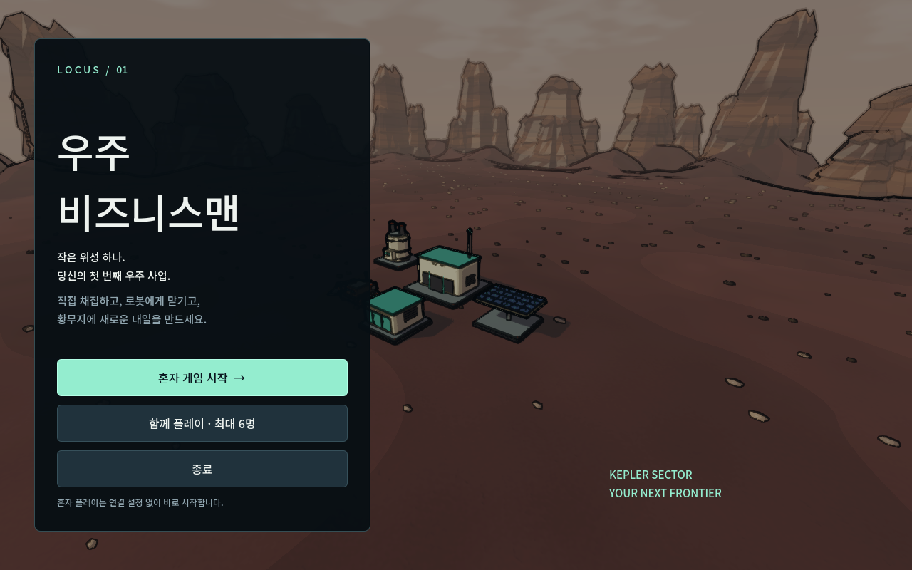
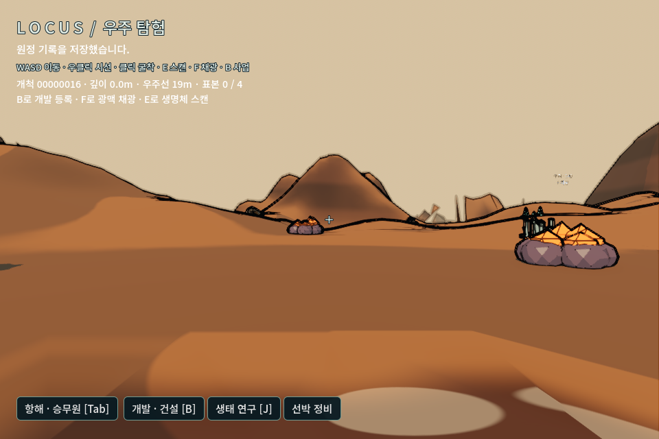

# 혼자 시작과 착륙 후 인터페이스

2026-09-06 사용자 요청에 따라 테스트 진입과 지표 조작을 가로막던 UI를 수정했다.

## 현재 동작

- 시작 화면은 `혼자 게임 시작`(저장 시 `혼자 이어하기`), `함께 플레이 · 최대 6명`, 종료로 정리했다. 기존 구매형 사업 시작/이어하기와 단독 실증 진입 항목은 제거했다. 기존 코드·저장 원본을 삭제한 것은 아니다.
- 혼자는 같은 탐험·산업·생태 규칙을 `OfflineMultiplayerPeer`로 실행한다. UDP 서버나 접속 설정을 만들지 않는다. 개인 장비 프로필은 유지하고 세계는 `solo_world.json`에 저장한다. 공동 세계 `crew_world.json`과 자동 병합하지 않는다.
- 혼자 시작하면 실제 우주선 외부 3D 화면과 목적지 단말이 열린다. 주소 16을 첫 추천값으로 넣었다. `선택한 행성으로 출발`은 항로 설정과 자신의 준비를 처리한 뒤 실제 항해한다. 궤도 접근 조건을 만족해야 착륙 버튼이 활성화된다. 여러 명의 준비/조종 권한 규칙은 그대로 유지한다.
- 착륙과 착륙 상태 이어하기 시 항해·연구·사업·정비 패널을 닫는다. 반복되는 상태 수신으로 항해 패널이 다시 열리지 않는다. 지표에는 짧은 HUD와 하단 도구 버튼이 남는다.
- B는 사업/건설, J는 생태 연구, Tab은 항해 패널을 열고 닫는다. 패널 간 전환 시 다른 큰 패널을 닫고 Esc로 정리한다. GUI 버튼에 포커스가 있어도 Tab을 처리한다. 주소 입력 중에는 글자 단축키가 탐험 동작을 실행하지 않는다.
- 지표에서 준비/이륙이 필요하면 선박 주변으로 복귀해 Tab을 연다. 혼자는 별도 준비 버튼 없이 이륙 요청을 수행하고, 여러 명은 전원 준비·조종사 권한·화물 반납 조건을 유지한다.

## 검증

Godot 4.7.2 / Metal Forward+ / Apple M2에서 검사했다.

- `test_solo_entry.gd` 26개: 실제 제목 메뉴 클릭 → 오프라인 방 없이 진입 → 출발 버튼 → 시간 경과에 따른 실제 항해 → 착륙 → 지형 충돌 준비 → 큰 패널 숨김 → 이동 → 뷰포트 실제 클릭 굴착 → 사업 등록 → 연구/항해 패널 → 960×640 도구 영역 → 저장과 착륙 상태 이어하기. 사용자의 저장 대신 임시 프로필/세계 경로를 사용한다.
- `test_solo_shortcuts.gd` 8개: 같은 고립 저장을 재개하고 실제 키 이벤트로 Tab/B/J/Esc·포커스·패널 전환·종료 저장을 확인한다.
- `tools/test_vessel_play.py --players 6` 83개: 독립 ENet 6인 참여·항해·지표 장착·출항·호스트 재시작 회귀. M2의 호스트 Metal 1개와 headless 게스트 5개이며 실제 인터넷 실험이 아니다.
- `tools/test_expansion.sh`의 확장 도메인 회귀 통과. 변경한 UI의 검증은 위 별도 실제 GPU 흐름으로 수행했다.

반복 실행은 `tools/test_solo_entry.sh`를 사용한다. 테스트 증거 폴더를 출력하며 게임 사용자 저장은 변경하지 않는다. 기존 INK v1 모델/공통 렌더링 기준은 유지했다. Windows 테스트 ZIP만 새로 내보내며 Windows EXE 실기 실행은 별도 검증 대상이다.
