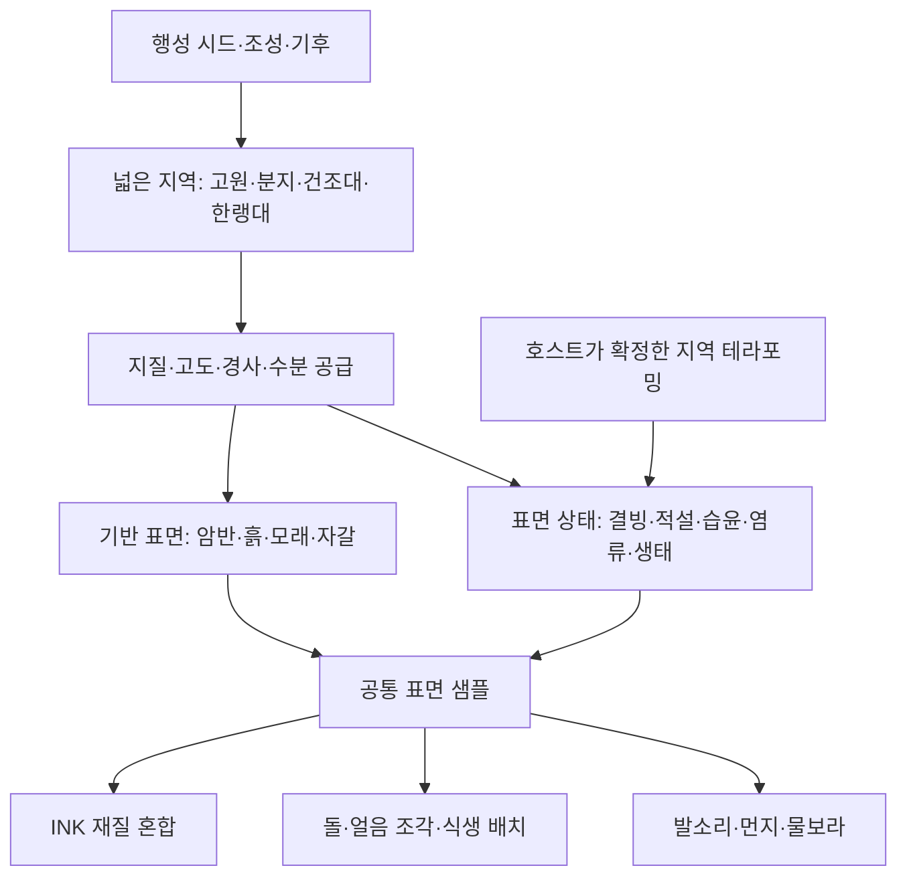

# 행성 지표 재질·복합 지역 구조

## 현재 적용 범위

[지표 텍스처·행성 3계열 제작 기록](../production/56-planet-surface-materials.md): 10종 공유 배열/트라이플래너·12착륙 계열 조합·높이 경계·노멀/거칠기·눈/얼음/젖음·현장 온도 전이·지하 피복 제외를 구현했다. `surface_materials.json`과 `surface_material_library.gd`가 실제 경로다. 아래 2절은 변경 전 출발점, 7절의 공통 CPU 표면 샘플/분포 캐시 등과 전 행성 지도는 장기 설계다. 자연물/발소리 전부를 동일 표면 샘플로 통합하거나 물리적 얼음판을 구현한 것은 아니다. 세부 채널·규칙·검수·저장 경계는 제작 기록 한 곳에서 관리한다.

2026-09-08 최초 **구조 설계 제안**. 사용자는 향상된 모델에 비해 바닥 표현이 부족하고 행성 표면이 단조롭다고 지적하며, 결빙 구역 등 여러 바닥 재질이 공존하는 구조를 먼저 구상하도록 요청했다. 아래 계층·재질 수·순서는 최초 제안이다. 이후 사용자가 텍스처·추가 계열 개발을 승인했으며 실제 적용 범위는 다음 현황을 우선한다.

[INK v1](../production/06-rendering-quality-standard.md) · [현재 지표 제작](../production/31-planet-diversity.md) · [오픈월드·지하](../game/08-open-world-and-underground.md) · [천체 시간](08-seeded-planetary-cycles.md) · [테라포밍](../game/04-terraforming-and-sales.md)을 함께 따른다.

**2026-09-08 추가 요구:** 현재 암석/행성 분류 전체를 수용해야 하며, 행성 렌더링의 전체 적용 여부도 확인한다. [전체 적용 감사](../production/53-planet-coverage-audit.md)에 최신 자산·실제 렌더·표현 공백을 구분했다. 아래 첫 재질 6종·한랭 지역 하나는 품질 실증용 시작점이며 최종 완료 범위가 아니다. 전체 적용 설계는 11~13절을 함께 따른다.

**후반 재화·재방문 추가 구상:** [행성 특화·공급망](../game/17-planet-specialization-and-supply.md)에서 외형 15계열을 최종 상한으로 두지 않고 주력 공급·가공·수입 역할에 따라 기존 지질을 강화하거나 새 환경을 추가하는 기준을 제안한다. 복원 계약과 공급 거점·운송을 함께 다루며 신규 재질/외형을 이미 구현한 것으로 표시하지 않는다.

## 1. 핵심 방향

**공유 재질 라이브러리를 지질·기후·지형에 따라 배치하고, 그 위에 눈·서리·습기·생태 같은 변화를 얹는다.** 행성 종류는 지역·재질의 후보와 비율을 정하는 상위 특성이다. 한 종류를 한 바닥 재질로 치환하지 않는다.

품질은 세 크기에서 만든다. 먼 곳에서는 넓은 퇴적지·암반·결빙지의 구분, 걸을 때는 재질 경계와 돌의 접지, 바로 앞에서는 균열·결·반사 차이가 보여야 한다. 해상도만 올리거나 작은 돌을 늘려서는 세 크기의 문제가 함께 해결되지 않는다.

행성마다 모든 환경을 넣지는 않는다. 건조 행성은 암반·먼지·자갈 중심이어도 충분하다. 물질 공급과 기후 조건이 맞는 행성에서만 얼음·물·습지가 함께 나타난다. 생태가 없는 행성을 지구식 숲·초원으로 자동 분류하지 않는다.

## 2. 현재 구현에서 확인한 출발점

| 현재 연결 | 확인 내용 | 개선 지점 |
| --- | --- | --- |
| `scripts/world/crew_surface_scene.gd` | 계열별 암석/먼지 색, 표면 무늬, 화산 상태 선택 | 지역별 재질 조합으로 확장 |
| `assets/materials/space/terrain.gdshader` | 경사·지층·색 무늬, 사막 구역, 지역 복원/염류/냉각. 추가 조사 때 9계열 `biome_style` 색면 변주 확인. 거칠기 `.96`, 텍스처 샘플·노멀맵 없음 | 요철·거칠기·혼합 경계와 환경 기반 분포 추가 |
| `scripts/world/surface_geology.gd` | 산화 사막의 암반·유로·모래 함수를 CPU와 셰이더에서 각각 계산 | 공통 지역 데이터로 일반화 |
| `scripts/world/surface_details.gd` | 계열별 Blender 장식, 사막 지질 배치, 건설/굴착 제외 | 같은 표면 분포로 모든 계열의 자연물 결정 |
| `scripts/world/terrain_field.gd` | 시드 높이·평원·분지·굴착, 사막의 낮은 턱/홈 | 재질 교체와 실제 지형 변경의 버전 분리 |
| `scripts/world/business_site_view.gd` | 한 개발 구역의 환경으로 지면 색·발광 변경 | 호스트 환경 결과를 지역 표면 상태로 변환 |
| `scripts/domain/planetary_cycles.gd` | 지역 기준 위경도·북쪽·천체 시간 존재 | 지역 기후 기준으로 재사용 |

현재 `data/terrain.json`은 2m 셀·24m 청크, 지역 반경 8,192m 설정이다. 행성 전체 지형이나 구면 위경도별 바이옴 지도는 아니다. 궤도 대륙과 착륙 지형의 정확한 대응, 주야 온도 결빙, 복수 지역 열 확산은 현재 완료 범위가 아니다.

최초 구상에서는 코드·문서와 기존 빙원 대표 캡처를 읽어 검토했다. 후속 전체 적용 요청에 따른 새 실제 렌더는 [추가 감사 기록](../production/53-planet-coverage-audit.md)에 따로 구분한다. 성능 벤치마크는 수행하지 않았다.

## 3. 현실 원리와 게임의 단순화

얼어 있는 곳과 노출 지면이 한 천체에 공존하는 방향은 타당하다. 다만 얼음의 종류와 조건도 다르다. 화성 계절 극관에는 이산화탄소 얼음과 물 얼음·먼지가 섞이고 지구의 눈 녹음과 다른 과정을 보인다. 이를 모든 외계행성에 같은 비율의 지구식 환경이 있다는 관측 근거로 확대하지 않는다. [NASA 화성 계절 서리](https://science.nasa.gov/photojournal/carbon-dioxide-frost-settling-from-seasonal-outbursts-on-mars-movie/).

- 추위만으로 얼음을 만들지 않는다. 얼 수 있는 물질의 양·공급과 기압·온도 조건이 필요하다.
- 장기 기후는 위도·장기 일사·고도·대기·지열로 정하는 게임 모델을 제안한다. 경사는 주로 덮개 유지와 암반 노출에 사용한다.
- 동주기 행성은 항성을 향한 면·밤 면·경계대의 일사와 열 수송을 표현하는 프로필을 둔다. 밤 면이 반드시 얼음이라는 규칙은 두지 않는다.
- 주야 조명과 장기 기후를 분리한다. 그림자가 생기는 즉시 눈이 쌓이거나 해가 뜨자 모든 얼음이 녹지 않는다.
- 첫 수분 상태는 물 기반 모델을 추천한다. 다른 휘발성 물질은 별도 상변화 프로필로 확장하고 물의 임계치를 그대로 재사용하지 않는다.

기존 `traits.water`는 환경 점수이지 실제 수량·해양 면적이 아니다. 수분 공급 분포로 변환하는 게임 규칙을 명시한다. 기존 온도/기압 지표도 단위·의미를 확인하고 물리량으로 오용하지 않는다.

## 4. 생성·표현 계층

| 층 | 역할 | 예시 |
| --- | --- | --- |
| 행성 프로필 | 허용 지역·재질, 조성, 기본 기후, 팔레트 | 건조 산화 행성 / 물이 있는 한랭 암석 행성 |
| 넓은 지역 | 이어지는 큰 지형·기후 구역 | 건조 고원 / 퇴적 분지 / 차가운 고지 |
| 지질·퇴적층 | 덮개 아래에도 유지되는 표면 구성 | 기반암 위 토사, 골짜기의 모래·자갈 |
| 표면 상태 | 환경에 따라 가역적·누적 변화 | 서리, 눈, 노출 얼음, 젖은 흙, 염류 껍질 |
| 생태 상태 | 연구·정착 조건을 충족한 피복 | 미생물막, 이끼형 피복, 식생 군집 |
| 표현 | 같은 원본을 거리·매체에 맞게 표시 | 재질·모델·발소리·작업 효과 |

지역은 연속적인 온도·수분·지형 분포에서 만들고 경계에 제한된 변화를 준다. 각 재질을 독립 노이즈로 뿌려 얼룩만 늘리지 않는다. ‘바이옴’은 탐험용 지역 분류이며 불모지에서 생태계 존재를 뜻하지 않는다.

## 5. 눈·얼음·젖은 땅

**암반 위의 눈, 얼어붙은 토양, 두꺼운 빙하, 호수 위 얼음판을 구분한다.** 얇은 눈/서리는 기반 재질을 덮는 피복이다. 노출 얼음은 별도 재질이고, 빙하와 보행 얼음판은 형상·충돌까지 필요한 지형/수면 기능이다.

첫 단계는 기존 지형 위 얇은 피복과 얼음 재질로 제한한다. 호수에 흰색 표면을 그렸다는 이유로 걸을 수 있게 하지 않는다. 바닥 높이를 바꿀 만큼 두꺼운 적설·빙하 후퇴·얼음판 파손은 후속이다.

- 완만한 면에는 눈이 남고 가파른 절벽에는 암반이 드러나게 한다. 바람 노출·홈의 퇴적 마스크로 보완한다.
- 서리·눈·얼음은 결·균열·반사도 다르게 만든다. 흰색/청록색의 차이로 끝내지 않는다.
- 결빙/해빙의 진입·해제 기준과 변화 시간을 달리하여 경계에서 깜빡이지 않게 한다. 수치는 데이터에서 조정한다.
- 액체 유지 조건에서는 눈/얼음 감소 → 젖은 기질 → 건조/생태 정착을 표현한다. 승화가 우세한 프로필은 액체 단계를 생략한다.
- 같은 x/z의 동굴 천장·바닥에 지상 눈·풀이 투영되지 않게 지표 노출·깊이·실제 면 법선을 평가한다. 굴착면은 드러난 지층을 사용하고 지하 결빙은 별도 조건으로 다룬다.

생태는 정착 기록과 기질·온도·수분 조건을 함께 요구한다. 테라포밍 점수가 높다는 이유만으로 지면 전체를 초록색으로 바꾸지 않는다.

## 6. 재질 품질·제작

첫 공유 라이브러리 후보는 **암반·풍화토·모래·자갈·눈·얼음 6종**이다. 젖음은 가능한 범위에서 기질의 상태로 표현한다. 염류·화산암·생태 피복은 기존 계열 지원을 유지하며 다음 제작 묶음으로 확장한다. 모든 행성에 6종을 모두 배치하지 않는다.

| 재질 구성 | 제작 원칙 |
| --- | --- |
| 색 | 큰 색면과 중간 크기 흔적. 고정 광원·강한 그림자를 색 이미지에 굽지 않음 |
| 요철 | Blender 균열·결·조각 형상을 노멀/높이로 베이크. 작은 입자는 약하게 |
| 빛 반응 | 거칠기와 제한된 하이라이트로 마른 흙·젖은 흙·얼음 구분 |
| 혼합 높이 | 모래가 홈에 끼고 눈 사이로 돌출 암석이 드러나는 경계. 실제 충돌 높이와 별개 |
| 정의·이력 | 미터당 무늬 크기, 색공간, 노멀 방향, 채널 의미, 강도, 원본/출력 기록 |

공통 `cel_light.gdshaderinc`의 3단 명암을 유지한다. 새 거칠기 텍스처는 현재 공통 `rough` 경로에 자동 반영되지 않으므로 실제 입력 연결을 함께 작업한다. 재질별 1K~2K 반복 텍스처에서 시작하고 보행 거리의 필요 밀도로 결정한다. 4K 이상 일괄 교체를 선행 조건으로 두지 않는다. 공유 텍스처와 행성 팔레트·분포로 변주한다.

연속 지형과 절벽은 월드 좌표의 3방향 투영을 기본안으로 둔다. 가파른 면의 늘어짐과 청크 UV 경계를 줄이고 세 축 노멀을 같은 공간으로 변환해 혼합한다. Godot 문서는 월드 트라이플래너 연속 매핑과 노멀/높이맵을 설명한다. 실제 적용은 기존 INK 셰이더 확장으로 별도 구현·확인한다. [Godot 재질 문서](https://docs.godotengine.org/en/stable/tutorials/3d/standard_material_3d.html).

반복은 넓은 색 변화·재질 경계·변형 타일로 분산한다. 모래결은 지역 바람 방향을 유지하여 임의 회전 경계가 드러나지 않게 한다. 색/노멀의 회전도 일치시킨다. 원거리에서는 미세 요철·내부 선·작은 장식을 줄이고 넓은 지역 차이는 유지한다. 노멀맵 때문에 INK 윤곽이 검은 잡음으로 바뀌는지 확인한다.

텍스처 자갈보다 큰 조각·노두만 Blender 모델로 배치한다. 같은 팔레트·군집·부분 매몰로 접지를 연결한다. 베이크 원본·새 모델은 Blender 실제 렌더, 결과 재질은 Godot Forward+ 지표에서 검수한다.

## 7. 공통 데이터·런타임 구조

아래는 예정 요소이며 생성·구현한 파일이 아니다.

| 예정 요소 | 책임 |
| --- | --- |
| `data/surface_materials.json` | 재질 ID, 텍스처, 미터 크기, 채널·빛 반응·효과 |
| `data/surface_regions.json` | 행성별 지역 후보·기후 조건·재질 조합·전이 |
| `scripts/domain/surface_environment.gd` | 시드·지역 환경·지표 노출로 표면 ID/가중치/상태 산출 |
| `scripts/world/surface_material_cache.gd` | 청크 분포 캐시와 렌더용 제어 텍스처 |
| 기존 `terrain.gdshader` | 재질 혼합, 공통 INK·안개·지역 변화 유지 |
| 기존 `surface_details.gd` | 공통 샘플로 자연물 종류·밀도·제외 판단 |

샘플의 개념은 `base_material_ids + base_weights + cover_type/amount + wetness + ecology_cover + exposure`다. 고도·지층은 기존 지형 필드를 읽는다. 환경 분류와 GPU의 미세 무늬를 분리하여 CPU/GPU가 별도 난수로 눈밭이나 암반 위치를 정하지 않게 한다.

첫 렌더 예산은 한 지점의 기반 재질 상위 2개와 덮개 1개를 제안한다. 복합 경계의 추가 혼합은 비용·품질을 보고 결정한다. 재질 배열은 저장/바인딩을 묶을 뿐 샘플 비용을 없애지 않는다. 전 재질을 모든 픽셀에서 세 축으로 샘플링하지 않는다.

2m 지형 셀과 별개인 표면 제어 격자로 메시를 늘리지 않고 경계를 표현한다. 인접 청크는 같은 좌표의 경계 여유 데이터를 사용한다. 제어맵의 재질 ID는 정수로 읽고 가중치만 보간하며 청크 팔레트 순서가 달라도 같은 재질을 가리키도록 정의한다. 지표 2D 분포는 동굴에 그대로 쓰지 않고 깊이·3D 지질 판정으로 보완한다.

넓은 분포는 청크 진입 시, 변화는 환경 상태가 바뀐 영역만 갱신한다. 원경도 같은 분포의 낮은 해상도 표현을 사용하여 접근 시 눈밭이 갑자기 생기지 않게 한다. 화질 설정은 텍스처·미세 요철·장식 거리를 바꾸고 재질 구역·플레이 판정은 유지한다.

발소리·바퀴 먼지·물보라도 공통 표면 샘플을 사용한다. 새 소리는 ElevenLabs 제작·이력·실제 재생 확인을 따른다. 장식 얼음과 채집 자원은 기존 자원 원장·도구 판정으로 구분한다. 미끄러짐·접지력·채집량 변경은 별도 게임 규칙으로 남긴다.

## 8. 지역 좌표·협동·저장·테라포밍

첫 단계는 **현재 착륙 지역 안의 복합 지표**다. `celestial_regions`의 위경도·북쪽을 기후 기준으로 재사용하되 몇백 m 걸으면 적도에서 극지로 바뀌는 압축을 하지 않는다. 지역 내부 변화는 고도·지질·수분·지열을 중심으로 한다. 지역과 행성 지도 좌표의 변환은 하나의 명시적인 규칙으로 관리한다.

후속 행성 규모 지도는 큰 기후/지질 분포를 궤도 모델과 착륙 지역이 공유한다. 착륙 주소·지역 이동·위경도 매핑이 필요하다. 구형 중력이나 행성 전체 실시간 메시가 재질 개선의 선행 조건은 아니다. 현재 색/환경 공유를 정확한 해안선 대응으로 표시하지 않는다.

표면 시드 스트림을 기존 지형·광물·생태와 독립시키고 `surface_version`·규칙 해시를 매니페스트에 고정한다. 100만 행성의 텍스처를 미리 만들지 않는다. 방문 지역 제어맵은 재생성 캐시로 두고 시드·규칙·누적 변화 상태를 저장한다.

호스트가 실제 결빙·습윤·정착 상태와 영향을 확정한다. 클라이언트는 동일 버전과 호스트 결과로 표현한다. 합류 시 현재 상태·변화 기준 시각을 복원하며 누적 피복은 양·마지막 갱신 시각 등 필요한 최소 상태를 저장한다.

기존 저장에는 형상·시설·광맥 좌표를 보존하는 재질 개선부터 적용하는 안을 추천한다. 새 기후 분포가 기존 자원·생태·사업과 충돌하면 기존 프로필을 유지한다. 분포 재생성·물리 변화는 새 세계 또는 명시적인 이행으로 분리한다.

테라포밍은 기존 사업 환경을 원본으로 읽고 중복 점수 체계를 만들지 않는다. 한 구역의 냉각·수분 영향 마스크로 표현하고 외부와 부드럽게 연결한다. 지역 복원을 행성 전체 결빙/해빙으로 확대하지 않는다. 복수 사업 구역의 겹침·열/수분 영향은 후속이다.

## 9. 추천 첫 장면·개발 순서

첫 품질 기준은 **한랭 암석 행성 한 지역**을 추천한다. 눈·얼음·암반 차이와 연결을 한 풍경에서 판단하기 쉽다. 액체가 유지되는 조건이면 젖은 해빙 경계도 표현한다. 조건에 맞지 않는 물·식생을 전시용으로 끼워 넣지 않는다.

| 구간 예시 | 표면 | 연결 |
| --- | --- | --- |
| 노출 능선 | 어두운 암반·성긴 자갈 | 돌출부는 눈이 얇고 홈에 잔설 |
| 완만한 한랭 지면 | 눈 덮개·노출 얼음 | 돌 주변·경사 변화에서 기반 재질 노출 |
| 결빙 분지 | 얼음 재질·퇴적 가장자리 | 수분 분포와 일치. 보행 얼음판은 후속 |
| 해빙 경계 | 젖은 토양·잔설 | 액체 유지 조건에서만 단계적 변화 |

넓은 주 표면과 소수 보조 표면, 드문 특징 구역으로 행성의 인상을 유지한다. 모든 표면을 같은 면적으로 나누지 않는다.

1. **재질 품질 기준:** 대표 지역에 재질·혼합을 연결하고 기존 형상에서 암반·눈·얼음이 색 외에도 구분되는지 확인한다.
2. **공통 분포 연결:** 시드 환경 샘플·청크 캐시·자연물·원경을 연결한다. 기존 사막 구역을 편입하고 계열별 허용 조합을 확장한다.
3. **지역 변화 연결:** 호스트 환경으로 얇은 피복·습윤·생태 표현을 변화시키고 저장 복원을 연결한다. 두꺼운 빙하·보행 수면은 별도다.
4. **행성 규모 확장:** 극지·저위도·동주기 구역과 궤도 지도/착륙 주소를 연결한다. 전체 날씨·해류·빙하 유동 시뮬레이션을 선행하지 않는다.

## 10. 최소 확인·이번 범위

구현 때 대표 지역의 근접/보행/원경에서 반복·경계·INK 선을 보고, 낮/그늘 비교와 짧은 이동으로 번짐·깜빡임을 확인한다. 인접 청크, 한 굴착면의 피복 누출, 건설 밑 장식 제외, 동일 시드 재방문을 변경에 맞춰 확인한다. 환경 변화 단계에서 한 구역의 전후·저장 복원을 추가한다. 같은 카메라·설정의 짧은 프레임 시간/메모리 비교로 비용을 기록한다.

문제 없는 상태에서 전체 회귀·장시간·다중 클라이언트 반복 검사를 선행하지 않는다. 실제 확인과 남은 범위는 구현 시 별도 제작 기록에 둔다.

**최초 구조 구상에서는 문서만 변경하고 게임 테스트를 실행하지 않았다.** 후속 전체 적용 감사는 사용자가 요청한 렌더 확인을 수행하며 별도 제작 기록을 남긴다. 새 재질·Blender 형상·셰이더·게임 규칙을 이 설계 작업에서 구현한 것은 아니다.

## 11. 전체 행성을 수용하는 분류 구조 — 추가 제안

현재 `basalt/glacial/sulfur/gas_giant/ice_giant`와 외형 15 ID는 저장 호환용으로 유지한다. 새 환경을 하나 추가할 때마다 `kind`와 셰이더 분기를 늘리기보다 다음 축의 조합으로 표현한다. 실제 과학 분류·관측 사실과 게임 프리셋은 구분한다.

| 독립 축 | 책임 | 기존 데이터와 연결 |
| --- | --- | --- |
| 천체 구조·크기 | 고체 표면/거대행성, 질량·반경·중력 | `kind`·기존 반경·천체 메타데이터의 호환 어댑터 |
| 지질 조성 | 주/보조 지질과 지역별 암반·퇴적물 | 자원 지질 10종. 주/보조 ID와 비율을 명시적으로 보존하는 새 버전 |
| 기후·물질 | 기온·기압·수분 공급·일사·지열 | 기존 `traits`·지역 환경. 점수와 물리량 단위를 구분 |
| 표면 상태 | 건조·습윤·결빙·적설·염류·용융 지각 | 지질을 교체하지 않고 변화하는 피복/상태 |
| 생태 | 무생물/자생/이식/정착과 피복 | 기존 생태 원장·연구 조건 |
| 시각 계열 | 팔레트·형상·풍화·대기 표현 스타일 | 현재 15 외형은 기본 프리셋 |
| 진행 | 티어별 접근·장비·자원·사업 조건 | 기존 티어 1~5. 티어를 암석 종류로 사용하지 않음 |

`glacial` 계열이 따뜻해져 눈이 줄어도 기반 지질·광맥이 다른 행성으로 재추첨되지 않는다. `basalt` 계열의 높은 산에도 물질·기후가 맞으면 눈이 남을 수 있다. 짙은 대기, 대기 없는 암석, 물로 대부분 덮인 표면, 용융 표면, 영구 동결, 동주기 경계대도 새 축의 조합으로 확장한다. 이 확장 후보를 모두 즉시 생성/착륙 가능한 새 종류로 승인한 것은 아니다.

가스/얼음 거대행성은 별도 대기 표현 프로필을 선택하고 지상 재질은 명시적으로 대상 아님으로 둔다. 육지가 없는 지역·보행 불가 표면도 착륙 능력 조건을 먼저 결정한다. 태양계 참조 8종의 전용 모델과 착륙 제한은 유지한다.

## 12. 현재 모든 계열의 표면 조합 목표

아래 조합은 모두 구현 전 제안이다. `조건부`는 온도·물질 공급·기압·생태 조건이 충족될 때만 사용한다. 첫 6종 라이브러리로 억지로 같은 재질을 재색칠해 끝내지 않고, 퇴적·결정질·화산·열수·염류의 재질/형상 변형을 추가한다. 반드시 각 행성 전용 이미지 세트를 만들라는 뜻은 아니다.

| 기존 계열 | 기본 지질·표면 조합 | 조건부 피복·환경 변화 |
| --- | --- | --- |
| `oxidized` 산화 사막 | 산화 암반·풍화토·모래·자갈·마른 유로 | 수분 공급 후 젖은 퇴적지, 적합한 한랭부의 서리 |
| `continental` 습윤 대륙 | 풍화 암반·토양·모래/자갈 퇴적지·물가 | 습윤·고지 잔설, 생태 원장에 따른 피복 |
| `cratered` 충돌 고원 | 노출 암반·충돌 잔해·먼지·결정질 노두 | 한랭 포획 구역의 서리, 공급이 있는 국소 결빙 |
| `fractured` 균열 빙원 | 노출 얼음·암반·빙하 퇴적물·균열 주변 | 눈/서리, 지열과 액체 조건에 맞는 국소 해빙 |
| `tundra` 해빙 툰드라 | 얼어 있는 토양·암반·자갈·잔설·분지 얼음 | 해빙 때 젖은 토양, 정착 조건을 만족한 피복 |
| `frozen` 극저온 설원 | 얼음·설피복·노출 암반·빙하 퇴적물 | 바람 노출/퇴적 차이, 물질에 맞는 상변화 |
| `volcanic` 불타는 화산 | 냉각 지각·화산암·재·균열·국소 고온부 | 냉각 시 발광 감소·지각 변화, 후속 토양/수분 |
| `salt` 염류 분지 | 소금 껍질·퇴적토·자갈·광물 침전 가장자리 | 공급/압력/온도에 따른 습윤·염수, 탈염 변화 |
| `ochre` 황토 열수대 | 열수 침전층·황색 광물 피복·다공질 암반·퇴적토 | 국소 고온/습윤·냉각·침전 상태 |
| 거대행성 6계열 | 지상 재질 대상 아님 | 구름 띠·폭풍·연무·광학 두께의 전용 대기 프로필 |
| 태양계 8행성 | 현재 지상 대상 아님 | 전용 궤도 모델·근/원거리·미리보기 보존 |

자원 지질 10종은 위 재질과 지역 형태의 별도 선택 축이다. `sedimentary`와 `alkaline`도 누락하지 않고 같은 행성의 보조 지역으로 표현할 수 있어야 한다. 광물 단서를 주는 노두와 채집 가능한 광맥은 구분하고, 보석·특이 소재가 있다고 지면 전체를 보석 텍스처로 바꾸지 않는다. 상세 주/보조 대응표는 감사 문서에 둔다.

## 13. 빠짐없는 렌더 연결을 위한 공통 계약

예정 `data/planet_visual_profiles.json`에 각 생성 프리셋의 `orbital_mesh`, `orbital_lod`, `atmosphere_profile`, `surface_region_profile`, `geology_material_set`, `supported_surface_states`, `landability`, `legacy_adapter`를 연결한다. `surface_region_profile`이 없는 거대행성/태양계는 누락과 구별되는 대상 아님 사유를 기록한다. 신규 파일·클래스명은 제안이다.

비행·항법 미리보기·후속 행성 지도는 공통 표현 생성기에서 매개변수를 받는다. 지역 기후와 궤도 표현은 같은 물질/상태 정의를 사용하고, 바다·빙원·눈·용융 지각을 서로 다른 상태로 구분한다. 현재 `water → sea_level`만으로 액체처럼 칠하는 연결을 이 계약으로 대체한다. 실제 구면 지리의 좌표 대응은 후속이어도 동일 상태의 의미부터 맞춘다.

완료 여부는 하나의 ‘행성 렌더 있음’ 대신 다음 열로 추적한다.

| 대상 | 필수 결과 또는 명시적 제외 |
| --- | --- |
| 현재 생성 외형 15계열 | 궤도 근/원거리·미리보기·대기·프리셋 매핑 |
| 태양계 참조 8종 | 전용 근/원거리·미리보기·현재 착륙 제한 |
| 착륙 지표 9계열 | 기반/보조 재질·자연물·원경·굴착면·지역 변화 |
| 지질 10종 | 주/보조 재질·형태 연결, 기존 자원 분포 보존 |
| 허용 상태 조합 | 건조/습윤/눈/얼음/염류/고온/생태의 조건·전이·저장 |
| 기존 세계 버전 | 매핑 유지·원래 지형/광맥/사업 보존 또는 명시적 이행 |

새 콘텐츠 ID를 추가하면 누락된 매핑·자산·가져오기·검수 목록을 알려주는 소규모 콘텐츠 검사를 확장한다. 모든 시드 이미지를 생성하지 않고 유한 프리셋과 상태 경계의 대표 사례를 확인한다. 정상 콘텐츠 누락을 임의 기본 암석으로 숨기지 않는다. 알려지지 않은 구버전 ID는 저장 원본을 보존하고 미지원 상태와 안전한 대체 표시를 명시하며, 잘못된 새 생성 콘텐츠를 지원 완료로 계산하지 않는다.

전체 개선 완료는 위 표의 모든 현재 대상이 지원될 때다. 한랭 지역 품질 실증은 첫 단계이며, 화산·염원·열수·거대행성·태양계와 지질 조합을 남겨둔 채 전체 완료로 표시하지 않는다.
